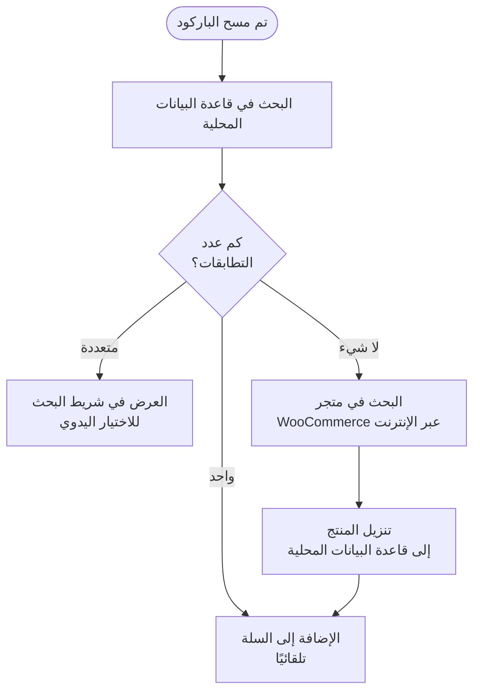

import Image from "@theme/IdealImage";
import Accordion from '@site/src/components/Accordion';
import AccordionItem from '@site/src/components/AccordionItem';

تتصرّف معظم قارئات الباركود مثل لوحة مفاتيح موصّلة بجهازك.
عندما تقرأ باركود، يكتشف WCPOS أن الأحرف أُدخلت أسرع من الكتابة العادية.
ويستخدم هذه "ضغطات المفاتيح السريعة" لتمييز الإدخال على أنه قراءة باركود.
يعمل هذا مباشرةً مع كل قارئ تقريبًا — لكن القارئات تدعم أيضًا [أوضاع اتصال](#connection-modes) أخرى يمكن لـ WCPOS الاتصال بها مباشرةً.

## إعداد قراءة الباركود {#configuring-barcode-scanning}

بما أن قراءة الباركود تحدث بسرعة كبيرة، يمكن لنقطة البيع التمييز بين الباركود وشيء مكتوب يدويًا.
في إعدادات نقطة البيع، ستجد خيارات لضبط طريقة عمل كشف الباركود بدقة.

  <Image
    alt="إعدادات قراءة الباركود في إعدادات نقطة البيع"
    img="/img/barcode-scanning-settings.png"
    style={{ maxHeight: 500 }}
  />
  
إعدادات قراءة الباركود في إعدادات نقطة البيع

| الإعداد | الغرض | القيمة النموذجية |
|---|---|---|
| **متوسط زمن الإدخال** | ما مدى السرعة التي يجب أن يكون بها الإدخال ليُحتسب باركودًا | فاصل زمني قصير — سريع بما يكفي بحيث لا تُطلقه الكتابة اليدوية |
| **الحد الأدنى للطول** | ما طول السلسلة المتصلة من الأحرف التي يجب أن يبلغها لتُعامَل باركودًا | طابق أقصر باركود تستخدمه (مثل 8 لـ EAN-8) |
| **إزالة البادئة/اللاحقة** | يزيل الأحرف الإضافية التي يضيفها قارئك (بادئة أو لاحقة) بحيث يبقى الباركود الرئيسي فقط | اتركه فارغًا ما لم يكن قارئك مُعدًّا لإضافتها |

## أوضاع الاتصال {#connection-modes}

للحصول على مسار موجَّه خلال الإعداد أو استكشاف الأخطاء وإصلاحها، استخدم [معالج إعداد القارئ](/hardware/scanners/setup-wizard).

يُشحن كل قارئ باركود في أحد أوضاع قليلة، ويحدد الوضع كيف يمكن لـ WCPOS استقبال قراءاته:

| الوضع | كيف تصل | الإعداد |
|---|---|---|
| **لوحة المفاتيح (HID)** — الإعداد المصنعي الافتراضي في معظم القارئات تقريبًا | "يكتب" القارئ الباركود؛ ويتعرّف WCPOS على ضغطات المفاتيح السريعة | لا شيء — أقرِن أو وصّل واقرأ |
| **تسلسلي (SPP / USB-COM)** | اتصال مباشر عبر USB التسلسلي أو Bluetooth SPP | بدّل وضع القارئ، ثم وصّله في إعدادات الباركود |
| **HID-POS** | اتصال مباشر لقارئات USB (عبر WebHID) | بدّل وضع القارئ، ثم وصّله في إعدادات الباركود |
| **Bluetooth LE (GATT من المُصنّع)** | اتصال Bluetooth Low Energy مباشر | أقرِن القارئ، ثم أضِفه في إعدادات الباركود عبر معرّف الخدمة UUID الخاص به |

لا يحتاج وضع لوحة المفاتيح إلى أي إعداد وهو المناسب لمعظم المتاجر. أما الاتصال المباشر فيستحق العناء إذا كانت القراءات تصل أحيانًا مشوّهة (اختلاط بين الأحرف الكبيرة/الرموز بسبب فروق تخطيط لوحة المفاتيح) أو تحطّ في المكان الخطأ عندما لا يكون التركيز على مربع البحث — إذ يوصّل القارئ المتصل مباشرةً كل قراءة إلى WCPOS مباشرةً، بغضّ النظر عن سرعة الكتابة أو تخطيط لوحة المفاتيح أو التركيز.

:::info لا يمكن توصيل قارئ في وضع لوحة المفاتيح مباشرةً
يعامل جهازك القارئ في وضع لوحة المفاتيح تمامًا مثل لوحة مفاتيح، ولا يُسمح لأي تطبيق بالسيطرة على لوحة مفاتيح.
إذا ضغطت **Connect serial scanner** أو **Connect HID scanner** في إعدادات الباركود ولم يظهر قارئك في القائمة، فهو على الأرجح لا يزال في وضع لوحة المفاتيح.
:::

**لتبديل الأوضاع**، ابحث عن باركود الإعداد في دليل قارئك (ابحث عن *"SPP mode"* أو *"serial mode"* أو *"HID-POS mode"*) واقرأه — فيعيد القارئ ضبط نفسه. أما لقارئات Bluetooth، فانسَ الاقتران القديم في إعدادات Bluetooth بجهازك وأقرِن من جديد بعد التبديل. وقراءة باركود *"HID"* أو *"keyboard"* من الدليل تعيده إلى الوضع السابق في أي وقت.

الاتصالات المباشرة مدعومة في تطبيق سطح المكتب والمتصفحات المبنية على Chrome (باستخدام دعم المتصفح لـ Web Serial وWebHID). ويُظهر تطبيق سطح المكتب أداة اختيار الأجهزة داخل التطبيق؛ ويُظهر Chrome أداة اختيار الأجهزة الخاصة به. وعلى iOS وAndroid، يكون وضع لوحة المفاتيح والقراءة بالكاميرا هما الخياران المدعومان، ويعترض Android إضافةً إلى ذلك إدخال مفاتيح القارئ العتادي مباشرةً.

## القراءة بالكاميرا {#camera-scanning}

يمكن لكل منصة — الويب وسطح المكتب وiOS وAndroid — القراءة بكاميرا الجهاز، فلا تحتاج إلى قارئ مخصص للبدء. افتح الكاميرا من أيقونة القراءة في شريط البحث؛ فتظهر كـ**لوحة قابلة لتغيير الحجم أسفل عوامل التصفية مباشرةً**، بحيث تبقى قائمة المنتجات مرئية أثناء القراءة. وجّه الكاميرا نحو باركود فيقرؤه WCPOS تمامًا كما يقرأ قراءة عتادية.

## ماذا يحدث عند اكتشاف باركود؟ {#what-happens-when-a-barcode-is-detected}

عندما تكتشف نقطة البيع باركودًا، تبحث في قاعدة بياناتها المحلية للعثور على منتج أو بديل منتج مطابق.
هناك ثلاث نتائج محتملة:

عندما لا تجد القراءة مطابقًا محليًا، يلجأ WCPOS إلى متجرك عبر الإنترنت، وينزّل المنتج المطابق، و**يضيفه إلى السلة تلقائيًا** — فالباركود غير المعروف يكمل عملية البيع رغم ذلك، وتكون القراءة نفسها فورية في المرة التالية.

:::tip المطابقات المتعددة تعني عادةً مشكلة في البيانات
إذا شارك أكثر من منتج الباركود نفسه، فلا يمكن لنقطة البيع معرفة أيّها تضيف، فتُسقِط الرمز في شريط البحث لتختار. وعندما يحدث هذا، يكون عادةً علامة على أن بيانات منتجك بحاجة إلى ترتيب — إذ ينبغي أن يكون لكل منتج باركود **فريد**.
:::

## ملاحظات القراءة وسلوكها {#scan-feedback-and-behaviour}

- **أصوات القراءة** — يمكن لـ WCPOS تشغيل صوت عند كل قراءة حتى يحصل أمناء الصندوق على تأكيد فوري دون النظر إلى الشاشة. الأصوات اختيارية وتقدّم مجموعة من الأنساق؛ فعّلها واختر نسقًا في [إعدادات الباركود](/settings/store/barcode).
- **على شاشة الطلبات** — تُوجَّه القراءات إلى حقل بحث الطلبات، فيمكنك قراءة باركود للعثور على الطلب أو المنتج الذي تبحث عنه.
- **باركود UPC-A** — تُحلّ قراءة UPC-A إلى الأرقام المطبوعة على العبوة، فتكون القيمة التي تطابقها نقطة البيع هي القيمة التي تستخدمها بيانات منتجك.

## فهم مزامنة المنتجات {#understanding-product-synchronisation}

تنزّل نقطة البيع كتالوجك على دفعات صغيرة في الخلفية، فليس كل منتج على الجهاز منذ الدقيقة الأولى — راجع [مزامنة المنتجات](/products/sync) لمعرفة كيفية عمل ذلك.

### لماذا يهمّ هذا لقراءة الباركود {#why-it-matters-for-barcode-scanning}

عندما تقرأ باركودًا غير مخزَّن محليًا بعد، تنتقل نقطة البيع عبر الإنترنت إلى متجر WooCommerce الخاص بك، وتجد ذلك المنتج، وتنزّله — فتكون القراءة نفسها فورية في المرة التالية. لست بحاجة إلى فعل أي شيء لتسريع هذا: إذ يملأ زرع الكتالوج في الخلفية بقية مخزونك من تلقاء نفسه، ويمكنك التحقق من التقدم في **صحة المتجر → قاعدة البيانات**.

## الأسئلة الشائعة {#faq}

<Accordion>
  <AccordionItem question="لماذا أحصل على '0 products found locally' عندما أقرأ باركودًا؟">

ليست كل المنتجات على الجهاز منذ البداية — إذ تزرع نقطة البيع كتالوجك في الخلفية خلال دقائقها الأولى من الاستخدام.
إذا كان المنتج الذي قرأته للتو غير مخزَّن بعد، فإن القراءة تدفع نقطة البيع للبحث عنه عبر الإنترنت وتنزيله، فيكون فوريًا في المرة التالية.

  </AccordionItem>

  <AccordionItem question="هل تنشئ نقطة البيع الباركود وتطبعه؟">

لا، ليس في الوقت الحالي. صُمِّمت نقطة البيع لدينا لقراءة الباركود الموجود وقراءته، لكنها لا تتضمن وظيفة لإنشائه أو طباعته.
إذا كنت بحاجة إلى إنشاء باركود لمنتجاتك، فيمكنك استخدام إضافات WooCommerce من جهات خارجية متخصصة في إنشاء الباركود وطباعته. وتشمل بعض الأمثلة:

- [EAN for WooCommerce](https://wordpress.org/plugins/ean-for-woocommerce/)
- [A4 Barcode Generator](https://wordpress.org/plugins/a4-barcode-generator/)

بمجرد إنشاء باركود لمنتجاتك، يمكنك قراءته بسهولة على نقطة البيع لتسريع عملية الدفع فيها.

  </AccordionItem>
</Accordion>
