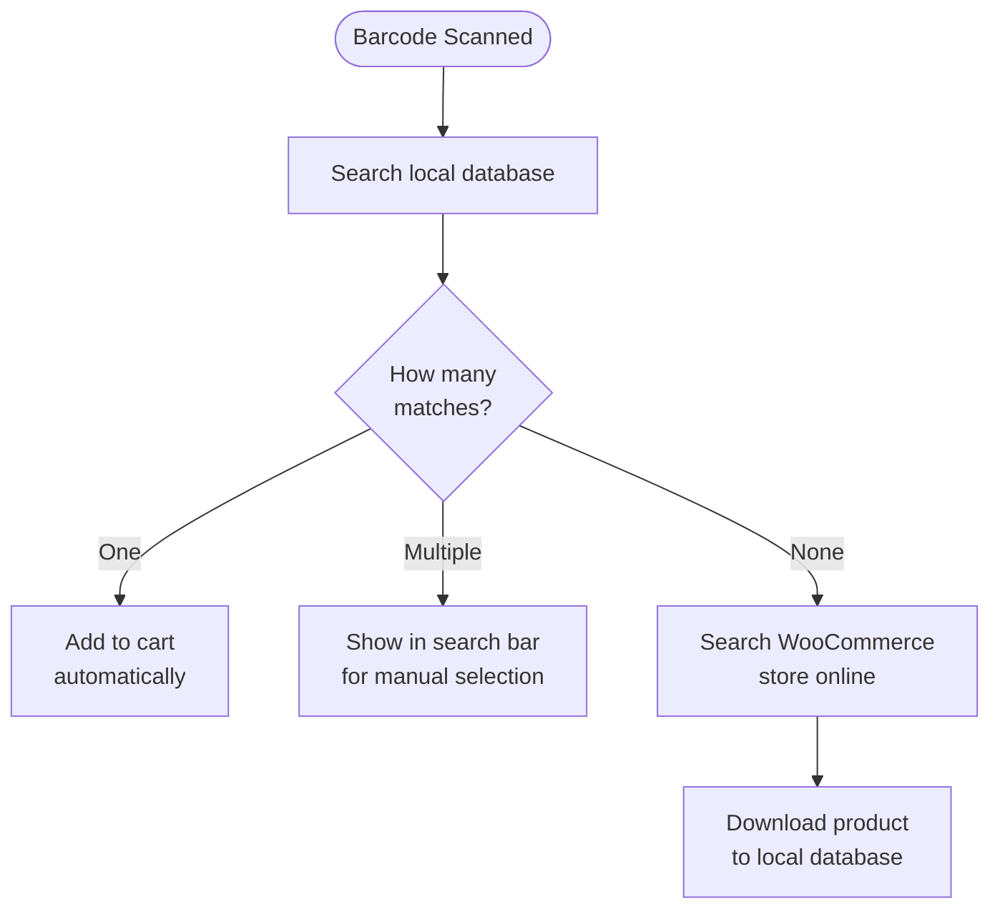

import Image from "@theme/IdealImage";
import Accordion from '@site/src/components/Accordion';
import AccordionItem from '@site/src/components/AccordionItem';

Die meisten Barcode-Scanner verhalten sich wie eine Tastatur, die mit Ihrem Gerät verbunden ist.
Wenn ein Barcode gescannt wird, erkennt WCPOS, dass die Zeichen schneller eingegeben wurden als bei normalem Tippen.
Diese "schnellen Tastatureingaben" werden verwendet, um die Eingabe als Barcode-Scan zu identifizieren.

## Barcode-Scannen konfigurieren {#configuring-barcode-scanning}

Da ein Barcode-Scan sehr schnell erfolgt, kann der POS zwischen einem Barcode und einer manuell eingegebenen Zeichenfolge unterscheiden.
In den POS-Einstellungen finden Sie Optionen zur Feinabstimmung der Barcode-Erkennung.

  <Image
    alt="Einstellungen für das Barcode-Scannen in den POS-Einstellungen"
    img="/img/barcode-scanning-settings.png"
    style={{ maxHeight: 500 }}
  />
  
Einstellungen für das Barcode-Scannen in den POS-Einstellungen

| Einstellung | Zweck | Typischer Wert |
|---|---|---|
| **Durchschnittliche Eingabezeit** | Wie schnell die Eingabe sein muss, damit sie als Barcode zählt | Ein kurzes Intervall — schnell genug, damit handschriftliches Eintippen es nicht auslöst |
| **Mindestlänge** | Wie lang die fortlaufende Zeichenfolge sein muss, damit sie als Barcode behandelt wird | An den kürzesten verwendeten Barcode anpassen (z. B. 8 für EAN-8) |
| **Entfernung von Präfix/Suffix** | Entfernt zusätzliche Zeichen, die der Scanner hinzufügt (ein Präfix oder Suffix), sodass nur der eigentliche Barcode übrig bleibt | Leer lassen, sofern der Scanner nicht dafür konfiguriert ist, solche Zeichen hinzuzufügen |

## Was passiert, wenn ein Barcode erkannt wird? {#what-happens-when-a-barcode-is-detected}

Wenn der POS einen Barcode erkennt, sucht er in seiner lokalen Datenbank nach einem passenden Produkt oder einer passenden Produktvariante.
Es gibt drei mögliche Ergebnisse:

:::tip Mehrere Übereinstimmungen weisen meist auf ein Datenproblem hin
Wenn mehr als ein Produkt denselben Barcode verwendet, kann der POS nicht erkennen, welches hinzugefügt werden soll. Deshalb wird der Code in die Suchleiste eingefügt, damit eine Auswahl getroffen werden kann. In der Regel ist das ein Hinweis darauf, dass die Produktdaten bereinigt werden müssen — jedes Produkt sollte einen **eindeutigen** Barcode haben.
:::

## Produktsynchronisierung verstehen {#understanding-product-synchronisation}

### Progressiver Produktdownload {#progressive-product-downloading}

WCPOS lädt nicht alle Produkte auf einmal.
Stattdessen werden sie in kleinen Stapeln heruntergeladen.
Dieser Ansatz verhindert Verlangsamungen und stellt sicher, dass Ihre Filiale reibungslos läuft.
Mit der Zeit werden durch die Nutzung des POS und die Durchführung von Suchen immer mehr Ihrer Produkte lokal auf Ihrem Gerät gespeichert.

Weitere Informationen finden Sie unter [Produktsynchronisierung](/products/sync).

### Warum das für das Barcode-Scannen wichtig ist {#why-it-matters-for-barcode-scanning}

Wenn ein Barcode gescannt wird, der noch nicht lokal gespeichert ist, geht der POS „online“, um ihn in Ihrem WooCommerce-Shop zu finden.
Im Rahmen dieses Vorgangs lädt er dieses Produkt (und weitere in kleinen Stapeln) herunter und speichert sie.
Das bedeutet, dass der POS mit der Zeit schneller und effizienter wird, je mehr Produkte lokal gespeichert sind.

### So beschleunigen Sie den Vorgang {#how-to-speed-up-the-process}

Schon die Suche nach Produkten im POS hilft dabei, mehr von Ihrem Warenbestand herunterzuladen.
Je häufiger die Suche verwendet wird — und je mehr gescannt wird — desto vollständiger wird Ihre lokale Datenbank.

## Häufige Fragen {#faq}

<Accordion>
  <AccordionItem question="Warum wird beim Scannen eines Barcodes '0 Produkte lokal gefunden' angezeigt?">

Nicht alle Produkte sind von Anfang an lokal verfuegbar.
Der POS laedt Produkte nach und nach aus Ihrem Onlineshop herunter und speichert sie auf Ihrem Geraet.
Wenn das gerade gescannte Produkt noch nicht gespeichert ist, veranlasst die Suche den POS, es online nachzuschlagen und anschliessend herunterzuladen, damit es kuenftig verfuegbar ist.

  </AccordionItem>

  <AccordionItem question="Kann der POS Barcodes erzeugen und drucken?">

Nein, derzeit nicht. Unser POS ist darauf ausgelegt, vorhandene Barcodes zu scannen und zu lesen, enthaelt aber keine Funktion zum Erstellen oder Drucken von Barcodes.
Wenn Barcodes fuer Ihre Produkte erstellt werden muessen, koennen Sie WooCommerce-Plugins von Drittanbietern verwenden, die auf die Erstellung und den Druck von Barcodes spezialisiert sind. Einige Beispiele:

- [EAN for WooCommerce](https://wordpress.org/plugins/ean-for-woocommerce/)
- [A4 Barcode Generator](https://wordpress.org/plugins/a4-barcode-generator/)

Nachdem Barcodes fuer Ihre Produkte erstellt wurden, koennen sie an der Kasse einfach gescannt werden, um den Kassenvorgang im POS zu beschleunigen.

  </AccordionItem>
</Accordion>
