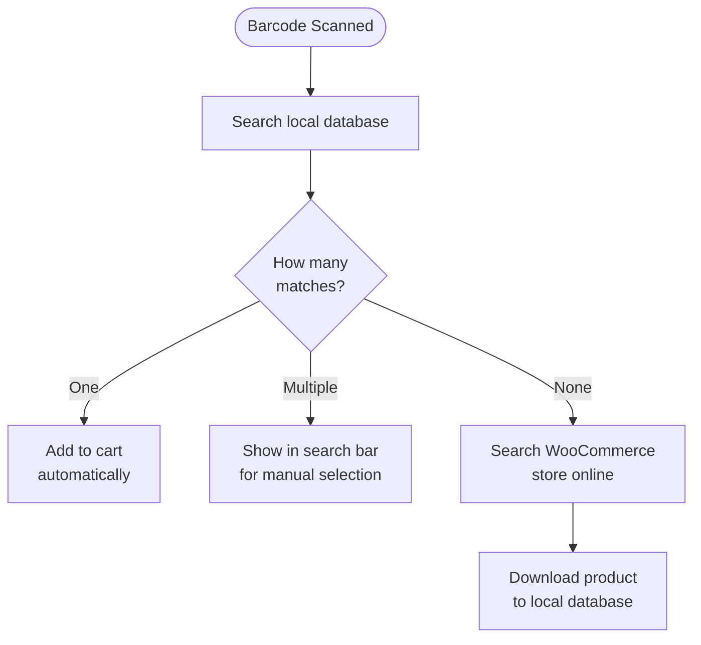

import Image from "@theme/IdealImage";
import Accordion from '@site/src/components/Accordion';
import AccordionItem from '@site/src/components/AccordionItem';

Die meisten Barcode-Scanner verhalten sich wie eine Tastatur, die mit Ihrem Gerät verbunden ist.
Wenn ein Barcode gescannt wird, erkennt WCPOS, dass die Zeichen schneller eingegeben wurden als bei normalem Tippen.
Diese "schnellen Tastatureingaben" werden verwendet, um die Eingabe als Barcode-Scan zu identifizieren.
Das funktioniert mit nahezu jedem Scanner sofort — Scanner unterstützen aber auch andere [Verbindungsmodi](#connection-modes), mit denen sich WCPOS direkt verbinden kann.

## Barcode-Scannen konfigurieren {#configuring-barcode-scanning}

Da ein Barcode-Scan sehr schnell erfolgt, kann der POS zwischen einem Barcode und einer manuell eingegebenen Zeichenfolge unterscheiden.
In den POS-Einstellungen finden Sie Optionen zur Feinabstimmung der Barcode-Erkennung.

  <Image
    alt="Einstellungen für das Barcode-Scannen in den POS-Einstellungen"
    img="/img/barcode-scanning-settings.png"
    style={{ maxHeight: 500 }}
  />
  
Einstellungen für das Barcode-Scannen in den POS-Einstellungen

| Einstellung | Zweck | Typischer Wert |
|---|---|---|
| **Durchschnittliche Eingabezeit** | Wie schnell die Eingabe sein muss, damit sie als Barcode zählt | Ein kurzes Intervall — schnell genug, damit handschriftliches Eintippen es nicht auslöst |
| **Mindestlänge** | Wie lang die fortlaufende Zeichenfolge sein muss, damit sie als Barcode behandelt wird | An den kürzesten verwendeten Barcode anpassen (z. B. 8 für EAN-8) |
| **Entfernung von Präfix/Suffix** | Entfernt zusätzliche Zeichen, die der Scanner hinzufügt (ein Präfix oder Suffix), sodass nur der eigentliche Barcode übrig bleibt | Leer lassen, sofern der Scanner nicht dafür konfiguriert ist, solche Zeichen hinzuzufügen |

## Verbindungsmodi {#connection-modes}

Einen geführten Weg durch Einrichtung und Fehlerbehebung bietet der [Scanner-Einrichtungsassistent](/hardware/scanners/setup-wizard).

Jeder Barcodescanner wird in einem von wenigen Modi ausgeliefert, und der Modus entscheidet, wie WCPOS seine Scans empfangen kann:

| Modus | Wie der Scan ankommt | Einrichtung |
|---|---|---|
| **Tastatur (HID)** — die Werkseinstellung bei nahezu jedem Scanner | Der Scanner „tippt“ den Barcode; WCPOS erkennt die schnellen Tastenanschläge | Keine — koppeln oder anstecken und scannen |
| **Seriell (SPP / USB-COM)** | Eine Direktverbindung zwischen Scanner und WCPOS | Modus des Scanners umschalten, dann in den Barcode-Einstellungen verbinden |
| **HID-POS** | Eine Direktverbindung (USB-Scanner) | Modus des Scanners umschalten, dann in den Barcode-Einstellungen verbinden |

Der Tastaturmodus erfordert keine Einrichtung und ist für die meisten Geschäfte die richtige Wahl. Eine Direktverbindung lohnt sich, wenn Scans gelegentlich verstümmelt ankommen (Verwechslungen von Groß-/Kleinschreibung oder Sonderzeichen durch abweichende Tastaturlayouts) oder an der falschen Stelle landen, weil das Suchfeld nicht fokussiert ist — ein direkt verbundener Scanner liefert jeden Scan unmittelbar an WCPOS, unabhängig von Tippgeschwindigkeit, Tastaturlayout oder Fokus.

:::info Ein Scanner im Tastaturmodus kann nicht direkt verbunden werden
Ihr Gerät behandelt einen Scanner im Tastaturmodus genau wie eine Tastatur, und keine App darf eine Tastatur übernehmen.
Wenn Sie in den Barcode-Einstellungen **Seriellen Scanner verbinden** oder **HID-Scanner verbinden** drücken und Ihr Scanner nicht in der Liste erscheint, befindet er sich mit ziemlicher Sicherheit noch im Tastaturmodus.
:::

**Zum Umschalten des Modus** suchen Sie den Einrichtungs-Barcode im Handbuch Ihres Scanners (achten Sie auf *„SPP mode“*, *„serial mode“* oder *„HID-POS mode“*) und scannen ihn — der Scanner konfiguriert sich selbst um. Bei Bluetooth-Scannern entfernen Sie die alte Kopplung in den Bluetooth-Einstellungen Ihres Geräts und koppeln nach dem Umschalten erneut. Das Scannen des Barcodes *„HID“* bzw. *„keyboard“* aus dem Handbuch schaltet jederzeit zurück.

Direktverbindungen werden derzeit in der Desktop-App und in Chrome-basierten Browsern unterstützt. Unter iOS und Android sind der Tastaturmodus und das Kamera-Scannen die unterstützten Optionen.

## Was passiert, wenn ein Barcode erkannt wird? {#what-happens-when-a-barcode-is-detected}

Wenn der POS einen Barcode erkennt, sucht er in seiner lokalen Datenbank nach einem passenden Produkt oder einer passenden Produktvariante.
Es gibt drei mögliche Ergebnisse:

```mermaid
flowchart TD
    Scan([Barcode Scanned]) --> Lookup[Search local database]
    Lookup --> Check{How many\nmatches?}
    Check -->|One| Cart[Add to cart\nautomatically]
    Check -->|Multiple| Search[Show in search bar\nfor manual selection]
    Check -->|None| Online[Search WooCommerce\nstore online]
    Online --> Download[Download product\nto local database]
```

:::tip Mehrere Übereinstimmungen weisen meist auf ein Datenproblem hin
Wenn mehr als ein Produkt denselben Barcode verwendet, kann der POS nicht erkennen, welches hinzugefügt werden soll. Deshalb wird der Code in die Suchleiste eingefügt, damit eine Auswahl getroffen werden kann. In der Regel ist das ein Hinweis darauf, dass die Produktdaten bereinigt werden müssen — jedes Produkt sollte einen **eindeutigen** Barcode haben.
:::

## Produktsynchronisierung verstehen {#understanding-product-synchronisation}

Der POS lädt Ihren Katalog im Hintergrund in kleinen Stapeln herunter, es befindet sich also nicht von der ersten Minute an jedes Produkt auf dem Gerät — wie das funktioniert, lesen Sie unter [Produktsynchronisierung](/products/sync).

### Warum das für das Barcode-Scannen wichtig ist {#why-it-matters-for-barcode-scanning}

Wenn ein Barcode gescannt wird, der noch nicht lokal gespeichert ist, geht der POS online zu Ihrem WooCommerce-Shop, findet das Produkt und lädt es herunter — derselbe Scan ist beim nächsten Mal also sofort da. Sie müssen nichts tun, um das zu beschleunigen: Die Katalog-Grundbefüllung im Hintergrund ergänzt den Rest Ihres Warenbestands von selbst, und den Fortschritt sehen Sie unter **Shop-Zustand → Datenbank**.

## Häufige Fragen {#faq}

<Accordion>
  <AccordionItem question="Warum wird beim Scannen eines Barcodes '0 Produkte lokal gefunden' angezeigt?">

Nicht alle Produkte befinden sich von Anfang an auf dem Gerät — der POS befüllt Ihren Katalog im Hintergrund während der ersten Minuten der Nutzung.
Wenn das gerade gescannte Produkt noch nicht gespeichert ist, veranlasst der Scan den POS, es online nachzuschlagen und herunterzuladen, sodass es beim nächsten Mal sofort da ist.

  </AccordionItem>

  <AccordionItem question="Kann der POS Barcodes erzeugen und drucken?">

Nein, derzeit nicht. Unser POS ist darauf ausgelegt, vorhandene Barcodes zu scannen und zu lesen, enthaelt aber keine Funktion zum Erstellen oder Drucken von Barcodes.
Wenn Barcodes fuer Ihre Produkte erstellt werden muessen, koennen Sie WooCommerce-Plugins von Drittanbietern verwenden, die auf die Erstellung und den Druck von Barcodes spezialisiert sind. Einige Beispiele:

- [EAN for WooCommerce](https://wordpress.org/plugins/ean-for-woocommerce/)
- [A4 Barcode Generator](https://wordpress.org/plugins/a4-barcode-generator/)

Nachdem Barcodes fuer Ihre Produkte erstellt wurden, koennen sie an der Kasse einfach gescannt werden, um den Kassenvorgang im POS zu beschleunigen.

  </AccordionItem>
</Accordion>
