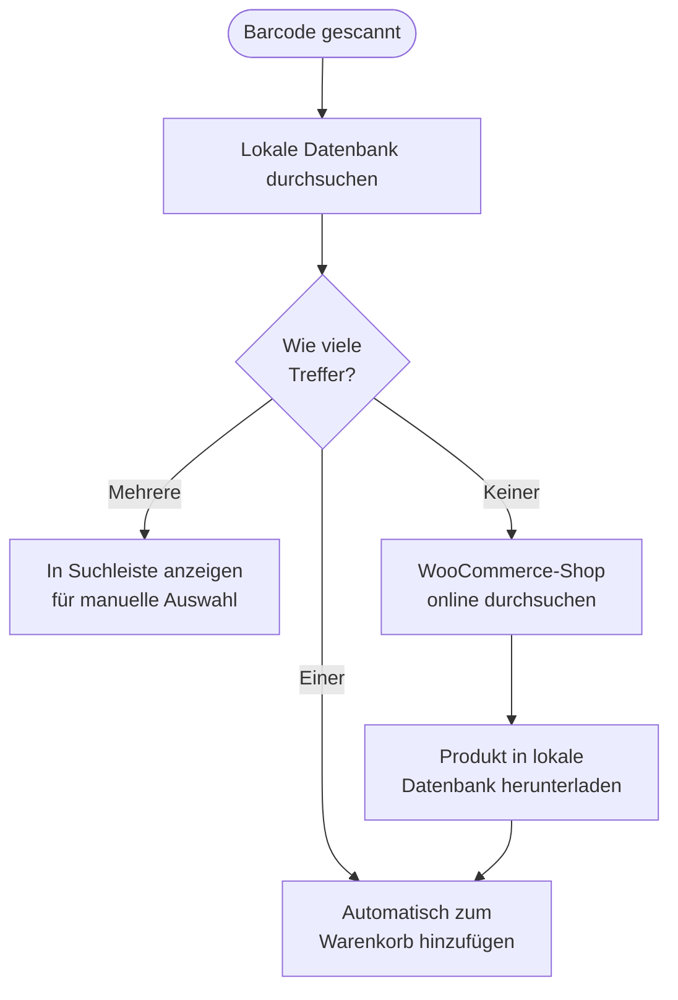

import Image from "@theme/IdealImage";
import Accordion from '@site/src/components/Accordion';
import AccordionItem from '@site/src/components/AccordionItem';

Die meisten Barcode-Scanner verhalten sich wie eine mit Ihrem Gerät verbundene Tastatur.
Wenn Sie einen Barcode scannen, erkennt WCPOS, dass die Zeichen schneller eingegeben wurden als bei normalem Tippen.
Es nutzt diese „schnellen Tastenanschläge“, um die Eingabe als Barcode-Scan zu identifizieren.
Das funktioniert mit nahezu jedem Scanner sofort — Scanner unterstützen aber auch andere [Verbindungsmodi](#connection-modes), mit denen sich WCPOS direkt verbinden kann.

## Barcode-Scannen konfigurieren {#configuring-barcode-scanning}

Da ein Barcode-Scan sehr schnell erfolgt, kann das POS zwischen einem Barcode und einer manuell eingegebenen Eingabe unterscheiden.
In den POS-Einstellungen finden Sie Optionen zur Feinabstimmung der Barcode-Erkennung.

  <Image
    alt="Einstellungen für das Barcode-Scannen in den POS-Einstellungen"
    img="/img/barcode-scanning-settings.png"
    style={{ maxHeight: 500 }}
  />
  
Einstellungen für das Barcode-Scannen in den POS-Einstellungen

| Einstellung | Zweck | Typischer Wert |
|---|---|---|
| **Durchschnittliche Eingabezeit** | Wie schnell die Eingabe sein muss, um als Barcode zu zählen | Ein kurzes Intervall — schnell genug, dass manuelles Tippen es nicht auslöst |
| **Mindestlänge** | Wie lang die fortlaufende Zeichenfolge sein muss, um als Barcode behandelt zu werden | An den kürzesten verwendeten Barcode anpassen (z. B. 8 für EAN-8) |
| **Entfernung von Präfix/Suffix** | Entfernt zusätzliche Zeichen, die Ihr Scanner hinzufügt (ein Präfix oder Suffix), sodass nur der eigentliche Barcode übrig bleibt | Leer lassen, sofern Ihr Scanner nicht dafür konfiguriert ist, solche Zeichen hinzuzufügen |

## Verbindungsmodi {#connection-modes}

Einen geführten Weg durch Einrichtung oder Fehlerbehebung bietet der [Scanner-Einrichtungsassistent](/hardware/scanners/setup-wizard).

Jeder Barcode-Scanner wird in einem von wenigen Modi ausgeliefert, und der Modus entscheidet, wie WCPOS seine Scans empfangen kann:

| Modus | Wie er ankommt | Einrichtung |
|---|---|---|
| **Tastatur (HID)** — die Werkseinstellung bei nahezu jedem Scanner | Der Scanner „tippt“ den Barcode; WCPOS erkennt die schnellen Tastenanschläge | Keine — koppeln oder anstecken und scannen |
| **Seriell (SPP / USB-COM)** | Eine Direktverbindung über USB-Seriell oder Bluetooth SPP | Modus des Scanners umschalten, dann in den Barcode-Einstellungen verbinden |
| **HID-POS** | Eine Direktverbindung für USB-Scanner (über WebHID) | Modus des Scanners umschalten, dann in den Barcode-Einstellungen verbinden |
| **Bluetooth LE (Hersteller-GATT)** | Eine direkte Bluetooth-Low-Energy-Verbindung | Scanner koppeln, dann in den Barcode-Einstellungen anhand seiner Dienst-UUID hinzufügen |

Der Tastaturmodus benötigt keine Einrichtung und ist für die meisten Geschäfte die richtige Wahl. Eine Direktverbindung lohnt sich, wenn Scans gelegentlich verstümmelt ankommen (Verwechslungen von Groß-/Kleinschreibung oder Sonderzeichen durch abweichende Tastaturlayouts) oder an der falschen Stelle landen, wenn das Suchfeld nicht fokussiert ist — ein direkt verbundener Scanner liefert jeden Scan unmittelbar an WCPOS, unabhängig von Tippgeschwindigkeit, Tastaturlayout oder Fokus.

:::info Ein Scanner im Tastaturmodus kann nicht direkt verbunden werden
Ihr Gerät behandelt einen Scanner im Tastaturmodus genau wie eine Tastatur, und keine App darf eine Tastatur übernehmen.
Wenn Sie in den Barcode-Einstellungen **Seriellen Scanner verbinden** oder **HID-Scanner verbinden** drücken und Ihr Scanner nicht in der Liste erscheint, befindet er sich mit ziemlicher Sicherheit noch im Tastaturmodus.
:::

**Zum Umschalten des Modus** suchen Sie den Einrichtungs-Barcode im Handbuch Ihres Scanners (achten Sie auf *„SPP mode“*, *„serial mode“* oder *„HID-POS mode“*) und scannen ihn — der Scanner konfiguriert sich selbst um. Bei Bluetooth-Scannern entfernen Sie die alte Kopplung in den Bluetooth-Einstellungen Ihres Geräts und koppeln nach dem Umschalten erneut. Das Scannen des Barcodes *„HID“* bzw. *„keyboard“* aus dem Handbuch schaltet jederzeit zurück.

Direktverbindungen werden in der Desktop-App und in Chrome-basierten Browsern unterstützt (über die Web-Serial- und WebHID-Unterstützung des Browsers). Die Desktop-App zeigt einen Geräteauswähler innerhalb der App an; Chrome zeigt seinen eigenen Geräteauswähler. Unter iOS und Android sind der Tastaturmodus und das Kamera-Scannen die unterstützten Optionen, und Android fängt zusätzlich die Tasteneingabe von Hardware-Scannern direkt ab.

## Kamera-Scannen {#camera-scanning}

Jede Plattform — Web, Desktop, iOS und Android — kann mit der Gerätekamera scannen, sodass Sie keinen dedizierten Scanner benötigen, um loszulegen. Öffnen Sie die Kamera über das Scan-Symbol in der Suchleiste; sie erscheint als **größenveränderbares Panel direkt unterhalb der Filter**, sodass die Produktliste während des Scannens sichtbar bleibt. Richten Sie die Kamera auf einen Barcode und WCPOS liest ihn genau so, wie es einen Hardware-Scan lesen würde.

## Was passiert, wenn ein Barcode erkannt wird? {#what-happens-when-a-barcode-is-detected}

Wenn das POS einen Barcode erkennt, sucht es in seiner lokalen Datenbank nach einem passenden Produkt oder einer passenden Produktvariation.
Es gibt drei mögliche Ergebnisse:

```mermaid
flowchart TD
    Scan([Barcode gescannt]) --> Lookup[Lokale Datenbank durchsuchen]
    Lookup --> Check{Wie viele\nTreffer?}
    Check -->|Einer| Cart[Automatisch zum\nWarenkorb hinzufügen]
    Check -->|Mehrere| Search[In Suchleiste anzeigen\nfür manuelle Auswahl]
    Check -->|Keiner| Online[WooCommerce-Shop\nonline durchsuchen]
    Online --> Download[Produkt in lokale\nDatenbank herunterladen]
    Download --> Cart
```

Wenn ein Scan keine lokale Übereinstimmung findet, weicht WCPOS auf Ihren Shop online aus, lädt das passende Produkt herunter und **fügt es automatisch dem Warenkorb hinzu** — sodass ein unbekannter Barcode den Verkauf trotzdem abschließt und derselbe Scan beim nächsten Mal sofort da ist.

:::tip Mehrere Übereinstimmungen weisen meist auf ein Datenproblem hin
Wenn mehr als ein Produkt denselben Barcode verwendet, kann das POS nicht erkennen, welches hinzugefügt werden soll, und legt den Code daher in die Suchleiste, damit Sie wählen können. Wenn das passiert, ist es meist ein Zeichen dafür, dass Ihre Produktdaten bereinigt werden müssen — jedes Produkt sollte einen **eindeutigen** Barcode haben.
:::

## Scan-Rückmeldung und -Verhalten {#scan-feedback-and-behaviour}

- **Scan-Töne** — WCPOS kann bei jedem Scan einen Ton abspielen, damit Kassierer eine sofortige Bestätigung erhalten, ohne auf den Bildschirm zu sehen. Töne sind optional und bieten eine Auswahl an Themen; aktivieren Sie sie und wählen Sie ein Thema in den [Barcode-Einstellungen](/settings/store/barcode).
- **Auf dem Bestellbildschirm** — Scans werden an das Suchfeld für Bestellungen weitergeleitet, sodass Sie einen Barcode scannen können, um die gesuchte Bestellung oder das gesuchte Produkt zu finden.
- **UPC-A-Barcodes** — ein UPC-A-Scan wird zu den auf der Verpackung aufgedruckten Ziffern aufgelöst, sodass der Wert, den das POS abgleicht, derselbe ist, den Ihre Produktdaten verwenden.

## Produktsynchronisierung verstehen {#understanding-product-synchronisation}

Das POS lädt Ihren Katalog im Hintergrund in kleinen Stapeln herunter, es befindet sich also nicht von der ersten Minute an jedes Produkt auf dem Gerät — wie das funktioniert, lesen Sie unter [Produktsynchronisierung](/products/sync).

### Warum das für das Barcode-Scannen wichtig ist {#why-it-matters-for-barcode-scanning}

Wenn Sie einen Barcode scannen, der noch nicht lokal gespeichert ist, geht das POS online zu Ihrem WooCommerce-Shop, findet das Produkt und lädt es herunter — sodass derselbe Scan beim nächsten Mal sofort da ist. Sie müssen nichts tun, um das zu beschleunigen: Die Katalog-Grundbefüllung im Hintergrund ergänzt den Rest Ihres Warenbestands von selbst, und den Fortschritt sehen Sie unter **Shop-Zustand → Datenbank**.

## F.A.Q. {#faq}

<Accordion>
  <AccordionItem question="Warum wird beim Scannen eines Barcodes '0 Produkte lokal gefunden' angezeigt?">

Nicht alle Produkte befinden sich von Anfang an auf dem Gerät — das POS befüllt Ihren Katalog im Hintergrund während der ersten Minuten der Nutzung.
Wenn das gerade gescannte Produkt noch nicht gespeichert ist, veranlasst der Scan das POS, es online nachzuschlagen und herunterzuladen, sodass es beim nächsten Mal sofort da ist.

  </AccordionItem>

  <AccordionItem question="Erzeugt und druckt das POS Barcodes?">

Nein, derzeit nicht. Unser POS ist darauf ausgelegt, vorhandene Barcodes zu scannen und zu lesen, enthält aber keine Funktion zum Erstellen oder Drucken von Barcodes.
Wenn Sie Barcodes für Ihre Produkte erzeugen müssen, können Sie WooCommerce-Plugins von Drittanbietern verwenden, die auf die Erstellung und den Druck von Barcodes spezialisiert sind. Einige Beispiele:

- [EAN for WooCommerce](https://wordpress.org/plugins/ean-for-woocommerce/)
- [A4 Barcode Generator](https://wordpress.org/plugins/a4-barcode-generator/)

Nachdem Sie Barcodes für Ihre Produkte erzeugt haben, können Sie sie an der Kasse einfach scannen, um den Kassenvorgang im POS zu beschleunigen.

  </AccordionItem>
</Accordion>
