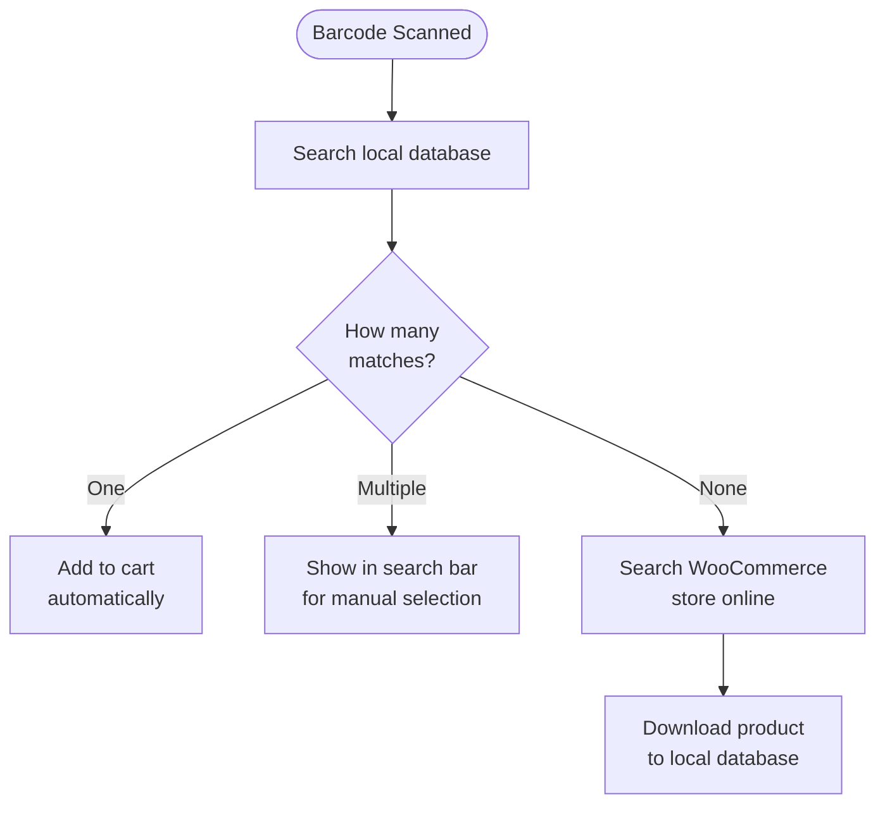

import Image from "@theme/IdealImage";
import Accordion from '@site/src/components/Accordion';
import AccordionItem from '@site/src/components/AccordionItem';

La mayoría de los escáneres de códigos de barras funcionan como un teclado conectado al dispositivo.
Al escanear un código de barras, WCPOS detecta que los caracteres se ingresaron más rápido que una escritura normal.
Utiliza estas "pulsaciones rápidas de teclas" para identificar la entrada como un escaneo de código de barras.

## Configuración del escaneo de códigos de barras {#configuring-barcode-scanning}

Dado que el escaneo de un código de barras ocurre muy rápido, el POS puede distinguir entre un código de barras y texto ingresado manualmente.
En la configuración del POS se encuentran opciones para ajustar con precisión el funcionamiento de la detección de códigos de barras.

  <Image
    alt="Ajustes de escaneo de códigos de barras en la configuración del POS"
    img="/img/barcode-scanning-settings.png"
    style={{ maxHeight: 500 }}
  />
  
Ajustes de escaneo de códigos de barras en la configuración del POS

| Ajuste | Propósito | Valor típico |
|---|---|---|
| **Tiempo promedio de entrada** | Velocidad mínima de entrada para considerarse un código de barras | Un intervalo corto, lo suficientemente rápido para que la escritura manual no lo active |
| **Longitud mínima** | Longitud mínima de la cadena continua de caracteres para considerarse un código de barras | Debe coincidir con el código de barras más corto en uso (p. ej., 8 para EAN-8) |
| **Eliminación de prefijo/sufijo** | Elimina los caracteres adicionales que el escáner añade (un prefijo o sufijo) para que solo quede el código de barras principal | Dejar vacío a menos que el escáner esté configurado para añadirlos |

## ¿Qué sucede cuando se detecta un código de barras? {#what-happens-when-a-barcode-is-detected}

Cuando el POS detecta un código de barras, busca en su base de datos local un producto o variación de producto que coincida.
Hay tres resultados posibles:

:::tip Las coincidencias múltiples suelen indicar un problema con los datos
Si más de un producto comparte el mismo código de barras, el POS no puede determinar cuál añadir, por lo que coloca el código en la barra de búsqueda para que se seleccione manualmente. Cuando esto ocurre, generalmente indica que los datos de productos necesitan una revisión: cada producto debe tener un código de barras **único**.
:::

## Sincronización de productos {#understanding-product-synchronisation}

### Descarga progresiva de productos {#progressive-product-downloading}

WCPOS no carga todos los productos de una sola vez.
En su lugar, los descarga en pequeños lotes.
Este enfoque evita ralentizaciones y garantiza que la tienda funcione sin problemas.
Con el tiempo, a medida que se utiliza el POS y se realizan búsquedas, más productos se almacenan localmente en el dispositivo.

Consulte [Sincronización de productos](/products/sync) para obtener más detalles.

### Por qué es importante para el escaneo de códigos de barras {#why-it-matters-for-barcode-scanning}

Cuando se escanea un código de barras que aún no está almacenado localmente, el POS se conectará en línea a la tienda WooCommerce para buscarlo.
Como parte de este proceso, descargará ese producto (y otros en pequeños lotes) y los guardará.
Esto significa que, con el tiempo, el POS se vuelve más rápido y eficiente a medida que más productos se almacenan localmente.

### Cómo acelerar el proceso {#how-to-speed-up-the-process}

Simplemente buscar productos en el POS ayuda a descargar más inventario.
Cuanto más se utilice la búsqueda — y cuanto más se escanee — más completa será la base de datos local.

## Preguntas frecuentes {#faq}

<Accordion>
  <AccordionItem question="¿Por qué aparece '0 productos encontrados localmente' al escanear un código de barras?">

No todos los productos están disponibles localmente desde el inicio.
El POS descarga gradualmente los productos de la tienda en línea y los almacena en el dispositivo.
Si el producto escaneado aún no está almacenado, la búsqueda hace que el POS lo consulte en línea y lo descargue para que esté disponible en el futuro.

  </AccordionItem>

  <AccordionItem question="¿El POS genera e imprime códigos de barras?">

No, no en este momento. El POS está diseñado para escanear y leer códigos de barras existentes, pero no incluye funcionalidad para crearlos o imprimirlos.
Para generar códigos de barras para los productos, es posible utilizar plugins de WooCommerce de terceros especializados en la creación e impresión de códigos de barras. Algunos ejemplos incluyen:

- [EAN for WooCommerce](https://wordpress.org/plugins/ean-for-woocommerce/)
- [A4 Barcode Generator](https://wordpress.org/plugins/a4-barcode-generator/)

Una vez generados los códigos de barras para los productos, es posible escanearlos en la caja para agilizar el proceso de cobro en el POS.

  </AccordionItem>
</Accordion>
