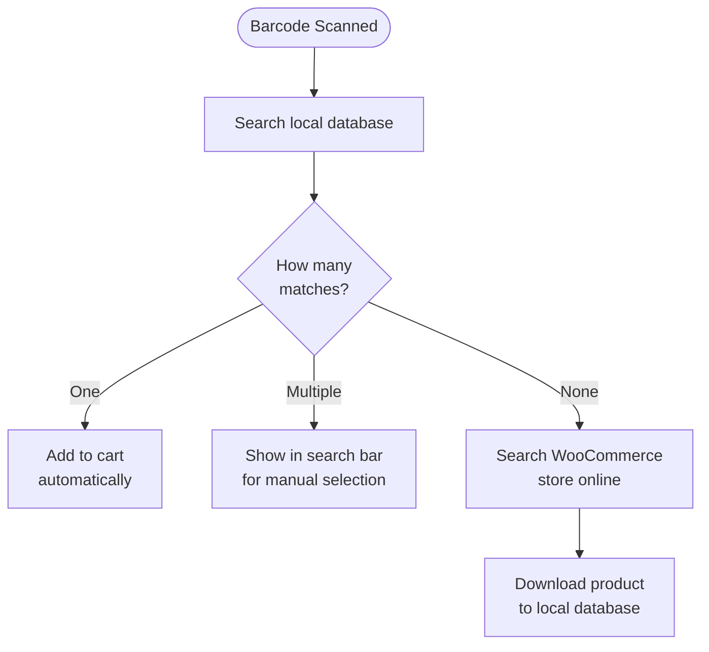

import Image from "@theme/IdealImage";
import Accordion from '@site/src/components/Accordion';
import AccordionItem from '@site/src/components/AccordionItem';

La mayoría de los escáneres de códigos de barras funcionan como un teclado conectado al dispositivo.
Al escanear un código de barras, WCPOS detecta que los caracteres se ingresaron más rápido que una escritura normal.
Utiliza estas "pulsaciones rápidas de teclas" para identificar la entrada como un escaneo de código de barras.
Esto funciona sin configuración con casi cualquier escáner, pero los escáneres también admiten otros [modos de conexión](#connection-modes) a los que WCPOS puede conectarse directamente.

## Configuración del escaneo de códigos de barras {#configuring-barcode-scanning}

Dado que el escaneo de un código de barras ocurre muy rápido, el POS puede distinguir entre un código de barras y texto ingresado manualmente.
En la configuración del POS se encuentran opciones para ajustar con precisión el funcionamiento de la detección de códigos de barras.

  <Image
    alt="Ajustes de escaneo de códigos de barras en la configuración del POS"
    img="/img/barcode-scanning-settings.png"
    style={{ maxHeight: 500 }}
  />
  
Ajustes de escaneo de códigos de barras en la configuración del POS

| Ajuste | Propósito | Valor típico |
|---|---|---|
| **Tiempo promedio de entrada** | Velocidad mínima de entrada para considerarse un código de barras | Un intervalo corto, lo suficientemente rápido para que la escritura manual no lo active |
| **Longitud mínima** | Longitud mínima de la cadena continua de caracteres para considerarse un código de barras | Debe coincidir con el código de barras más corto en uso (p. ej., 8 para EAN-8) |
| **Eliminación de prefijo/sufijo** | Elimina los caracteres adicionales que el escáner añade (un prefijo o sufijo) para que solo quede el código de barras principal | Dejar vacío a menos que el escáner esté configurado para añadirlos |

## Modos de conexión {#connection-modes}

Para seguir una ruta guiada de configuración o de resolución de problemas, utilice el [Asistente de configuración del escáner](/hardware/scanner-setup-wizard).

Todos los escáneres de códigos de barras se entregan en uno de estos modos, y el modo determina cómo puede recibir WCPOS sus escaneos:

| Modo | Cómo llega | Configuración |
|---|---|---|
| **Teclado (HID)** — el valor de fábrica en casi todos los escáneres | El escáner «escribe» el código de barras; WCPOS reconoce las pulsaciones rápidas | Ninguna: empareje o conecte el escáner y escanee |
| **Serie (SPP / USB-COM)** | Una conexión directa entre el escáner y WCPOS | Cambie el modo del escáner y luego conéctelo en los ajustes de códigos de barras |
| **HID-POS** | Una conexión directa (escáneres USB) | Cambie el modo del escáner y luego conéctelo en los ajustes de códigos de barras |

El modo teclado no requiere configuración y es la opción adecuada para la mayoría de las tiendas. Una conexión directa merece la pena si los escaneos llegan a veces distorsionados (confusiones de mayúsculas o símbolos por diferencias de distribución de teclado) o acaban en el lugar equivocado cuando el cuadro de búsqueda no tiene el foco: un escáner conectado directamente entrega cada escaneo directamente a WCPOS, independientemente de la velocidad de escritura, la distribución del teclado o el foco.

:::info Un escáner en modo teclado no se puede conectar directamente
Su dispositivo trata a un escáner en modo teclado exactamente igual que a un teclado, y ninguna aplicación puede apropiarse de un teclado.
Si pulsa **Conectar escáner serie** o **Conectar escáner HID** en los ajustes de códigos de barras y su escáner no aparece en la lista, casi con toda seguridad sigue en modo teclado.
:::

**Para cambiar de modo**, busque el código de barras de configuración en el manual del escáner (busque *«modo SPP»*, *«modo serie»* o *«modo HID-POS»*) y escanéelo: el escáner se reconfigura solo. En los escáneres Bluetooth, olvide el emparejamiento anterior en los ajustes de Bluetooth del dispositivo y vuelva a emparejar tras el cambio. Escanear el código de barras *«HID»* o *«teclado»* del manual lo devuelve al estado anterior en cualquier momento.

Las conexiones directas son compatibles actualmente con la aplicación de escritorio y con los navegadores basados en Chrome. En iOS y Android, las opciones admitidas son el modo teclado y el escaneo por cámara.

## ¿Qué sucede cuando se detecta un código de barras? {#what-happens-when-a-barcode-is-detected}

Cuando el POS detecta un código de barras, busca en su base de datos local un producto o variación de producto que coincida.
Hay tres resultados posibles:

```mermaid
flowchart TD
    Scan([Barcode Scanned]) --> Lookup[Search local database]
    Lookup --> Check{How many\nmatches?}
    Check -->|One| Cart[Add to cart\nautomatically]
    Check -->|Multiple| Search[Show in search bar\nfor manual selection]
    Check -->|None| Online[Search WooCommerce\nstore online]
    Online --> Download[Download product\nto local database]
```

:::tip Las coincidencias múltiples suelen indicar un problema con los datos
Si más de un producto comparte el mismo código de barras, el POS no puede determinar cuál añadir, por lo que coloca el código en la barra de búsqueda para que se seleccione manualmente. Cuando esto ocurre, generalmente indica que los datos de productos necesitan una revisión: cada producto debe tener un código de barras **único**.
:::

## Sincronización de productos {#understanding-product-synchronisation}

El POS descarga el catálogo en pequeños lotes en segundo plano, por lo que no todos los productos están en el dispositivo desde el primer minuto — consulte [Sincronización de productos](/products/sync) para saber cómo funciona.

### Por qué es importante para el escaneo de códigos de barras {#why-it-matters-for-barcode-scanning}

Cuando se escanea un código de barras que aún no está almacenado localmente, el POS se conecta en línea a la tienda WooCommerce, encuentra ese producto y lo descarga, de modo que el mismo escaneo es instantáneo la próxima vez. No hay que hacer nada para acelerarlo: la siembra del catálogo en segundo plano completa el resto del inventario por sí sola, y el progreso se puede consultar en **Estado de la tienda → Base de datos**.

## Preguntas frecuentes {#faq}

<Accordion>
  <AccordionItem question="¿Por qué aparece '0 productos encontrados localmente' al escanear un código de barras?">

No todos los productos están en el dispositivo desde el inicio: el POS siembra el catálogo en segundo plano durante sus primeros minutos de uso.
Si el producto escaneado aún no está almacenado, el escaneo hace que el POS lo consulte en línea y lo descargue, de modo que sea instantáneo la próxima vez.

  </AccordionItem>

  <AccordionItem question="¿El POS genera e imprime códigos de barras?">

No, no en este momento. El POS está diseñado para escanear y leer códigos de barras existentes, pero no incluye funcionalidad para crearlos o imprimirlos.
Para generar códigos de barras para los productos, es posible utilizar plugins de WooCommerce de terceros especializados en la creación e impresión de códigos de barras. Algunos ejemplos incluyen:

- [EAN for WooCommerce](https://wordpress.org/plugins/ean-for-woocommerce/)
- [A4 Barcode Generator](https://wordpress.org/plugins/a4-barcode-generator/)

Una vez generados los códigos de barras para los productos, es posible escanearlos en la caja para agilizar el proceso de cobro en el POS.

  </AccordionItem>
</Accordion>
