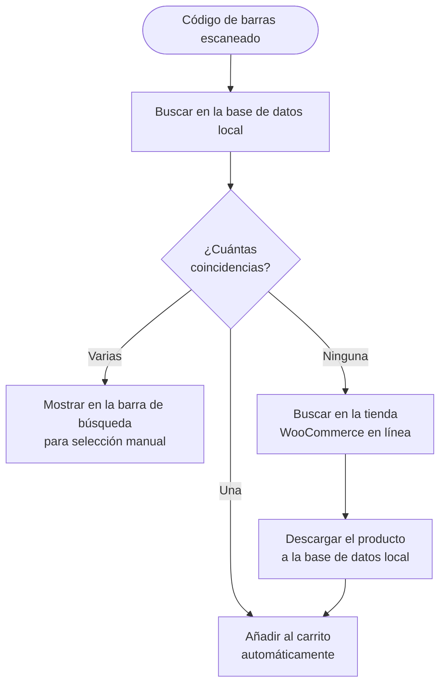

import Image from "@theme/IdealImage";
import Accordion from '@site/src/components/Accordion';
import AccordionItem from '@site/src/components/AccordionItem';

La mayoría de los escáneres de códigos de barras se comportan como un teclado conectado a su dispositivo.
Al escanear un código de barras, WCPOS detecta que los caracteres se introdujeron más rápido que una escritura normal.
Usa estas "pulsaciones rápidas de teclas" para identificar la entrada como un escaneo de código de barras.
Esto funciona sin configuración con casi cualquier escáner — pero los escáneres también admiten otros [modos de conexión](#connection-modes) a los que WCPOS puede conectarse directamente.

## Configuración del escaneo de códigos de barras {#configuring-barcode-scanning}

Dado que un escaneo de código de barras ocurre muy rápido, el POS puede distinguir entre un código de barras y algo escrito a mano.
En los ajustes del POS encontrará opciones para ajustar con precisión el funcionamiento de la detección de códigos de barras.

  <Image
    alt="Ajustes de escaneo de códigos de barras en los ajustes del POS"
    img="/img/barcode-scanning-settings.png"
    style={{ maxHeight: 500 }}
  />
  
Ajustes de escaneo de códigos de barras en los ajustes del POS

| Ajuste | Propósito | Valor típico |
|---|---|---|
| **Tiempo medio de entrada** | Qué tan rápida debe ser la entrada para contar como un código de barras | Un intervalo corto — lo bastante rápido para que la escritura manual no lo active |
| **Longitud mínima** | Qué longitud debe tener la cadena continua de caracteres para tratarse como un código de barras | Debe coincidir con el código de barras más corto que use (p. ej., 8 para EAN-8) |
| **Eliminación de prefijo/sufijo** | Elimina los caracteres adicionales que su escáner añade (un prefijo o sufijo) para que solo quede el código de barras principal | Déjelo vacío a menos que su escáner esté configurado para añadirlos |

## Modos de conexión {#connection-modes}

Para seguir una ruta guiada de configuración o resolución de problemas, utilice el [Asistente de configuración del escáner](/hardware/scanners/setup-wizard).

Todos los escáneres de códigos de barras se entregan en uno de unos pocos modos, y el modo determina cómo puede recibir WCPOS sus escaneos:

| Modo | Cómo llega | Configuración |
|---|---|---|
| **Teclado (HID)** — el valor de fábrica en casi todos los escáneres | El escáner "escribe" el código de barras; WCPOS reconoce las pulsaciones rápidas | Ninguna — empareje o conecte y escanee |
| **Serie (SPP / USB-COM)** | Una conexión directa por serie USB o Bluetooth SPP | Cambie el modo del escáner y luego conéctelo en los ajustes de códigos de barras |
| **HID-POS** | Una conexión directa para escáneres USB (mediante WebHID) | Cambie el modo del escáner y luego conéctelo en los ajustes de códigos de barras |
| **Bluetooth LE (GATT del fabricante)** | Una conexión Bluetooth Low Energy directa | Empareje el escáner y luego añádalo en los ajustes de códigos de barras por su UUID de servicio |

El modo teclado no necesita configuración y es la opción adecuada para la mayoría de las tiendas. Una conexión directa merece la pena si los escaneos a veces llegan distorsionados (confusiones de mayúsculas/símbolos por diferencias de distribución de teclado) o acaban en el lugar equivocado cuando el cuadro de búsqueda no tiene el foco — un escáner conectado directamente entrega cada escaneo directamente a WCPOS, independientemente de la velocidad de escritura, la distribución del teclado o el foco.

:::info Un escáner en modo teclado no se puede conectar directamente
Su dispositivo trata a un escáner en modo teclado exactamente igual que a un teclado, y ninguna aplicación puede apropiarse de un teclado.
Si pulsa **Conectar escáner serie** o **Conectar escáner HID** en los ajustes de códigos de barras y su escáner no aparece en la lista, casi con toda seguridad sigue en modo teclado.
:::

**Para cambiar de modo**, busque el código de barras de configuración en el manual de su escáner (busque *"modo SPP"*, *"modo serie"* o *"modo HID-POS"*) y escanéelo — el escáner se reconfigura solo. Para los escáneres Bluetooth, olvide el emparejamiento anterior en los ajustes de Bluetooth de su dispositivo y vuelva a emparejar tras el cambio. Escanear el código de barras *"HID"* o *"teclado"* del manual lo devuelve al estado anterior en cualquier momento.

Las conexiones directas son compatibles con la aplicación de escritorio y los navegadores basados en Chrome (usando la compatibilidad Web Serial y WebHID del navegador). La aplicación de escritorio muestra un selector de dispositivos dentro de la propia aplicación; Chrome muestra su propio selector de dispositivos. En iOS y Android, las opciones admitidas son el modo teclado y el escaneo por cámara, y Android además intercepta directamente la entrada de teclas del escáner de hardware.

## Escaneo por cámara {#camera-scanning}

Todas las plataformas — web, escritorio, iOS y Android — pueden escanear con la cámara del dispositivo, así que no necesita un escáner dedicado para empezar. Abra la cámara desde el icono de escaneo de la barra de búsqueda; aparece como un **panel redimensionable justo debajo de los filtros**, de modo que la lista de productos permanece a la vista mientras escanea. Apunte la cámara a un código de barras y WCPOS lo lee exactamente igual que un escaneo de hardware.

## ¿Qué sucede cuando se detecta un código de barras? {#what-happens-when-a-barcode-is-detected}

Cuando el POS detecta un código de barras, busca en su base de datos local un producto o variación de producto que coincida.
Hay tres resultados posibles:

```mermaid
flowchart TD
    Scan([Código de barras escaneado]) --> Lookup[Buscar en la base de datos local]
    Lookup --> Check{¿Cuántas\ncoincidencias?}
    Check -->|Una| Cart[Añadir al carrito\nautomáticamente]
    Check -->|Varias| Search[Mostrar en la barra de búsqueda\npara selección manual]
    Check -->|Ninguna| Online[Buscar en la tienda\nWooCommerce en línea]
    Online --> Download[Descargar el producto\na la base de datos local]
    Download --> Cart
```

Cuando un escaneo no encuentra ninguna coincidencia local, WCPOS recurre a su tienda en línea, descarga el producto coincidente y **lo añade al carrito automáticamente** — así que un código de barras desconocido igualmente completa la venta, y el mismo escaneo es instantáneo la próxima vez.

:::tip Las coincidencias múltiples suelen indicar un problema con los datos
Si más de un producto comparte el mismo código de barras, el POS no puede saber cuál añadir, así que coloca el código en la barra de búsqueda para que elija. Cuando esto ocurre, suele ser señal de que sus datos de productos necesitan una revisión — cada producto debe tener un código de barras **único**.
:::

## Confirmación y comportamiento del escaneo {#scan-feedback-and-behaviour}

- **Sonidos de escaneo** — WCPOS puede reproducir un sonido en cada escaneo para que los cajeros obtengan confirmación instantánea sin mirar la pantalla. Los sonidos son opcionales y ofrecen a elegir entre varios temas; actívelos y elija un tema en los [Ajustes de códigos de barras](/settings/store/barcode).
- **En la pantalla de Pedidos** — los escaneos se dirigen al campo de búsqueda de Pedidos, así que puede escanear un código de barras para encontrar el pedido o el producto que busca.
- **Códigos de barras UPC-A** — un escaneo UPC-A se resuelve en los dígitos impresos en el paquete, de modo que el valor que el POS compara es el que usan sus datos de producto.

## Comprensión de la sincronización de productos {#understanding-product-synchronisation}

El POS descarga su catálogo en pequeños lotes en segundo plano, así que no todos los productos están en el dispositivo desde el primer minuto — consulte [Sincronización de productos](/products/sync) para saber cómo funciona.

### Por qué es importante para el escaneo de códigos de barras {#why-it-matters-for-barcode-scanning}

Cuando escanea un código de barras que aún no está almacenado localmente, el POS se conecta en línea a su tienda WooCommerce, encuentra ese producto y lo descarga — de modo que el mismo escaneo es instantáneo la próxima vez. No tiene que hacer nada para acelerarlo: la siembra del catálogo en segundo plano completa el resto de su inventario por sí sola, y puede consultar el progreso en **Estado de la tienda → Base de datos**.

## Preguntas frecuentes {#faq}

<Accordion>
  <AccordionItem question="¿Por qué aparece '0 productos encontrados localmente' al escanear un código de barras?">

No todos los productos están en el dispositivo desde el principio — el POS siembra su catálogo en segundo plano durante sus primeros minutos de uso.
Si el producto que acaba de escanear aún no está almacenado, el escaneo hace que el POS lo consulte en línea y lo descargue, de modo que sea instantáneo la próxima vez.

  </AccordionItem>

  <AccordionItem question="¿El POS genera e imprime códigos de barras?">

No, no en este momento. Nuestro POS está diseñado para escanear y leer códigos de barras existentes, pero no incluye funcionalidad para crearlos o imprimirlos.
Si necesita generar códigos de barras para sus productos, puede usar plugins de WooCommerce de terceros especializados en la creación e impresión de códigos de barras. Algunos ejemplos incluyen:

- [EAN for WooCommerce](https://wordpress.org/plugins/ean-for-woocommerce/)
- [A4 Barcode Generator](https://wordpress.org/plugins/a4-barcode-generator/)

Una vez que haya generado códigos de barras para sus productos, puede escanearlos fácilmente en la caja para agilizar el proceso de cobro en el POS.

  </AccordionItem>
</Accordion>
