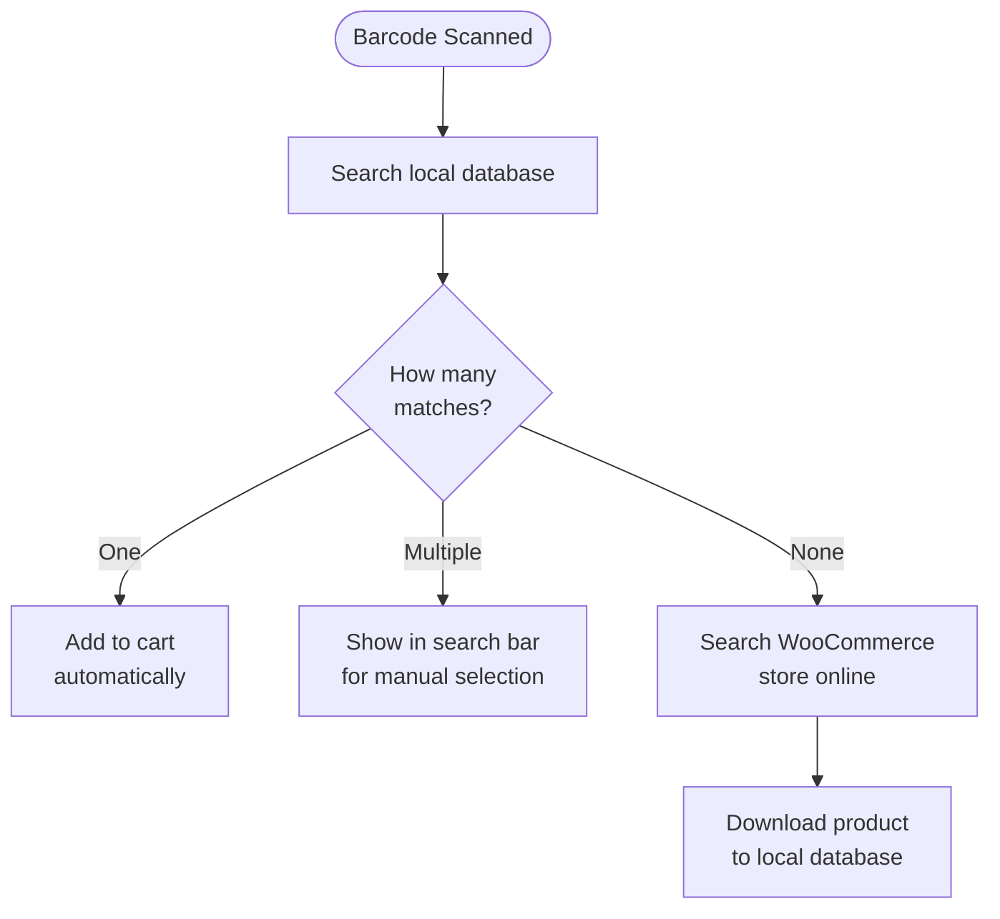

import Image from "@theme/IdealImage";
import Accordion from '@site/src/components/Accordion';
import AccordionItem from '@site/src/components/AccordionItem';

La plupart des scanners de codes-barres se comportent comme un clavier connecté à votre appareil.
Lorsque vous scannez un code-barres, WCPOS détecte que les caractères ont été saisis plus rapidement qu'une frappe normale.
Ces « frappes rapides » permettent d'identifier la saisie comme une lecture de code-barres.

## Configuration de la lecture de codes-barres {#configuring-barcode-scanning}

La lecture d'un code-barres étant très rapide, le PDV peut faire la différence entre un code-barres et une saisie manuelle.
Dans les paramètres du PDV, vous trouverez des options pour ajuster le fonctionnement de la détection des codes-barres.

  <Image
    alt="Paramètres de lecture de codes-barres dans les paramètres du PDV"
    img="/img/barcode-scanning-settings.png"
    style={{ maxHeight: 500 }}
  />
  
Paramètres de lecture de codes-barres dans les paramètres du PDV

| Paramètre | Fonction | Valeur typique |
|---|---|---|
| **Temps de saisie moyen** | Rapidité de saisie requise pour être considérée comme un code-barres | Un intervalle court — suffisamment rapide pour que la saisie manuelle ne le déclenche pas |
| **Longueur minimale** | Longueur minimale de la chaîne de caractères continue pour être traitée comme un code-barres | Correspond au code-barres le plus court que vous utilisez (par ex. 8 pour EAN-8) |
| **Suppression du préfixe/suffixe** | Supprime les caractères supplémentaires ajoutés par le lecteur (un préfixe ou un suffixe) afin de ne conserver que le code-barres principal | Laisser vide sauf si le lecteur est configuré pour en ajouter |

## Que se passe-t-il lorsqu'un code-barres est détecté ? {#what-happens-when-a-barcode-is-detected}

Lorsque le PDV détecte un code-barres, il recherche dans sa base de données locale un produit ou une variation de produit correspondant.
Trois résultats sont possibles :

:::tip Les correspondances multiples indiquent généralement un problème de données
Si plusieurs produits partagent le même code-barres, le PDV ne peut pas déterminer lequel ajouter et place donc le code dans la barre de recherche pour que vous puissiez choisir. Lorsque cela se produit, c'est généralement le signe que vos données produits doivent être corrigées — chaque produit devrait avoir un code-barres **unique**.
:::

## Comprendre la synchronisation des produits {#understanding-product-synchronisation}

### Téléchargement progressif des produits {#progressive-product-downloading}

WCPOS ne charge pas tous les produits en une seule fois.
Il les télécharge plutôt par petits lots.
Cette approche évite les ralentissements et garantit le bon fonctionnement de la boutique.
Au fil du temps, à mesure que le PDV est utilisé et que des recherches sont effectuées, davantage de produits sont stockés localement sur l'appareil.

Consultez [Synchronisation des produits](/products/sync) pour plus de détails.

### Pourquoi c'est important pour la lecture de codes-barres {#why-it-matters-for-barcode-scanning}

Lorsqu'un code-barres scanné n'est pas encore stocké localement, le PDV « passe en ligne » pour le rechercher dans la boutique WooCommerce.
Au cours de ce processus, le produit (ainsi que d'autres, par petits lots) est téléchargé et enregistré.
Cela signifie qu'au fil du temps, le PDV devient plus rapide et plus efficace à mesure que davantage de produits sont stockés localement.

### Comment accélérer le processus {#how-to-speed-up-the-process}

Rechercher des produits dans le PDV permet de télécharger une plus grande partie de l'inventaire.
Plus la recherche est utilisée — et plus de codes-barres sont scannés — plus la base de données locale devient complète.

## F.A.Q. {#faq}

<Accordion>
  <AccordionItem question="Pourquoi le message « 0 produits trouvés localement » s'affiche-t-il lorsque je scanne un code-barres ?">

Tous les produits ne sont pas disponibles localement dès le départ.
Le PDV télécharge progressivement les produits depuis votre boutique en ligne et les stocke sur votre appareil.
Si le produit que vous venez de scanner n'est pas encore stocké, la recherche déclenche une consultation en ligne par le PDV, qui le télécharge ensuite pour qu'il soit disponible à l'avenir.

  </AccordionItem>

  <AccordionItem question="Le PDV génère-t-il et imprime-t-il des codes-barres ?">

Non, pas pour le moment. Notre PDV est conçu pour scanner et lire les codes-barres existants, mais il n'inclut pas de fonctionnalité pour les créer ou les imprimer.
Si vous avez besoin de générer des codes-barres pour vos produits, vous pouvez utiliser des extensions WooCommerce tierces spécialisées dans la création et l'impression de codes-barres. En voici quelques exemples :

- [EAN for WooCommerce](https://wordpress.org/plugins/ean-for-woocommerce/)
- [A4 Barcode Generator](https://wordpress.org/plugins/a4-barcode-generator/)

Une fois les codes-barres générés pour vos produits, vous pouvez les scanner facilement en caisse pour accélérer le processus de paiement dans le PDV.

  </AccordionItem>
</Accordion>
