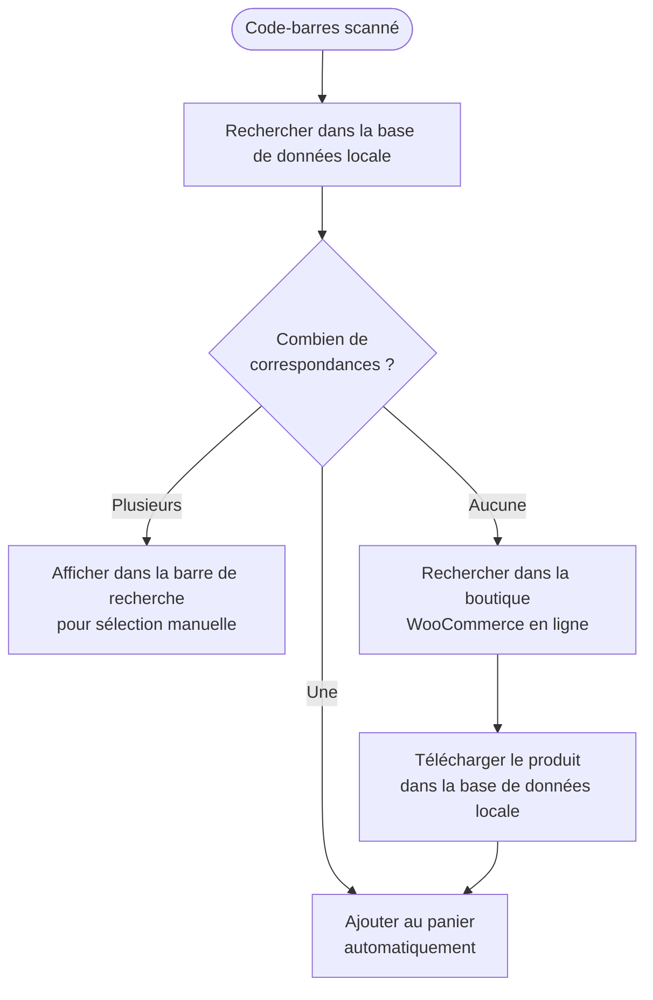

import Image from "@theme/IdealImage";
import Accordion from '@site/src/components/Accordion';
import AccordionItem from '@site/src/components/AccordionItem';

La plupart des lecteurs de codes-barres se comportent comme un clavier connecté à votre appareil.
Lorsque vous scannez un code-barres, WCPOS détecte que les caractères ont été saisis plus rapidement qu'une frappe normale.
Il utilise ces « frappes rapides » pour identifier la saisie comme une lecture de code-barres.
Cela fonctionne d'emblée avec presque tous les lecteurs — mais les lecteurs prennent aussi en charge d'autres [modes de connexion](#connection-modes) auxquels WCPOS peut se connecter directement.

## Configuration de la lecture de codes-barres {#configuring-barcode-scanning}

La lecture d'un code-barres étant très rapide, le PDV peut faire la différence entre un code-barres et une saisie manuelle.
Dans les paramètres du PDV, vous trouverez des options pour ajuster finement le fonctionnement de la détection des codes-barres.

  <Image
    alt="Paramètres de lecture de codes-barres dans les paramètres du PDV"
    img="/img/barcode-scanning-settings.png"
    style={{ maxHeight: 500 }}
  />
  
Paramètres de lecture de codes-barres dans les paramètres du PDV

| Paramètre | Fonction | Valeur typique |
|---|---|---|
| **Temps de saisie moyen** | Rapidité de saisie requise pour être considérée comme un code-barres | Un intervalle court — assez rapide pour que la saisie manuelle ne le déclenche pas |
| **Longueur minimale** | Longueur minimale de la chaîne de caractères continue pour être traitée comme un code-barres | Correspond au code-barres le plus court que vous utilisez (par ex. 8 pour EAN-8) |
| **Suppression du préfixe/suffixe** | Supprime les caractères supplémentaires ajoutés par le lecteur (un préfixe ou un suffixe) afin de ne conserver que le code-barres principal | Laisser vide sauf si le lecteur est configuré pour en ajouter |

## Modes de connexion {#connection-modes}

Pour un parcours guidé de configuration ou de dépannage, utilisez l'[assistant de configuration du lecteur](/hardware/scanners/setup-wizard).

Chaque lecteur de codes-barres est livré dans l'un de quelques modes, et ce mode détermine la façon dont WCPOS peut recevoir ses lectures :

| Mode | Comment la lecture arrive | Configuration |
|---|---|---|
| **Clavier (HID)** — le réglage d'usine de presque tous les lecteurs | Le lecteur « tape » le code-barres ; WCPOS reconnaît les frappes rapides | Aucune — appairez ou branchez, puis scannez |
| **Série (SPP / USB-COM)** | Une connexion directe via série USB ou Bluetooth SPP | Changez le mode du lecteur, puis connectez-le dans les paramètres Code-barres |
| **HID-POS** | Une connexion directe pour les lecteurs USB (via WebHID) | Changez le mode du lecteur, puis connectez-le dans les paramètres Code-barres |
| **Bluetooth LE (GATT du fabricant)** | Une connexion directe Bluetooth Low Energy | Appairez le lecteur, puis ajoutez-le dans les paramètres Code-barres par son UUID de service |

Le mode clavier ne nécessite aucune configuration et convient à la plupart des boutiques. Une connexion directe vaut la peine si les lectures arrivent parfois déformées (confusions de majuscules ou de symboles dues aux différences de disposition clavier) ou aboutissent au mauvais endroit lorsque le champ de recherche n'a pas le focus — un lecteur connecté directement transmet chaque lecture directement à WCPOS, quels que soient la vitesse de frappe, la disposition du clavier ou le focus.

:::info Un lecteur en mode clavier ne peut pas être connecté directement
Votre appareil traite un lecteur en mode clavier exactement comme un clavier, et aucune application n'est autorisée à prendre le contrôle d'un clavier.
Si vous appuyez sur **Connecter un lecteur série** ou **Connecter un lecteur HID** dans les paramètres Code-barres et que votre lecteur n'apparaît pas dans la liste, c'est presque certainement qu'il est encore en mode clavier.
:::

**Pour changer de mode**, trouvez le code-barres de configuration dans le manuel de votre lecteur (cherchez *« mode SPP »*, *« mode série »* ou *« mode HID-POS »*) et scannez-le — le lecteur se reconfigure lui-même. Pour les lecteurs Bluetooth, oubliez l'ancien appairage dans les paramètres Bluetooth de votre appareil et appairez-le à nouveau après le changement. Scanner le code-barres *« HID »* ou *« clavier »* du manuel permet de revenir en arrière à tout moment.

Les connexions directes sont prises en charge dans l'application de bureau et les navigateurs basés sur Chrome (grâce à la prise en charge Web Serial et WebHID du navigateur). L'application de bureau affiche un sélecteur d'appareil à l'intérieur de l'application ; Chrome affiche son propre sélecteur d'appareil. Sur iOS et Android, le mode clavier et la lecture par caméra sont les options prises en charge, et Android intercepte en outre directement la saisie clavier des lecteurs matériels.

## Lecture par caméra {#camera-scanning}

Toutes les plateformes — web, bureau, iOS et Android — peuvent scanner avec la caméra de l'appareil, vous n'avez donc pas besoin d'un lecteur dédié pour commencer. Ouvrez la caméra depuis l'icône de scan dans la barre de recherche ; elle apparaît sous la forme d'un **panneau redimensionnable directement sous les filtres**, de sorte que la liste des produits reste visible pendant que vous scannez. Pointez la caméra vers un code-barres et WCPOS le lit exactement comme il le ferait pour une lecture matérielle.

## Que se passe-t-il lorsqu'un code-barres est détecté ? {#what-happens-when-a-barcode-is-detected}

Lorsque le PDV détecte un code-barres, il recherche dans sa base de données locale un produit ou une variation de produit correspondant.
Trois résultats sont possibles :

```mermaid
flowchart TD
    Scan([Code-barres scanné]) --> Lookup[Rechercher dans la base de données locale]
    Lookup --> Check{Combien de\ncorrespondances ?}
    Check -->|Une| Cart[Ajouter au panier\nautomatiquement]
    Check -->|Plusieurs| Search[Afficher dans la barre de recherche\npour sélection manuelle]
    Check -->|Aucune| Online[Rechercher dans la boutique\nWooCommerce en ligne]
    Online --> Download[Télécharger le produit\ndans la base de données locale]
    Download --> Cart
```

Lorsqu'une lecture ne trouve aucune correspondance locale, WCPOS se replie sur votre boutique en ligne, télécharge le produit correspondant et **l'ajoute automatiquement au panier** — ainsi, un code-barres inconnu permet tout de même de finaliser la vente, et la même lecture est instantanée la fois suivante.

:::tip Les correspondances multiples indiquent généralement un problème de données
Si plusieurs produits partagent le même code-barres, le PDV ne peut pas déterminer lequel ajouter et place donc le code dans la barre de recherche pour que vous puissiez choisir. Lorsque cela se produit, c'est généralement le signe que vos données produits doivent être corrigées — chaque produit devrait avoir un code-barres **unique**.
:::

## Retour de scan et comportement {#scan-feedback-and-behaviour}

- **Sons de scan** — WCPOS peut jouer un son à chaque lecture pour que les caissiers obtiennent une confirmation instantanée sans regarder l'écran. Les sons sont facultatifs et proposent un choix de thèmes ; activez-les et choisissez un thème dans les [paramètres Code-barres](/settings/store/barcode).
- **Sur l'écran Commandes** — les lectures sont dirigées vers le champ de recherche des commandes, de sorte que vous pouvez scanner un code-barres pour trouver la commande ou le produit que vous cherchez.
- **Codes-barres UPC-A** — une lecture UPC-A se résout vers les chiffres imprimés sur l'emballage, de sorte que la valeur que le PDV compare est celle utilisée par vos données produits.

## Comprendre la synchronisation des produits {#understanding-product-synchronisation}

Le PDV télécharge votre catalogue par petits lots en arrière-plan, de sorte que tous les produits ne sont pas sur l'appareil dès la première minute — consultez [Synchronisation des produits](/products/sync) pour comprendre le fonctionnement.

### Pourquoi c'est important pour la lecture de codes-barres {#why-it-matters-for-barcode-scanning}

Lorsque vous scannez un code-barres qui n'est pas encore stocké localement, le PDV se connecte à votre boutique WooCommerce, trouve ce produit et le télécharge — la même lecture est donc instantanée la fois suivante. Vous n'avez rien à faire pour accélérer le processus : l'amorçage du catalogue en arrière-plan complète le reste de votre inventaire de lui-même, et vous pouvez suivre la progression dans **État de la boutique → Base de données**.

## F.A.Q. {#faq}

<Accordion>
  <AccordionItem question="Pourquoi le message « 0 produits trouvés localement » s'affiche-t-il lorsque je scanne un code-barres ?">

Tous les produits ne sont pas sur l'appareil dès le départ — le PDV amorce votre catalogue en arrière-plan pendant ses premières minutes d'utilisation.
Si le produit que vous venez de scanner n'est pas encore stocké, la lecture déclenche une consultation en ligne par le PDV, qui le télécharge, de sorte qu'il est instantané la fois suivante.

  </AccordionItem>

  <AccordionItem question="Le PDV génère-t-il et imprime-t-il des codes-barres ?">

Non, pas pour le moment. Notre PDV est conçu pour scanner et lire les codes-barres existants, mais il n'inclut pas de fonctionnalité pour les créer ou les imprimer.
Si vous avez besoin de générer des codes-barres pour vos produits, vous pouvez utiliser des extensions WooCommerce tierces spécialisées dans la création et l'impression de codes-barres. En voici quelques exemples :

- [EAN for WooCommerce](https://wordpress.org/plugins/ean-for-woocommerce/)
- [A4 Barcode Generator](https://wordpress.org/plugins/a4-barcode-generator/)

Une fois les codes-barres générés pour vos produits, vous pouvez les scanner facilement en caisse pour accélérer le processus de paiement dans le PDV.

  </AccordionItem>
</Accordion>
