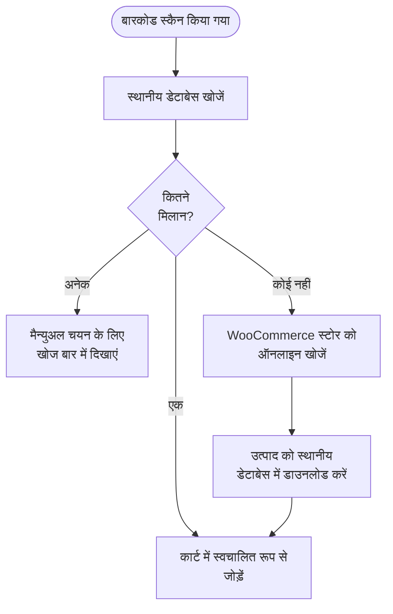

import Image from "@theme/IdealImage";
import Accordion from '@site/src/components/Accordion';
import AccordionItem from '@site/src/components/AccordionItem';

अधिकांश बारकोड स्कैनर आपके डिवाइस से जुड़े कीबोर्ड की तरह व्यवहार करते हैं।
जब आप एक बारकोड स्कैन करते हैं, तो WCPOS यह पहचानता है कि वर्ण सामान्य टाइपिंग की तुलना में तेज़ी से दर्ज किए गए थे।
यह इन "तेज़ कुंजी-दबावों" का उपयोग इनपुट को बारकोड स्कैन के रूप में पहचानने के लिए करता है।
यह लगभग हर स्कैनर के साथ बिना किसी सेटअप के काम करता है — लेकिन स्कैनर अन्य [कनेक्शन मोड](#connection-modes) भी समर्थित करते हैं जिनसे WCPOS सीधे जुड़ सकता है।

## बारकोड स्कैनिंग कॉन्फ़िगर करना {#configuring-barcode-scanning}

चूँकि एक बारकोड स्कैन बहुत तेज़ी से होता है, इसलिए POS एक बारकोड और हाथ से टाइप की गई किसी चीज़ के बीच अंतर बता सकता है।
POS सेटिंग्स में, आपको बारकोड पहचान कैसे कार्य करती है, इसे फ़ाइन-ट्यून करने के विकल्प मिलेंगे।

  <Image
    alt="POS सेटिंग्स में बारकोड स्कैनिंग सेटिंग्स"
    img="/img/barcode-scanning-settings.png"
    style={{ maxHeight: 500 }}
  />
  
POS सेटिंग्स में बारकोड स्कैनिंग सेटिंग्स

| सेटिंग | उद्देश्य | सामान्य मान |
|---|---|---|
| **औसत इनपुट समय** | इनपुट कितना तेज़ होना चाहिए ताकि उसे बारकोड माना जाए | एक छोटा अंतराल — इतना तेज़ कि हाथ से टाइप करने पर वह सक्रिय न हो |
| **न्यूनतम लंबाई** | वर्णों की निरंतर स्ट्रिंग कितनी लंबी होनी चाहिए ताकि उसे बारकोड माना जाए | आपके द्वारा उपयोग किए जाने वाले सबसे छोटे बारकोड के बराबर रखें (जैसे EAN-8 के लिए 8) |
| **प्रिफिक्स/सफिक्स हटाना** | आपका स्कैनर जो अतिरिक्त वर्ण जोड़ता है (एक प्रिफिक्स या सफिक्स) उन्हें हटा देता है ताकि केवल मुख्य बारकोड बचे | खाली छोड़ें, जब तक आपका स्कैनर उन्हें जोड़ने के लिए कॉन्फ़िगर न हो |

## कनेक्शन मोड {#connection-modes}

सेटअप या समस्या निवारण के लिए एक मार्गदर्शित रास्ते हेतु, [स्कैनर सेटअप विज़ार्ड](/hardware/scanners/setup-wizard) का उपयोग करें।

हर बारकोड स्कैनर कुछ मोड में से किसी एक में आता है, और मोड ही तय करता है कि WCPOS उसके स्कैन कैसे प्राप्त कर सकता है:

| मोड | यह कैसे पहुँचता है | सेटअप |
|---|---|---|
| **कीबोर्ड (HID)** — लगभग हर स्कैनर पर फ़ैक्टरी डिफ़ॉल्ट | स्कैनर बारकोड को "टाइप" करता है; WCPOS तेज़ कीस्ट्रोक्स को पहचान लेता है | कोई नहीं — पेयर करें या प्लग इन करें और स्कैन करें |
| **सीरियल (SPP / USB-COM)** | USB सीरियल या Bluetooth SPP पर एक सीधा कनेक्शन | स्कैनर का मोड बदलें, फिर उसे बारकोड सेटिंग्स में कनेक्ट करें |
| **HID-POS** | USB स्कैनर के लिए एक सीधा कनेक्शन (WebHID के माध्यम से) | स्कैनर का मोड बदलें, फिर उसे बारकोड सेटिंग्स में कनेक्ट करें |
| **Bluetooth LE (वेंडर GATT)** | एक सीधा Bluetooth Low Energy कनेक्शन | स्कैनर को पेयर करें, फिर उसे बारकोड सेटिंग्स में उसके सेवा UUID द्वारा जोड़ें |

कीबोर्ड मोड को किसी सेटअप की आवश्यकता नहीं होती और यह अधिकांश स्टोर के लिए सही है। एक सीधा कनेक्शन तब उपयोगी है जब स्कैन कभी-कभी गड़बड़ होकर पहुँचते हों (कीबोर्ड-लेआउट के अंतर से अपरकेस/सिंबल की गड़बड़ी) या खोज बॉक्स पर फ़ोकस न होने पर गलत जगह चले जाते हों — एक सीधे कनेक्ट किया गया स्कैनर हर स्कैन को सीधे WCPOS तक पहुँचाता है, चाहे टाइपिंग गति, कीबोर्ड लेआउट, या फ़ोकस कुछ भी हो।

:::info कीबोर्ड मोड वाले स्कैनर को सीधे कनेक्ट नहीं किया जा सकता
आपका डिवाइस कीबोर्ड-मोड वाले स्कैनर को बिल्कुल एक कीबोर्ड की तरह मानता है, और किसी भी ऐप को किसी कीबोर्ड पर नियंत्रण लेने की अनुमति नहीं होती।
यदि आप बारकोड सेटिंग्स में **Connect serial scanner** या **Connect HID scanner** दबाते हैं और आपका स्कैनर सूची में दिखाई नहीं देता, तो वह लगभग निश्चित रूप से अब भी कीबोर्ड मोड में है।
:::

**मोड बदलने के लिए**, अपने स्कैनर की मैनुअल में सेटअप बारकोड खोजें (*"SPP mode"*, *"serial mode"*, या *"HID-POS mode"* देखें) और उसे स्कैन करें — स्कैनर स्वयं को फिर से कॉन्फ़िगर कर लेता है। Bluetooth स्कैनर के लिए, अपने डिवाइस की Bluetooth सेटिंग्स में पुरानी पेयरिंग हटाएँ और मोड बदलने के बाद दोबारा पेयर करें। मैनुअल का *"HID"* या *"keyboard"* बारकोड स्कैन करने पर वह कभी भी वापस बदल जाता है।

सीधे कनेक्शन डेस्कटॉप ऐप और Chrome-आधारित ब्राउज़रों में समर्थित हैं (ब्राउज़र के Web Serial और WebHID समर्थन का उपयोग करते हुए)। डेस्कटॉप ऐप ऐप के भीतर एक डिवाइस चयनकर्ता दिखाता है; Chrome अपना स्वयं का डिवाइस पिकर दिखाता है। iOS और Android पर, कीबोर्ड मोड और कैमरा स्कैनिंग समर्थित विकल्प हैं, और Android अतिरिक्त रूप से हार्डवेयर-स्कैनर की कुंजी इनपुट को सीधे इंटरसेप्ट करता है।

## कैमरा स्कैनिंग {#camera-scanning}

हर प्लेटफ़ॉर्म — वेब, डेस्कटॉप, iOS, और Android — डिवाइस के कैमरे से स्कैन कर सकता है, इसलिए शुरू करने के लिए आपको एक समर्पित स्कैनर की आवश्यकता नहीं है। खोज बार में स्कैन आइकन से कैमरा खोलें; यह **फ़िल्टर के ठीक नीचे एक आकार बदलने योग्य पैनल** के रूप में दिखाई देता है, ताकि स्कैन करते समय उत्पाद सूची दृश्य में बनी रहे। कैमरे को किसी बारकोड की ओर इंगित करें और WCPOS उसे ठीक वैसे ही पढ़ता है जैसे वह किसी हार्डवेयर स्कैन को पढ़ेगा।

## जब कोई बारकोड पहचाना जाता है, तब क्या होता है? {#what-happens-when-a-barcode-is-detected}

जब POS किसी बारकोड को पहचानता है, तो यह अपने स्थानीय डेटाबेस में एक मिलान उत्पाद या उत्पाद भिन्नता खोजता है।
तीन संभावित परिणाम हैं:

जब किसी स्कैन को कोई स्थानीय मिलान नहीं मिलता, तो WCPOS ऑनलाइन आपके स्टोर पर फ़ॉलबैक करता है, मिलान उत्पाद को डाउनलोड करता है, और **उसे स्वचालित रूप से कार्ट में जोड़ देता है** — इसलिए एक अज्ञात बारकोड भी बिक्री पूरी कर देता है, और वही स्कैन अगली बार तत्काल होता है।

:::tip कई मिलान आमतौर पर एक डेटा समस्या का संकेत होते हैं
यदि एक से अधिक उत्पाद एक ही बारकोड साझा करते हैं, तो POS यह नहीं जान सकता कि किसे जोड़ना है, इसलिए यह कोड को खोज बार में डाल देता है ताकि आप चुन सकें। जब ऐसा होता है, तो यह आमतौर पर इस बात का संकेत होता है कि आपके उत्पाद डेटा को व्यवस्थित करने की आवश्यकता है — प्रत्येक उत्पाद का एक **अनूठा** बारकोड होना चाहिए।
:::

## स्कैन फ़ीडबैक और व्यवहार {#scan-feedback-and-behaviour}

- **स्कैन ध्वनियाँ** — WCPOS प्रत्येक स्कैन पर एक ध्वनि बजा सकता है ताकि कैशियर को स्क्रीन देखे बिना तत्काल पुष्टि मिल जाए। ध्वनियाँ वैकल्पिक हैं और थीम का विकल्प प्रदान करती हैं; उन्हें चालू करें और [बारकोड सेटिंग्स](/settings/store/barcode) में एक थीम चुनें।
- **ऑर्डर स्क्रीन पर** — स्कैन Orders खोज फ़ील्ड में रूट किए जाते हैं, इसलिए आप जिस ऑर्डर या उत्पाद की तलाश कर रहे हैं उसे खोजने के लिए एक बारकोड स्कैन कर सकते हैं।
- **UPC-A बारकोड** — एक UPC-A स्कैन पैकेज पर छपे अंकों में परिणत होता है, इसलिए POS जिस मान से मिलान करता है वह वही है जिसका आपका उत्पाद डेटा उपयोग करता है।

## उत्पाद समकालन को समझना {#understanding-product-synchronisation}

POS आपके कैटलॉग को पृष्ठभूमि में छोटे बैचों में डाउनलोड करता है, इसलिए पहले ही मिनट से हर उत्पाद डिवाइस पर नहीं होता — यह कैसे काम करता है, इसके लिए [उत्पाद समकालन](/products/sync) देखें।

### यह बारकोड स्कैनिंग के लिए क्यों मायने रखता है {#why-it-matters-for-barcode-scanning}

जब आप ऐसा बारकोड स्कैन करते हैं जो अभी तक स्थानीय रूप से संग्रहीत नहीं है, तो POS ऑनलाइन आपके WooCommerce स्टोर पर जाता है, उस उत्पाद को खोजता है, और उसे डाउनलोड कर लेता है — इसलिए वही स्कैन अगली बार तत्काल होता है। इसे तेज़ करने के लिए आपको कुछ करने की आवश्यकता नहीं है: पृष्ठभूमि कैटलॉग सीड आपकी बाकी इन्वेंटरी अपने आप भर देती है, और आप प्रगति **स्टोर हेल्थ → डेटाबेस** में देख सकते हैं।

## सामान्य प्रश्न {#faq}

<Accordion>
  <AccordionItem question="जब मैं कोई बारकोड स्कैन करता हूँ तो मुझे 'स्थानीय स्तर पर 0 उत्पाद मिले' क्यों मिलता है?">

शुरू से ही सभी उत्पाद डिवाइस पर नहीं होते — POS उपयोग के पहले कुछ मिनटों में पृष्ठभूमि में आपके कैटलॉग की सीडिंग करता है।
यदि आपने अभी जो उत्पाद स्कैन किया है वह अभी तक संग्रहीत नहीं है, तो स्कैन POS को उसे ऑनलाइन खोजने और डाउनलोड करने के लिए प्रेरित करता है, ताकि अगली बार वह तत्काल मिले।

  </AccordionItem>

  <AccordionItem question="क्या POS बारकोड उत्पन्न और प्रिंट करता है?">

नहीं, इस समय नहीं। हमारा POS मौजूदा बारकोड को स्कैन और पढ़ने के लिए डिज़ाइन किया गया है, लेकिन इसमें उन्हें बनाने या प्रिंट करने की कार्यक्षमता शामिल नहीं है।
यदि आपको अपने उत्पादों के लिए बारकोड उत्पन्न करने की आवश्यकता है, तो आप बारकोड निर्माण और प्रिंटिंग में विशेषज्ञता रखने वाले तृतीय-पक्ष WooCommerce प्लगइनों का उपयोग कर सकते हैं। कुछ उदाहरणों में शामिल हैं:

- [EAN for WooCommerce](https://wordpress.org/plugins/ean-for-woocommerce/)
- [A4 Barcode Generator](https://wordpress.org/plugins/a4-barcode-generator/)

एक बार जब आप अपने उत्पादों के लिए बारकोड उत्पन्न कर लेते हैं, तो आप उन्हें रजिस्टर पर आसानी से स्कैन कर सकते हैं ताकि POS में चेकआउट प्रक्रिया को तेज़ किया जा सके।

  </AccordionItem>
</Accordion>
