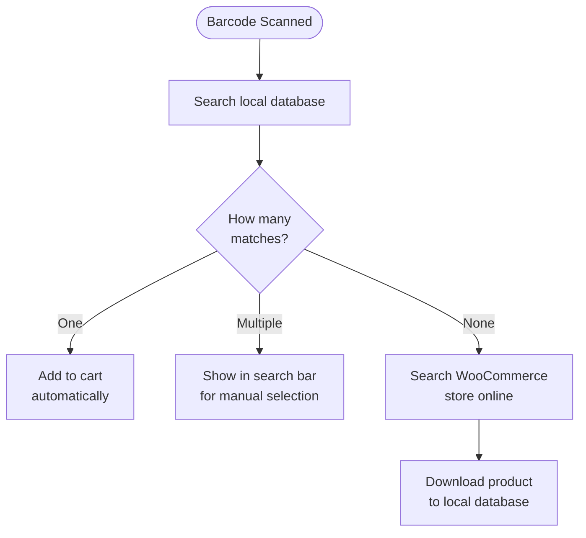

import Image from "@theme/IdealImage";
import Accordion from '@site/src/components/Accordion';
import AccordionItem from '@site/src/components/AccordionItem';

La maggior parte degli scanner per codici a barre si comporta come una tastiera collegata al dispositivo.
Quando si scansiona un codice a barre, WCPOS rileva che i caratteri sono stati inseriti più velocemente rispetto alla digitazione normale.
Utilizza queste "pressioni rapide dei tasti" per identificare l'input come una scansione di codice a barre.

## Configurazione della scansione codici a barre {#configuring-barcode-scanning}

Poiché la scansione di un codice a barre avviene molto rapidamente, il POS è in grado di distinguere tra un codice a barre e un testo digitato manualmente.
Nelle impostazioni del POS sono disponibili opzioni per regolare il funzionamento del rilevamento dei codici a barre.

  <Image
    alt="Impostazioni di scansione codici a barre nelle Impostazioni del POS"
    img="/img/barcode-scanning-settings.png"
    style={{ maxHeight: 500 }}
  />
  
Impostazioni di scansione codici a barre nelle Impostazioni del POS

| Impostazione | Scopo | Valore tipico |
|---|---|---|
| **Tempo medio di input** | Velocità minima dell'input per essere considerato un codice a barre | Un intervallo breve — abbastanza rapido da non essere attivato dalla digitazione manuale |
| **Lunghezza minima** | Lunghezza minima della stringa continua di caratteri per essere trattata come codice a barre | Impostare in base al codice a barre più corto utilizzato (es. 8 per EAN-8) |
| **Rimozione prefisso/suffisso** | Rimuove i caratteri aggiuntivi aggiunti dallo scanner (un prefisso o un suffisso) in modo che rimanga solo il codice a barre principale | Lasciare vuoto a meno che lo scanner non sia configurato per aggiungerli |

## Cosa succede quando viene rilevato un codice a barre? {#what-happens-when-a-barcode-is-detected}

Quando il POS rileva un codice a barre, cerca nel database locale un prodotto o una variante di prodotto corrispondente.
Ci sono tre possibili risultati:

:::tip Corrispondenze multiple indicano solitamente un problema nei dati
Se più di un prodotto condivide lo stesso codice a barre, il POS non può determinare quale aggiungere, quindi inserisce il codice nella barra di ricerca per consentire la scelta. Quando ciò accade, di solito significa che i dati dei prodotti necessitano di una revisione — ogni prodotto dovrebbe avere un codice a barre **univoco**.
:::

## Comprendere la sincronizzazione dei prodotti {#understanding-product-synchronisation}

### Download progressivo dei prodotti {#progressive-product-downloading}

WCPOS non carica tutti i prodotti contemporaneamente.
Li scarica invece in piccoli lotti.
Questo approccio previene i rallentamenti e garantisce un funzionamento fluido del negozio.
Con il tempo, man mano che si utilizza il POS e si effettuano ricerche, un numero sempre maggiore di prodotti viene memorizzato localmente sul dispositivo.

Per maggiori dettagli, consultare [Sincronizzazione prodotti](/products/sync).

### Perché è importante per la scansione dei codici a barre {#why-it-matters-for-barcode-scanning}

Quando si scansiona un codice a barre non ancora memorizzato localmente, il POS si collegherà online al negozio WooCommerce per cercarlo.
Durante questo processo, il prodotto (e altri in piccoli lotti) viene scaricato e salvato.
Ciò significa che con il tempo il POS diventa più veloce ed efficiente man mano che un numero maggiore di prodotti viene memorizzato localmente.

### Come velocizzare il processo {#how-to-speed-up-the-process}

Effettuare ricerche di prodotti nel POS consente di scaricare una parte maggiore dell'inventario.
Più si utilizza la ricerca e più si effettuano scansioni, più completo diventa il database locale.

## Domande frequenti {#faq}

<Accordion>
  <AccordionItem question="Perché compare '0 prodotti trovati localmente' quando scansiono un codice a barre?">

Non tutti i prodotti sono disponibili localmente fin dall'inizio.
Il POS scarica gradualmente i prodotti dal negozio online e li salva sul dispositivo.
Se il prodotto appena scansionato non è ancora stato scaricato, la ricerca attiva il POS per cercarlo online e scaricarlo, in modo che sia disponibile in futuro.

  </AccordionItem>

  <AccordionItem question="Il POS genera e stampa codici a barre?">

No, al momento no. Il POS è progettato per scansionare e leggere codici a barre esistenti, ma non include funzionalità per crearli o stamparli.
Per generare codici a barre per i prodotti è possibile utilizzare plugin WooCommerce di terze parti specializzati nella creazione e stampa di codici a barre. Alcuni esempi:

- [EAN for WooCommerce](https://wordpress.org/plugins/ean-for-woocommerce/)
- [A4 Barcode Generator](https://wordpress.org/plugins/a4-barcode-generator/)

Una volta generati i codici a barre per i prodotti, è possibile scansionarli alla cassa per velocizzare il processo di checkout nel POS.

  </AccordionItem>
</Accordion>
