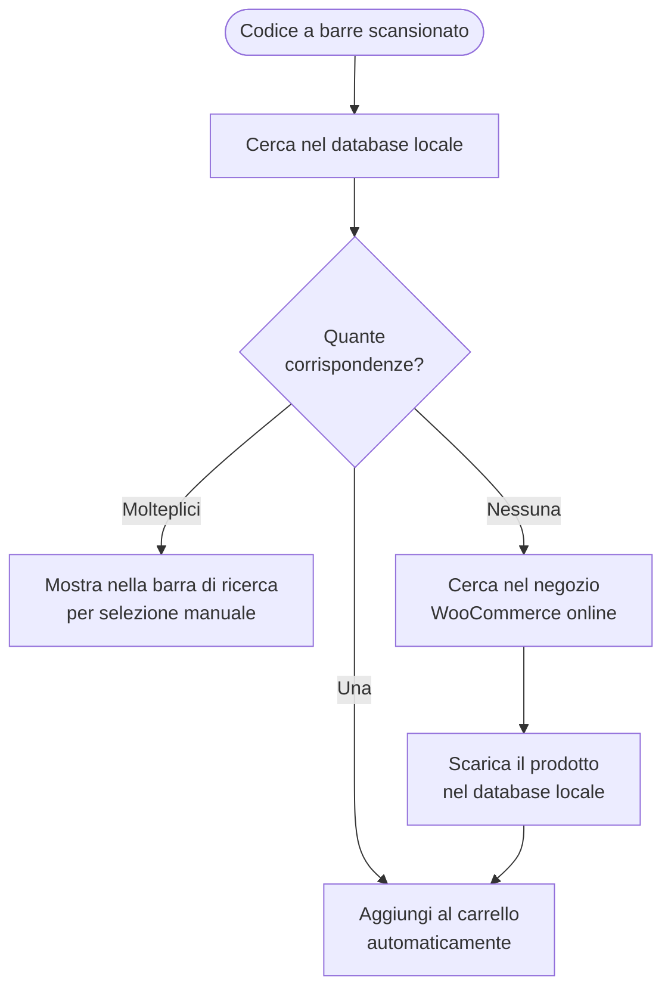

import Image from "@theme/IdealImage";
import Accordion from '@site/src/components/Accordion';
import AccordionItem from '@site/src/components/AccordionItem';

La maggior parte degli scanner di codici a barre si comporta come una tastiera collegata al tuo dispositivo.
Quando scansioni un codice a barre, WCPOS rileva che i caratteri sono stati inseriti più velocemente della digitazione normale.
Usa queste "pressioni rapide dei tasti" per identificare l'input come una scansione di un codice a barre.
Questo funziona da subito con quasi tutti gli scanner — ma gli scanner supportano anche altre [modalità di connessione](#connection-modes) a cui WCPOS può collegarsi direttamente.

## Configurazione della scansione dei codici a barre {#configuring-barcode-scanning}

Poiché la scansione di un codice a barre avviene molto rapidamente, il POS può distinguere tra un codice a barre e qualcosa digitato a mano.
Nelle impostazioni del POS troverai opzioni per mettere a punto il funzionamento del rilevamento dei codici a barre.

  <Image
    alt="Impostazioni di scansione dei codici a barre nelle Impostazioni del POS"
    img="/img/barcode-scanning-settings.png"
    style={{ maxHeight: 500 }}
  />
  
Impostazioni di scansione dei codici a barre nelle Impostazioni del POS

| Impostazione | Scopo | Valore tipico |
|---|---|---|
| **Tempo medio di input** | Quanto veloce deve essere l'input per contare come codice a barre | Un intervallo breve — abbastanza rapido da non essere attivato dalla digitazione manuale |
| **Lunghezza minima** | Quanto deve essere lunga la stringa continua di caratteri per essere trattata come codice a barre | Corrisponde al codice a barre più corto che usi (es. 8 per EAN-8) |
| **Rimozione prefisso/suffisso** | Rimuove i caratteri aggiuntivi che il tuo scanner aggiunge (un prefisso o un suffisso) in modo che rimanga solo il codice a barre principale | Lascia vuoto a meno che il tuo scanner non sia configurato per aggiungerli |

## Modalità di connessione {#connection-modes}

Per un percorso guidato attraverso la configurazione o la risoluzione dei problemi, usa la [Configurazione guidata dello scanner](/hardware/scanners/setup-wizard).

Ogni scanner di codici a barre viene fornito in una di poche modalità, e la modalità determina come WCPOS può ricevere le sue scansioni:

| Modalità | Come arriva | Configurazione |
|---|---|---|
| **Tastiera (HID)** — l'impostazione di fabbrica di quasi tutti gli scanner | Lo scanner "digita" il codice a barre; WCPOS riconosce le pressioni rapide dei tasti | Nessuna — associa o collega e scansiona |
| **Seriale (SPP / USB-COM)** | Una connessione diretta tramite seriale USB o Bluetooth SPP | Cambia la modalità dello scanner, poi collegalo nelle impostazioni Codici a barre |
| **HID-POS** | Una connessione diretta per gli scanner USB (tramite WebHID) | Cambia la modalità dello scanner, poi collegalo nelle impostazioni Codici a barre |
| **Bluetooth LE (GATT del produttore)** | Una connessione diretta Bluetooth Low Energy | Associa lo scanner, poi aggiungilo nelle impostazioni Codici a barre tramite il suo UUID di servizio |

La modalità tastiera non richiede alcuna configurazione ed è la scelta giusta per la maggior parte dei negozi. Una connessione diretta conviene se le scansioni a volte arrivano alterate (maiuscole/simboli scambiati per via delle differenze di layout della tastiera) o finiscono nel posto sbagliato quando la casella di ricerca non è attiva — uno scanner collegato direttamente consegna ogni scansione direttamente a WCPOS, indipendentemente dalla velocità di digitazione, dal layout della tastiera o dal focus.

:::info Uno scanner in modalità tastiera non può essere collegato direttamente
Il tuo dispositivo tratta uno scanner in modalità tastiera esattamente come una tastiera, e a nessuna app è consentito prendere il controllo di una tastiera.
Se premi **Collega scanner seriale** o **Collega scanner HID** nelle impostazioni Codici a barre e il tuo scanner non compare nell'elenco, è quasi certamente ancora in modalità tastiera.
:::

**Per cambiare modalità**, individua il codice a barre di configurazione nel manuale del tuo scanner (cerca *"modalità SPP"*, *"modalità seriale"* o *"modalità HID-POS"*) e scansionalo — lo scanner si riconfigura da solo. Per gli scanner Bluetooth, elimina la vecchia associazione nelle impostazioni Bluetooth del tuo dispositivo e riassocialo dopo il cambio. Scansionare il codice a barre *"HID"* o *"tastiera"* del manuale lo riporta indietro in qualsiasi momento.

Le connessioni dirette sono supportate nell'app Desktop e nei browser basati su Chrome (usando il supporto Web Serial e WebHID del browser). L'app Desktop mostra un selettore di dispositivi all'interno dell'app; Chrome mostra il proprio selettore di dispositivi. Su iOS e Android, la modalità tastiera e la scansione con fotocamera sono le opzioni supportate, e Android intercetta inoltre direttamente l'input dei tasti degli scanner hardware.

## Scansione con fotocamera {#camera-scanning}

Ogni piattaforma — web, desktop, iOS e Android — può scansionare con la fotocamera del dispositivo, così non hai bisogno di uno scanner dedicato per iniziare. Apri la fotocamera dall'icona di scansione nella barra di ricerca; appare come un **pannello ridimensionabile direttamente sotto i filtri**, così l'elenco dei prodotti resta in vista mentre scansioni. Punta la fotocamera su un codice a barre e WCPOS lo legge esattamente come farebbe con una scansione hardware.

## Cosa succede quando viene rilevato un codice a barre? {#what-happens-when-a-barcode-is-detected}

Quando il POS rileva un codice a barre, cerca nel suo database locale un prodotto o una variante di prodotto corrispondente.
Ci sono tre possibili risultati:

```mermaid
flowchart TD
    Scan([Codice a barre scansionato]) --> Lookup[Cerca nel database locale]
    Lookup --> Check{Quante\ncorrispondenze?}
    Check -->|Una| Cart[Aggiungi al carrello\nautomaticamente]
    Check -->|Molteplici| Search[Mostra nella barra di ricerca\nper selezione manuale]
    Check -->|Nessuna| Online[Cerca nel negozio\nWooCommerce online]
    Online --> Download[Scarica il prodotto\nnel database locale]
    Download --> Cart
```

Quando una scansione non trova alcuna corrispondenza locale, WCPOS ricorre al tuo negozio online, scarica il prodotto corrispondente e **lo aggiunge automaticamente al carrello** — così un codice a barre sconosciuto completa comunque la vendita, e la stessa scansione è istantanea la volta successiva.

:::tip Corrispondenze multiple di solito indicano un problema nei dati
Se più di un prodotto condivide lo stesso codice a barre, il POS non può sapere quale aggiungere, quindi inserisce il codice nella barra di ricerca perché tu possa scegliere. Quando ciò accade, di solito è segno che i tuoi dati dei prodotti hanno bisogno di essere sistemati — ogni prodotto dovrebbe avere un codice a barre **univoco**.
:::

## Feedback e comportamento della scansione {#scan-feedback-and-behaviour}

- **Suoni di scansione** — WCPOS può riprodurre un suono a ogni scansione così che i cassieri ricevano una conferma istantanea senza guardare lo schermo. I suoni sono opzionali e offrono una scelta di temi; attivali e scegli un tema nelle [Impostazioni dei codici a barre](/settings/store/barcode).
- **Nella schermata Ordini** — le scansioni vengono indirizzate al campo di ricerca degli Ordini, così puoi scansionare un codice a barre per trovare l'ordine o il prodotto che stai cercando.
- **Codici a barre UPC-A** — una scansione UPC-A si risolve nelle cifre stampate sulla confezione, così il valore che il POS confronta è quello che usano i tuoi dati dei prodotti.

## Comprendere la sincronizzazione dei prodotti {#understanding-product-synchronisation}

Il POS scarica il tuo catalogo in piccoli lotti in background, quindi non tutti i prodotti sono sul dispositivo fin dal primo minuto — vedi [Sincronizzazione dei prodotti](/products/sync) per capire come funziona.

### Perché è importante per la scansione dei codici a barre {#why-it-matters-for-barcode-scanning}

Quando scansioni un codice a barre non ancora memorizzato localmente, il POS si collega online al tuo negozio WooCommerce, trova quel prodotto e lo scarica — così la stessa scansione è istantanea la volta successiva. Non devi fare nulla per velocizzare il processo: il precaricamento del catalogo in background completa da solo il resto del tuo inventario, e puoi controllarne l'avanzamento in **Stato del negozio → Database**.

## Domande frequenti {#faq}

<Accordion>
  <AccordionItem question="Perché compare '0 prodotti trovati localmente' quando scansiono un codice a barre?">

Non tutti i prodotti sono sul dispositivo fin dall'inizio — il POS precarica il tuo catalogo in background nei primi minuti di utilizzo.
Se il prodotto appena scansionato non è ancora memorizzato, la scansione fa sì che il POS lo cerchi online e lo scarichi, così è istantaneo la volta successiva.

  </AccordionItem>

  <AccordionItem question="Il POS genera e stampa codici a barre?">

No, al momento no. Il nostro POS è progettato per scansionare e leggere codici a barre esistenti, ma non include funzionalità per crearli o stamparli.
Se hai bisogno di generare codici a barre per i tuoi prodotti, puoi usare plugin WooCommerce di terze parti specializzati nella creazione e stampa di codici a barre. Alcuni esempi:

- [EAN for WooCommerce](https://wordpress.org/plugins/ean-for-woocommerce/)
- [A4 Barcode Generator](https://wordpress.org/plugins/a4-barcode-generator/)

Una volta generati i codici a barre per i tuoi prodotti, puoi scansionarli facilmente alla cassa per velocizzare il processo di checkout nel POS.

  </AccordionItem>
</Accordion>
