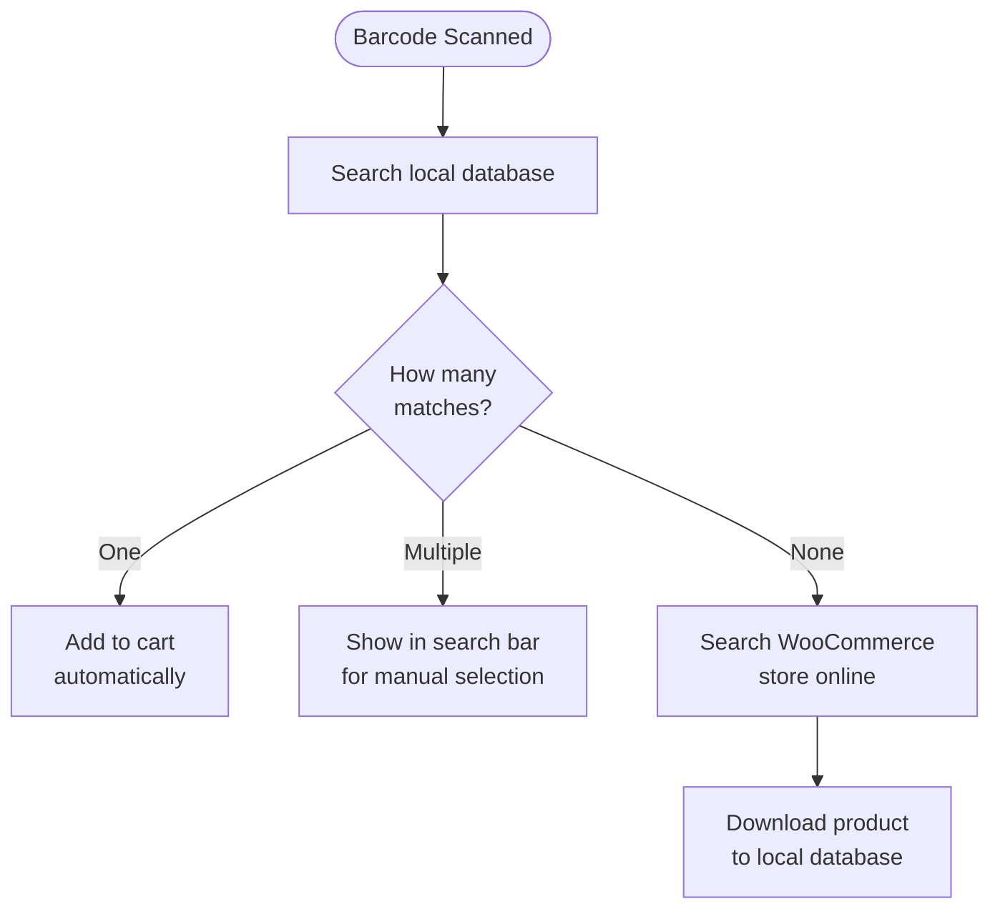

import Image from "@theme/IdealImage";
import Accordion from '@site/src/components/Accordion';
import AccordionItem from '@site/src/components/AccordionItem';

La maggior parte degli scanner per codici a barre si comporta come una tastiera collegata al dispositivo.
Quando si scansiona un codice a barre, WCPOS rileva che i caratteri sono stati inseriti più velocemente rispetto alla digitazione normale.
Utilizza queste "pressioni rapide dei tasti" per identificare l'input come una scansione di codice a barre.
Questo funziona da subito con quasi tutti gli scanner, ma gli scanner supportano anche altre [modalità di connessione](#connection-modes) a cui WCPOS può collegarsi direttamente.

## Configurazione della scansione codici a barre {#configuring-barcode-scanning}

Poiché la scansione di un codice a barre avviene molto rapidamente, il POS è in grado di distinguere tra un codice a barre e un testo digitato manualmente.
Nelle impostazioni del POS sono disponibili opzioni per regolare il funzionamento del rilevamento dei codici a barre.

  <Image
    alt="Impostazioni di scansione codici a barre nelle Impostazioni del POS"
    img="/img/barcode-scanning-settings.png"
    style={{ maxHeight: 500 }}
  />
  
Impostazioni di scansione codici a barre nelle Impostazioni del POS

| Impostazione | Scopo | Valore tipico |
|---|---|---|
| **Tempo medio di input** | Velocità minima dell'input per essere considerato un codice a barre | Un intervallo breve — abbastanza rapido da non essere attivato dalla digitazione manuale |
| **Lunghezza minima** | Lunghezza minima della stringa continua di caratteri per essere trattata come codice a barre | Impostare in base al codice a barre più corto utilizzato (es. 8 per EAN-8) |
| **Rimozione prefisso/suffisso** | Rimuove i caratteri aggiuntivi aggiunti dallo scanner (un prefisso o un suffisso) in modo che rimanga solo il codice a barre principale | Lasciare vuoto a meno che lo scanner non sia configurato per aggiungerli |

## Modalità di connessione {#connection-modes}

Per un percorso guidato attraverso la configurazione o la risoluzione dei problemi, usa la [Configurazione guidata dello scanner](/hardware/scanner-setup-wizard).

Ogni scanner di codici a barre viene fornito in una di poche modalità, e la modalità determina come WCPOS può ricevere le sue scansioni:

| Modalità | Come arriva | Configurazione |
|---|---|---|
| **Tastiera (HID)** — l'impostazione di fabbrica di quasi tutti gli scanner | Lo scanner "digita" il codice a barre; WCPOS riconosce le pressioni rapide dei tasti | Nessuna — associa o collega lo scanner e scansiona |
| **Seriale (SPP / USB-COM)** | Una connessione diretta tra lo scanner e WCPOS | Cambia la modalità dello scanner, poi collegalo nelle impostazioni Codici a barre |
| **HID-POS** | Una connessione diretta (scanner USB) | Cambia la modalità dello scanner, poi collegalo nelle impostazioni Codici a barre |

La modalità tastiera non richiede alcuna configurazione ed è la scelta giusta per la maggior parte dei negozi. Una connessione diretta conviene se le scansioni a volte arrivano alterate (maiuscole e simboli scambiati per via delle differenze di layout della tastiera) o finiscono nel posto sbagliato quando il campo di ricerca non è attivo: uno scanner collegato direttamente consegna ogni scansione direttamente a WCPOS, indipendentemente dalla velocità di digitazione, dal layout della tastiera o dal focus.

:::info Uno scanner in modalità tastiera non può essere collegato direttamente
Il tuo dispositivo tratta uno scanner in modalità tastiera esattamente come una tastiera, e a nessuna app è consentito prendere il controllo di una tastiera.
Se premi **Collega scanner seriale** o **Collega scanner HID** nelle impostazioni Codici a barre e il tuo scanner non compare nell'elenco, è quasi certamente ancora in modalità tastiera.
:::

**Per cambiare modalità**, individua il codice a barre di configurazione nel manuale del tuo scanner (cerca *«modalità SPP»*, *«modalità seriale»* o *«modalità HID-POS»*) e scansionalo: lo scanner si riconfigura da solo. Per gli scanner Bluetooth, elimina la vecchia associazione nelle impostazioni Bluetooth del dispositivo e riassocialo dopo il cambio di modalità. Scansionare il codice a barre *«HID»* o *«tastiera»* del manuale riporta lo scanner alla modalità precedente in qualsiasi momento.

Le connessioni dirette sono attualmente supportate nell'app Desktop e nei browser basati su Chrome. Su iOS e Android le opzioni supportate sono la modalità tastiera e la scansione tramite fotocamera.

## Cosa succede quando viene rilevato un codice a barre? {#what-happens-when-a-barcode-is-detected}

Quando il POS rileva un codice a barre, cerca nel database locale un prodotto o una variante di prodotto corrispondente.
Ci sono tre possibili risultati:

```mermaid
flowchart TD
    Scan([Barcode Scanned]) --> Lookup[Search local database]
    Lookup --> Check{How many\nmatches?}
    Check -->|One| Cart[Add to cart\nautomatically]
    Check -->|Multiple| Search[Show in search bar\nfor manual selection]
    Check -->|None| Online[Search WooCommerce\nstore online]
    Online --> Download[Download product\nto local database]
```

:::tip Corrispondenze multiple indicano solitamente un problema nei dati
Se più di un prodotto condivide lo stesso codice a barre, il POS non può determinare quale aggiungere, quindi inserisce il codice nella barra di ricerca per consentire la scelta. Quando ciò accade, di solito significa che i dati dei prodotti necessitano di una revisione — ogni prodotto dovrebbe avere un codice a barre **univoco**.
:::

## Comprendere la sincronizzazione dei prodotti {#understanding-product-synchronisation}

Il POS scarica il catalogo in piccoli lotti in background, quindi non tutti i prodotti sono sul dispositivo fin dal primo minuto — consultare [Sincronizzazione prodotti](/products/sync) per capire come funziona.

### Perché è importante per la scansione dei codici a barre {#why-it-matters-for-barcode-scanning}

Quando si scansiona un codice a barre non ancora memorizzato localmente, il POS si collega online al negozio WooCommerce, trova quel prodotto e lo scarica, così la stessa scansione sarà istantanea la volta successiva. Non serve fare nulla per velocizzare il processo: il precaricamento del catalogo in background completa da solo il resto dell'inventario e puoi controllarne l'avanzamento in **Stato del negozio → Database**.

## Domande frequenti {#faq}

<Accordion>
  <AccordionItem question="Perché compare '0 prodotti trovati localmente' quando scansiono un codice a barre?">

Non tutti i prodotti sono sul dispositivo fin dall'inizio: il POS precarica il catalogo in background nei primi minuti di utilizzo.
Se il prodotto appena scansionato non è ancora stato salvato, la scansione fa sì che il POS lo cerchi online e lo scarichi, così la volta successiva sarà istantaneo.

  </AccordionItem>

  <AccordionItem question="Il POS genera e stampa codici a barre?">

No, al momento no. Il POS è progettato per scansionare e leggere codici a barre esistenti, ma non include funzionalità per crearli o stamparli.
Per generare codici a barre per i prodotti è possibile utilizzare plugin WooCommerce di terze parti specializzati nella creazione e stampa di codici a barre. Alcuni esempi:

- [EAN for WooCommerce](https://wordpress.org/plugins/ean-for-woocommerce/)
- [A4 Barcode Generator](https://wordpress.org/plugins/a4-barcode-generator/)

Una volta generati i codici a barre per i prodotti, è possibile scansionarli alla cassa per velocizzare il processo di checkout nel POS.

  </AccordionItem>
</Accordion>
