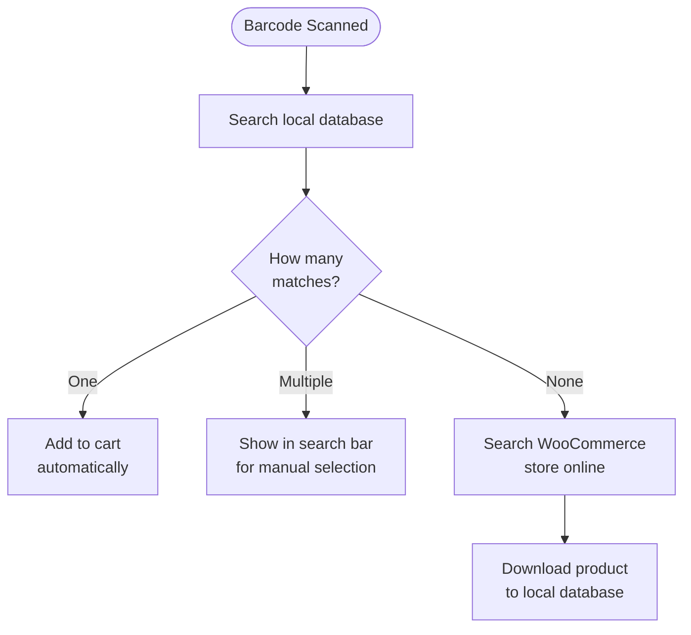

import Image from "@theme/IdealImage";
import Accordion from '@site/src/components/Accordion';
import AccordionItem from '@site/src/components/AccordionItem';

ほとんどのバーコードスキャナーは、デバイスに接続されたキーボードのように動作します。
バーコードをスキャンすると、WCPOSは文字が通常の入力よりも速く入力されたことを検出します。
この「高速なキー入力」を使用して、入力をバーコードスキャンとして識別します。

## バーコードスキャンの設定 {#configuring-barcode-scanning}

バーコードスキャンは非常に高速に行われるため、POSはバーコードと手入力された内容を区別できます。
POS設定には、バーコード検出の動作を微調整するためのオプションがあります。

  <Image
    alt="POS設定のバーコードスキャン設定"
    img="/img/barcode-scanning-settings.png"
    style={{ maxHeight: 500 }}
  />
  
POS設定のバーコードスキャン設定

| 設定 | 目的 | 一般的な値 |
|---|---|---|
| **平均入力時間** | バーコードとして認識するために必要な入力速度 | 短い間隔 — 手入力ではトリガーされない程度に十分速くします |
| **最小文字数** | バーコードとして扱うために必要な連続文字列の長さ | 使用する最短のバーコードに合わせます（例: EAN-8 の場合は 8） |
| **プレフィックス/サフィックスの削除** | スキャナーが追加する余分な文字（プレフィックスまたはサフィックス）を削除し、メインのバーコードだけを残します | スキャナーがそれらを追加するように設定されていない限り、空のままにします |

## バーコードが検出されるとどうなりますか？ {#what-happens-when-a-barcode-is-detected}

POS がバーコードを検出すると、ローカルデータベース内で一致する商品または商品バリエーションを検索します。
考えられる結果は 3 つあります:

:::tip 複数一致する場合は、通常データに問題があります
複数の商品が同じバーコードを共有している場合、POS はどの商品を追加すべきか判断できないため、そのコードを検索バーに入力し、選択できるようにします。この場合は通常、商品データの整理が必要であることを示しています。各商品には**一意**のバーコードを設定する必要があります。
:::

## 商品の同期について {#understanding-product-synchronisation}

### 段階的な商品ダウンロード {#progressive-product-downloading}

WCPOS はすべての商品を一度に読み込むわけではありません。
代わりに、少量ずつまとめてダウンロードします。
この方法により動作の低下を防ぎ、店舗をスムーズに運用できます。
POS を使用して検索を行うにつれて、より多くの商品が端末にローカル保存されます。

詳しくは [商品の同期](/products/sync) を参照してください。

### バーコードスキャンで重要な理由 {#why-it-matters-for-barcode-scanning}

まだローカルに保存されていないバーコードをスキャンすると、POS は WooCommerce ストアに「オンライン」で接続して商品を検索します。
この処理の一環として、その商品（および少量のバッチに含まれる他の商品）をダウンロードして保存します。
つまり、ローカルに保存される商品が増えるほど、POS は時間とともにより高速で効率的になります。

### 処理を高速化する方法 {#how-to-speed-up-the-process}

POS で商品を検索するだけで、在庫をより多くダウンロードできます。
検索を多く使用し、スキャンを多く行うほど、ローカルデータベースはより完全になります。

## よくある質問 {#faq}

<Accordion>
  <AccordionItem question="バーコードをスキャンすると「ローカルで商品が 0 件見つかりました」と表示されるのはなぜですか？">

最初からすべての商品がローカルで利用できるわけではありません。
POS はオンライン店舗から商品を段階的にダウンロードし、端末に保存します。
スキャンした商品がまだ保存されていない場合、検索によって POS がオンラインでその商品を検索し、今後利用できるようにダウンロードします。

  </AccordionItem>

  <AccordionItem question="POS でバーコードを生成して印刷できますか？">

いいえ、現時点ではできません。POS は既存のバーコードをスキャンして読み取るように設計されていますが、バーコードを作成または印刷する機能は含まれていません。
商品のバーコードを生成する必要がある場合は、バーコードの作成と印刷に特化したサードパーティ製 WooCommerce プラグインを使用できます。例:

- [EAN for WooCommerce](https://wordpress.org/plugins/ean-for-woocommerce/)
- [A4 Barcode Generator](https://wordpress.org/plugins/a4-barcode-generator/)

商品のバーコードを生成したら、レジで簡単にスキャンできるため、POS での会計処理をすばやく進められます。

  </AccordionItem>
</Accordion>
