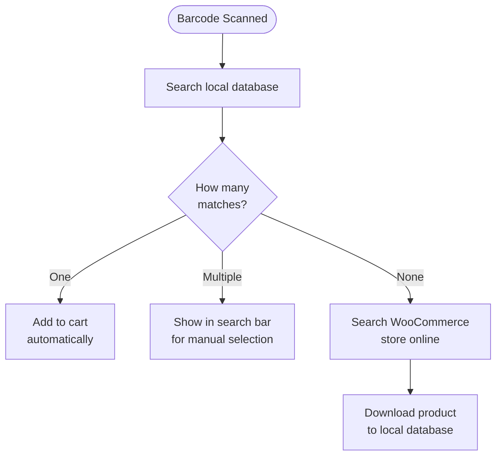

import Image from "@theme/IdealImage";
import Accordion from '@site/src/components/Accordion';
import AccordionItem from '@site/src/components/AccordionItem';

ほとんどのバーコードスキャナーは、デバイスに接続されたキーボードのように動作します。
バーコードをスキャンすると、WCPOSは文字が通常の入力よりも速く入力されたことを検出します。
この「高速なキー入力」を使用して、入力をバーコードスキャンとして識別します。
この方式はほぼすべてのスキャナーで設定なしに動作しますが、スキャナーには WCPOS が直接接続できる他の[接続モード](#connection-modes)もあります。

## バーコードスキャンの設定 {#configuring-barcode-scanning}

バーコードスキャンは非常に高速に行われるため、POSはバーコードと手入力された内容を区別できます。
POS設定には、バーコード検出の動作を微調整するためのオプションがあります。

  <Image
    alt="POS設定のバーコードスキャン設定"
    img="/img/barcode-scanning-settings.png"
    style={{ maxHeight: 500 }}
  />
  
POS設定のバーコードスキャン設定

| 設定 | 目的 | 一般的な値 |
|---|---|---|
| **平均入力時間** | バーコードとして認識するために必要な入力速度 | 短い間隔 — 手入力ではトリガーされない程度に十分速くします |
| **最小文字数** | バーコードとして扱うために必要な連続文字列の長さ | 使用する最短のバーコードに合わせます（例: EAN-8 の場合は 8） |
| **プレフィックス/サフィックスの削除** | スキャナーが追加する余分な文字（プレフィックスまたはサフィックス）を削除し、メインのバーコードだけを残します | スキャナーがそれらを追加するように設定されていない限り、空のままにします |

## 接続モード {#connection-modes}

セットアップやトラブルシューティングをガイド付きで進めるには、[スキャナーセットアップウィザード](/hardware/scanners/setup-wizard)を使用してください。

すべてのバーコードスキャナーはいくつかのモードのいずれかで出荷され、そのモードによって WCPOS がスキャンを受け取る方法が決まります。

| モード | 受け取り方 | セットアップ |
|---|---|---|
| **キーボード (HID)** — ほぼすべてのスキャナーの工場出荷時の初期設定 | スキャナーがバーコードを「入力」し、WCPOS が高速なキー入力として認識します | 不要 — ペアリングまたは接続してスキャンするだけです |
| **シリアル (SPP / USB-COM)** | スキャナーと WCPOS の直接接続 | スキャナーのモードを切り替えたうえで、バーコード設定から接続します |
| **HID-POS** | 直接接続（USB スキャナー） | スキャナーのモードを切り替えたうえで、バーコード設定から接続します |

キーボードモードはセットアップが不要で、ほとんどの店舗に適しています。スキャンが文字化けすることがある場合（キーボードレイアウトの違いによる大文字・記号の取り違え）や、検索ボックスにフォーカスがないときにスキャンが別の場所に入力されてしまう場合は、直接接続する価値があります。直接接続したスキャナーは、入力速度、キーボードレイアウト、フォーカスの状態にかかわらず、すべてのスキャンを WCPOS に直接届けます。

:::info キーボードモードのスキャナーは直接接続できません
デバイスはキーボードモードのスキャナーをキーボードとまったく同じものとして扱い、どのアプリもキーボードを占有することは許可されていません。
バーコード設定で **シリアルスキャナーを接続** または **HID スキャナーを接続** を押してもスキャナーが一覧に表示されない場合、そのスキャナーはほぼ確実にまだキーボードモードのままです。
:::

**モードを切り替えるには**、スキャナーのマニュアルでセットアップ用バーコード（*「SPP mode」*、*「serial mode」*、*「HID-POS mode」* などの記載）を探してスキャンしてください。スキャナーが自動的に再設定されます。Bluetooth スキャナーの場合は、デバイスの Bluetooth 設定で以前のペアリングを削除し、切り替え後に再度ペアリングしてください。マニュアルの *「HID」* または *「keyboard」* のバーコードをスキャンすれば、いつでも元に戻せます。

直接接続は現在、デスクトップアプリと Chrome 系ブラウザーで利用できます。iOS と Android では、キーボードモードとカメラスキャンが対応する選択肢です。

## バーコードが検出されるとどうなりますか？ {#what-happens-when-a-barcode-is-detected}

POS がバーコードを検出すると、ローカルデータベース内で一致する商品または商品バリエーションを検索します。
考えられる結果は 3 つあります:

```mermaid
flowchart TD
    Scan([Barcode Scanned]) --> Lookup[Search local database]
    Lookup --> Check{How many\nmatches?}
    Check -->|One| Cart[Add to cart\nautomatically]
    Check -->|Multiple| Search[Show in search bar\nfor manual selection]
    Check -->|None| Online[Search WooCommerce\nstore online]
    Online --> Download[Download product\nto local database]
```

:::tip 複数一致する場合は、通常データに問題があります
複数の商品が同じバーコードを共有している場合、POS はどの商品を追加すべきか判断できないため、そのコードを検索バーに入力し、選択できるようにします。この場合は通常、商品データの整理が必要であることを示しています。各商品には**一意**のバーコードを設定する必要があります。
:::

## 商品の同期について {#understanding-product-synchronisation}

POS はバックグラウンドでカタログを小分けにダウンロードするため、最初の時点ですべての商品が端末にあるわけではありません。仕組みについては [商品の同期](/products/sync) を参照してください。

### バーコードスキャンで重要な理由 {#why-it-matters-for-barcode-scanning}

まだローカルに保存されていないバーコードをスキャンすると、POS は WooCommerce ストアにオンラインで接続してその商品を見つけ、ダウンロードします。そのため、同じスキャンは次回から即座に処理されます。処理を高速化するために何かをする必要はありません。バックグラウンドのカタログシードが残りの在庫を自動的に取り込み、進捗は **ストアヘルス → データベース** で確認できます。

## よくある質問 {#faq}

<Accordion>
  <AccordionItem question="バーコードをスキャンすると「ローカルで商品が 0 件見つかりました」と表示されるのはなぜですか？">

最初からすべての商品が端末にあるわけではありません。POS は使用開始からの数分間でバックグラウンドにカタログをシードします。
スキャンした商品がまだ保存されていない場合、そのスキャンをきっかけに POS がオンラインで商品を検索してダウンロードするため、次回からは即座に処理されます。

  </AccordionItem>

  <AccordionItem question="POS でバーコードを生成して印刷できますか？">

いいえ、現時点ではできません。POS は既存のバーコードをスキャンして読み取るように設計されていますが、バーコードを作成または印刷する機能は含まれていません。
商品のバーコードを生成する必要がある場合は、バーコードの作成と印刷に特化したサードパーティ製 WooCommerce プラグインを使用できます。例:

- [EAN for WooCommerce](https://wordpress.org/plugins/ean-for-woocommerce/)
- [A4 Barcode Generator](https://wordpress.org/plugins/a4-barcode-generator/)

商品のバーコードを生成したら、レジで簡単にスキャンできるため、POS での会計処理をすばやく進められます。

  </AccordionItem>
</Accordion>
