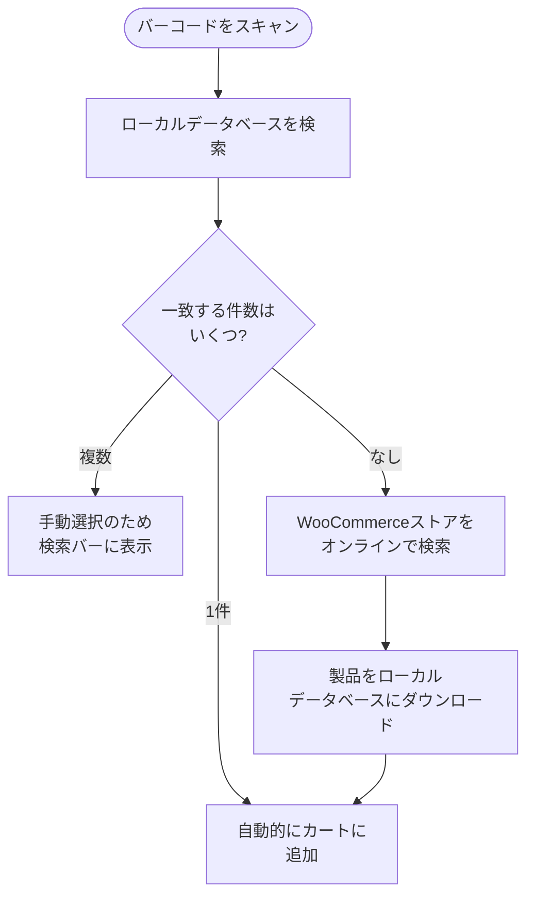

import Image from "@theme/IdealImage";
import Accordion from '@site/src/components/Accordion';
import AccordionItem from '@site/src/components/AccordionItem';

ほとんどのバーコードスキャナーは、デバイスに接続されたキーボードのように動作します。
バーコードをスキャンすると、WCPOS は文字が通常の入力よりも速く入力されたことを検出します。
この「高速なキー入力」を使用して、入力をバーコードスキャンとして識別します。
この方式はほぼすべてのスキャナーで設定なしに動作しますが、スキャナーには WCPOS が直接接続できる他の[接続モード](#connection-modes)もあります。

## バーコードスキャンの設定 {#configuring-barcode-scanning}

バーコードのスキャンは非常に高速に行われるため、POS はバーコードと手入力の違いを見分けられます。
POS の設定には、バーコード検出の動作を微調整するオプションがあります。

  <Image
    alt="POS 設定内のバーコードスキャン設定"
    img="/img/barcode-scanning-settings.png"
    style={{ maxHeight: 500 }}
  />
  
POS 設定内のバーコードスキャン設定

| 設定 | 目的 | 一般的な値 |
|---|---|---|
| **平均入力時間** | バーコードとみなすために入力がどれだけ速い必要があるか | 短い間隔 — 手入力では反応しない程度に速い値 |
| **最小長** | バーコードとして扱うために連続する文字列がどれだけ長い必要があるか | 使用する最短のバーコードに合わせる（例: EAN-8 なら 8） |
| **プレフィックス／サフィックスの除去** | スキャナーが追加する余分な文字（プレフィックスまたはサフィックス）を除去し、メインのバーコードだけを残す | スキャナーがそれらを追加するよう設定されていない限り、空のままにする |

## 接続モード {#connection-modes}

セットアップやトラブルシューティングのガイド付きの手順については、[スキャナーセットアップウィザード](/hardware/scanners/setup-wizard)を使用してください。

すべてのバーコードスキャナーは、いくつかのモードのいずれかで出荷され、そのモードによって WCPOS がスキャンをどのように受け取れるかが決まります:

| モード | 届き方 | セットアップ |
|---|---|---|
| **キーボード（HID）** — ほぼすべてのスキャナーの工場出荷時の初期設定 | スキャナーがバーコードを「入力」し、WCPOS が高速なキー入力を認識する | 不要 — ペアリングまたは接続してスキャンするだけ |
| **シリアル（SPP / USB-COM）** | USB シリアルまたは Bluetooth SPP 経由の直接接続 | スキャナーのモードを切り替え、バーコード設定で接続する |
| **HID-POS** | USB スキャナー向けの直接接続（WebHID 経由） | スキャナーのモードを切り替え、バーコード設定で接続する |
| **Bluetooth LE（ベンダー GATT）** | Bluetooth Low Energy による直接接続 | スキャナーをペアリングし、そのサービス UUID を使ってバーコード設定で追加する |

キーボードモードはセットアップ不要で、ほとんどのストアに適しています。スキャンが文字化けして届いたり（キーボードレイアウトの違いによる大文字／記号の取り違え）、検索ボックスにフォーカスがないときに誤った場所に入力されたりする場合は、直接接続の価値があります — 直接接続されたスキャナーは、入力速度、キーボードレイアウト、フォーカスに関係なく、すべてのスキャンを WCPOS に直接届けます。

:::info キーボードモードのスキャナーは直接接続できません
デバイスはキーボードモードのスキャナーをキーボードとまったく同じように扱い、どのアプリもキーボードを乗っ取ることは許可されていません。
バーコード設定で **シリアルスキャナーを接続** または **HID スキャナーを接続** を押してもスキャナーが一覧に表示されない場合、それはほぼ確実にまだキーボードモードのままです。
:::

**モードを切り替えるには**、スキャナーのマニュアルでセットアップ用のバーコードを探し（*「SPP mode」*、*「serial mode」*、または *「HID-POS mode」* を参照）、それをスキャンします — スキャナーが自身を再設定します。Bluetooth スキャナーの場合は、切り替え後にデバイスの Bluetooth 設定で古いペアリングを削除し、再度ペアリングしてください。マニュアルの *「HID」* または *「keyboard」* のバーコードをスキャンすれば、いつでも元に戻せます。

直接接続は、デスクトップアプリと Chrome ベースのブラウザー（ブラウザーの Web Serial および WebHID のサポートを使用）でサポートされています。デスクトップアプリはアプリ内にデバイスの選択画面を表示し、Chrome は独自のデバイスピッカーを表示します。iOS と Android では、キーボードモードとカメラスキャンがサポートされる選択肢で、Android はさらにハードウェアスキャナーのキー入力を直接インターセプトします。

## カメラスキャン {#camera-scanning}

すべてのプラットフォーム — Web、デスクトップ、iOS、Android — がデバイスのカメラでスキャンできるため、始めるのに専用のスキャナーは必要ありません。検索バーのスキャンアイコンからカメラを開きます。これは**フィルターのすぐ下にサイズ変更可能なパネル**として表示されるため、スキャン中も商品一覧が見えたままになります。カメラをバーコードに向けると、WCPOS はハードウェアスキャンとまったく同じようにそれを読み取ります。

## バーコードが検出されたときの動作 {#what-happens-when-a-barcode-is-detected}

POS はバーコードを検出すると、ローカルデータベースを調べて一致する商品または商品バリエーションを探します。
考えられる結果は 3 つあります:

```mermaid
flowchart TD
    Scan([バーコードをスキャン]) --> Lookup[ローカルデータベースを検索]
    Lookup --> Check{一致する件数は\nいくつ?}
    Check -->|1件| Cart[自動的にカートに\n追加]
    Check -->|複数| Search[手動選択のため\n検索バーに表示]
    Check -->|なし| Online[WooCommerceストアを\nオンラインで検索]
    Online --> Download[製品をローカル\nデータベースにダウンロード]
    Download --> Cart
```

スキャンでローカルに一致が見つからない場合、WCPOS はオンラインのストアにフォールバックし、一致する商品をダウンロードして、**自動的にカートに追加します** — そのため、未知のバーコードでも売上を完了でき、同じスキャンは次回から即座に処理されます。

:::tip 複数の一致は通常データの問題を示します
複数の商品が同じバーコードを共有している場合、POS はどれを追加すべきか判断できないため、そのコードを検索バーに入れて選択できるようにします。これが起こるときは、通常、商品データの整理が必要であることのサインです — 各商品には **一意の** バーコードを設定すべきです。
:::

## スキャンのフィードバックと動作 {#scan-feedback-and-behaviour}

- **スキャン音** — WCPOS はスキャンごとに音を鳴らすことができ、レジ担当者は画面を見なくても即座に確認できます。音はオプションで、テーマを選択できます。[バーコード設定](/settings/store/barcode)でオンにしてテーマを選んでください。
- **注文画面では** — スキャンは注文の検索フィールドに送られるため、バーコードをスキャンして目的の注文や商品を見つけられます。
- **UPC-A バーコード** — UPC-A のスキャンはパッケージに印刷された数字に解決されるため、POS が照合する値は商品データが使用しているものと一致します。

## 商品同期について {#understanding-product-synchronisation}

POS はカタログをバックグラウンドで小さなバッチに分けてダウンロードするため、最初の 1 分ですべての商品がデバイスに揃うわけではありません — 仕組みについては[商品同期](/products/sync)を参照してください。

### バーコードスキャンにとって重要な理由 {#why-it-matters-for-barcode-scanning}

まだローカルに保存されていないバーコードをスキャンすると、POS はオンラインで WooCommerce ストアにアクセスし、その商品を見つけてダウンロードします — そのため同じスキャンは次回から即座に処理されます。これを速めるために何かをする必要はありません: バックグラウンドのカタログシードが残りの在庫を自動的に埋めていき、進行状況は **ストアの健全性 → データベース** で確認できます。

## F.A.Q. {#faq}

<Accordion>
  <AccordionItem question="バーコードをスキャンすると「ローカルに商品が 0 件見つかりました」と表示されるのはなぜですか？">

最初からすべての商品がデバイスにあるわけではありません — POS は使用開始からの最初の数分間で、バックグラウンドでカタログをシードします。
スキャンしたばかりの商品がまだ保存されていない場合、そのスキャンをきっかけに POS がオンラインで検索してダウンロードするため、次回は即座に処理されます。

  </AccordionItem>

  <AccordionItem question="POS はバーコードを生成して印刷しますか？">

いいえ、現時点ではできません。当社の POS は既存のバーコードをスキャンして読み取るように設計されていますが、それらを作成または印刷する機能は含まれていません。
商品用のバーコードを生成する必要がある場合は、バーコードの作成と印刷を専門とするサードパーティの WooCommerce プラグインを使用できます。例:

- [EAN for WooCommerce](https://wordpress.org/plugins/ean-for-woocommerce/)
- [A4 Barcode Generator](https://wordpress.org/plugins/a4-barcode-generator/)

商品用のバーコードを生成したら、レジで簡単にスキャンして、POS での会計プロセスを高速化できます。

  </AccordionItem>
</Accordion>
