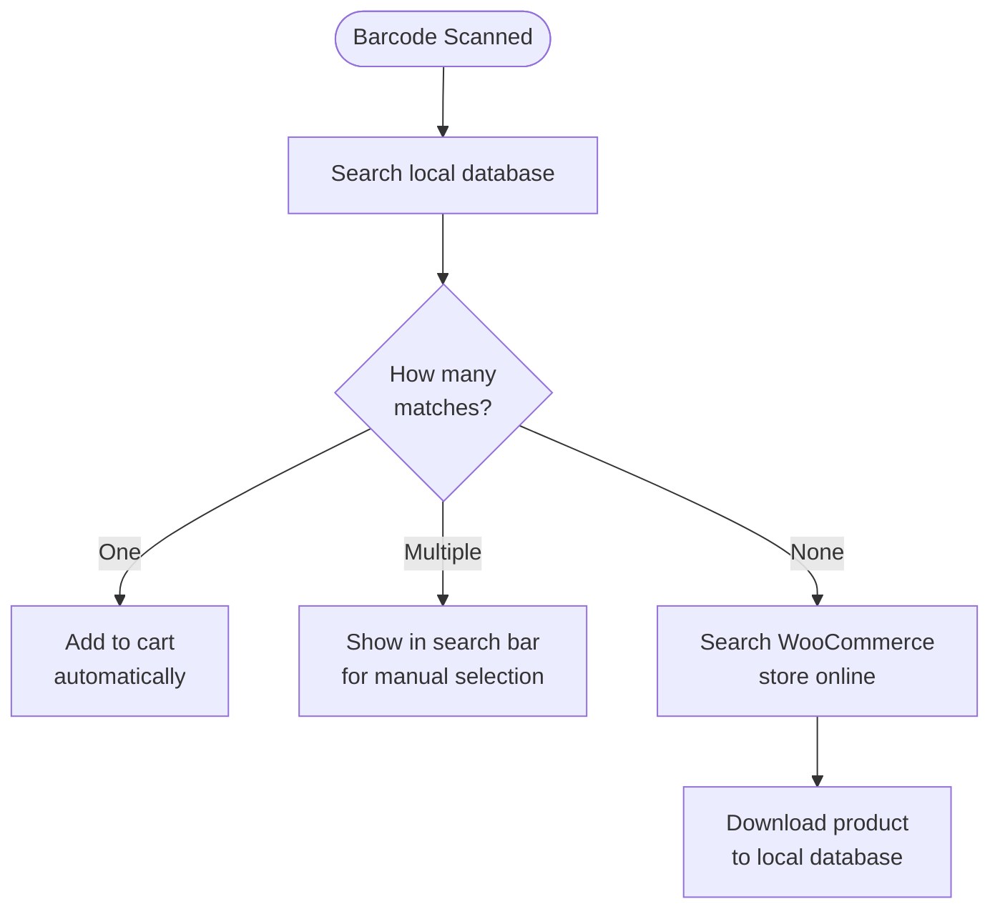

import Image from "@theme/IdealImage";
import Accordion from '@site/src/components/Accordion';
import AccordionItem from '@site/src/components/AccordionItem';

대부분의 바코드 스캐너는 기기에 연결된 키보드처럼 동작합니다.
바코드를 스캔하면 WCPOS가 일반 타이핑보다 빠르게 입력된 문자를 감지합니다.
이러한 "빠른 키 입력"을 통해 해당 입력이 바코드 스캔임을 식별합니다.

## 바코드 스캔 설정 {#configuring-barcode-scanning}

바코드 스캔은 매우 빠르게 이루어지므로, POS에서 바코드와 직접 입력한 내용을 구분할 수 있습니다.
POS 설정에서 바코드 감지 방식을 세부 조정할 수 있는 옵션을 확인할 수 있습니다.

  <Image
    alt="POS 설정의 바코드 스캔 설정"
    img="/img/barcode-scanning-settings.png"
    style={{ maxHeight: 500 }}
  />
  
POS 설정의 바코드 스캔 설정

| 설정 | 용도 | 일반적인 값 |
|---|---|---|
| **평균 입력 시간** | 바코드로 인식되려면 입력이 얼마나 빨라야 하는지 설정 | 짧은 간격 — 수동 타이핑으로는 트리거되지 않을 만큼 빠른 속도 |
| **최소 길이** | 바코드로 처리되려면 연속 문자열이 얼마나 길어야 하는지 설정 | 사용하는 가장 짧은 바코드에 맞게 설정 (예: EAN-8의 경우 8) |
| **접두사/접미사 제거** | 스캐너가 추가하는 여분의 문자(접두사 또는 접미사)를 제거하여 바코드 본문만 남김 | 스캐너에서 접두사/접미사를 추가하도록 설정하지 않았다면 비워 두세요 |

## 바코드가 감지되면 어떻게 되나요? {#what-happens-when-a-barcode-is-detected}

POS에서 바코드가 감지되면, 로컬 데이터베이스에서 일치하는 상품 또는 상품 옵션을 검색합니다.
세 가지 결과가 가능합니다:

:::tip 여러 건이 일치하면 대개 데이터 문제입니다
동일한 바코드를 가진 상품이 두 개 이상이면, POS에서 어떤 상품을 추가해야 할지 알 수 없으므로 해당 코드를 검색창에 표시하여 직접 선택할 수 있도록 합니다. 이런 경우는 대개 상품 데이터를 정리해야 한다는 신호입니다 — 각 상품에는 **고유한** 바코드가 있어야 합니다.
:::

## 상품 동기화 이해하기 {#understanding-product-synchronisation}

### 점진적 상품 다운로드 {#progressive-product-downloading}

WCPOS는 모든 상품을 한 번에 불러오지 않습니다.
대신 소량의 배치 단위로 상품을 다운로드합니다.
이 방식은 속도 저하를 방지하고 매장이 원활하게 운영되도록 합니다.
시간이 지남에 따라 POS를 사용하고 검색을 수행하면 더 많은 상품이 기기에 로컬로 저장됩니다.

자세한 내용은 [상품 동기화](/products/sync)를 참조하세요.

### 바코드 스캔에 중요한 이유 {#why-it-matters-for-barcode-scanning}

아직 로컬에 저장되지 않은 바코드를 스캔하면 POS가 WooCommerce 스토어에 "온라인 접속"하여 해당 상품을 찾습니다.
이 과정에서 해당 상품과 함께 다른 상품도 소량의 배치 단위로 다운로드하여 저장합니다.
따라서 시간이 지날수록 로컬에 저장되는 상품이 많아지면서 POS가 더 빠르고 효율적으로 작동합니다.

### 다운로드를 빠르게 하는 방법 {#how-to-speed-up-the-process}

POS에서 상품을 검색하기만 해도 더 많은 재고가 다운로드됩니다.
검색과 스캔을 많이 할수록 로컬 데이터베이스가 더 완전해집니다.

## 자주 묻는 질문 {#faq}

<Accordion>
  <AccordionItem question="바코드를 스캔할 때 '로컬에서 0개의 상품을 찾았습니다'라고 표시되는 이유는 무엇인가요?">

처음부터 모든 상품이 로컬에서 사용 가능한 것은 아닙니다.
POS는 온라인 스토어에서 상품을 점진적으로 다운로드하여 기기에 저장합니다.
방금 스캔한 상품이 아직 저장되지 않은 경우, 검색을 통해 POS가 온라인에서 해당 상품을 조회한 후 다운로드하여 이후에 사용할 수 있도록 합니다.

  </AccordionItem>

  <AccordionItem question="POS에서 바코드를 생성하고 인쇄할 수 있나요?">

아니요, 현재는 지원되지 않습니다. WCPOS POS는 기존 바코드를 스캔하고 읽도록 설계되었으며, 바코드를 생성하거나 인쇄하는 기능은 포함되어 있지 않습니다.
상품 바코드를 생성해야 하는 경우, 바코드 생성 및 인쇄를 전문으로 하는 서드파티 WooCommerce 플러그인을 사용할 수 있습니다. 예시는 다음과 같습니다:

- [EAN for WooCommerce](https://wordpress.org/plugins/ean-for-woocommerce/)
- [A4 Barcode Generator](https://wordpress.org/plugins/a4-barcode-generator/)

상품 바코드를 생성한 후에는 POS에서 계산대에서 간편하게 스캔하여 결제 과정을 빠르게 진행할 수 있습니다.

  </AccordionItem>
</Accordion>
