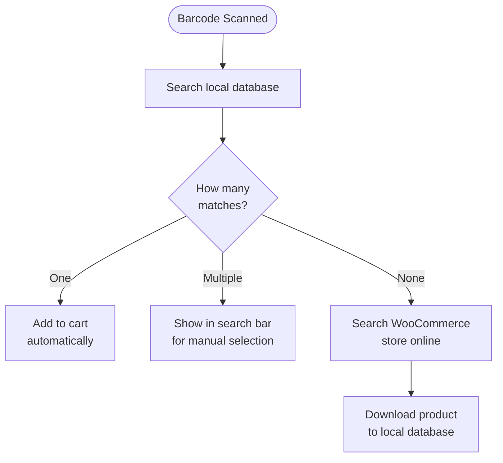

import Image from "@theme/IdealImage";
import Accordion from '@site/src/components/Accordion';
import AccordionItem from '@site/src/components/AccordionItem';

대부분의 바코드 스캐너는 기기에 연결된 키보드처럼 동작합니다.
바코드를 스캔하면 WCPOS가 일반 타이핑보다 빠르게 입력된 문자를 감지합니다.
이러한 "빠른 키 입력"을 통해 해당 입력이 바코드 스캔임을 식별합니다.
이 방식은 거의 모든 스캐너에서 별도 설정 없이 작동합니다 — 다만 스캐너는 WCPOS가 직접 연결할 수 있는 다른 [연결 모드](#connection-modes)도 지원합니다.

## 바코드 스캔 설정 {#configuring-barcode-scanning}

바코드 스캔은 매우 빠르게 이루어지므로, POS에서 바코드와 직접 입력한 내용을 구분할 수 있습니다.
POS 설정에서 바코드 감지 방식을 세부 조정할 수 있는 옵션을 확인할 수 있습니다.

  <Image
    alt="POS 설정의 바코드 스캔 설정"
    img="/img/barcode-scanning-settings.png"
    style={{ maxHeight: 500 }}
  />
  
POS 설정의 바코드 스캔 설정

| 설정 | 용도 | 일반적인 값 |
|---|---|---|
| **평균 입력 시간** | 바코드로 인식되려면 입력이 얼마나 빨라야 하는지 설정 | 짧은 간격 — 수동 타이핑으로는 트리거되지 않을 만큼 빠른 속도 |
| **최소 길이** | 바코드로 처리되려면 연속 문자열이 얼마나 길어야 하는지 설정 | 사용하는 가장 짧은 바코드에 맞게 설정 (예: EAN-8의 경우 8) |
| **접두사/접미사 제거** | 스캐너가 추가하는 여분의 문자(접두사 또는 접미사)를 제거하여 바코드 본문만 남김 | 스캐너에서 접두사/접미사를 추가하도록 설정하지 않았다면 비워 두세요 |

## 연결 모드 {#connection-modes}

설정이나 문제 해결을 단계별로 진행하려면 [스캐너 설정 마법사](/hardware/scanners/setup-wizard)를 사용하세요.

모든 바코드 스캐너는 몇 가지 모드 중 하나로 출고되며, 이 모드에 따라 WCPOS가 스캔을 받는 방식이 결정됩니다:

| 모드 | 전달 방식 | 설정 |
|---|---|---|
| **키보드 (HID)** — 거의 모든 스캐너의 공장 기본값 | 스캐너가 바코드를 "입력"하고, WCPOS가 빠른 키 입력을 인식합니다 | 없음 — 페어링하거나 연결한 뒤 스캔하면 됩니다 |
| **시리얼 (SPP / USB-COM)** | 스캐너와 WCPOS 간의 직접 연결 | 스캐너의 모드를 전환한 뒤 바코드 설정에서 연결합니다 |
| **HID-POS** | 직접 연결 (USB 스캐너) | 스캐너의 모드를 전환한 뒤 바코드 설정에서 연결합니다 |

키보드 모드는 별도 설정이 필요 없고 대부분의 매장에 적합합니다. 스캔 결과가 간혹 깨져서 들어오거나(키보드 레이아웃 차이로 대소문자·기호가 뒤바뀜) 검색창에 포커스가 없을 때 엉뚱한 곳에 입력된다면 직접 연결이 유리합니다 — 직접 연결된 스캐너는 입력 속도, 키보드 레이아웃, 포커스와 관계없이 모든 스캔을 WCPOS로 바로 전달합니다.

:::info 키보드 모드의 스캐너는 직접 연결할 수 없습니다
기기는 키보드 모드 스캐너를 키보드와 완전히 동일하게 취급하며, 어떤 앱도 키보드를 가로챌 수 없습니다.
바코드 설정에서 **시리얼 스캐너 연결** 또는 **HID 스캐너 연결**을 눌렀는데 목록에 스캐너가 나타나지 않는다면, 거의 확실히 아직 키보드 모드입니다.
:::

**모드를 전환하려면** 스캐너 설명서에서 설정용 바코드를 찾아(*"SPP mode"*, *"serial mode"*, *"HID-POS mode"* 항목) 스캔하세요 — 스캐너가 스스로 재구성됩니다. Bluetooth 스캐너는 기기의 Bluetooth 설정에서 기존 페어링을 해제한 뒤 모드 전환 후 다시 페어링하세요. 설명서의 *"HID"* 또는 *"keyboard"* 바코드를 스캔하면 언제든지 되돌릴 수 있습니다.

직접 연결은 현재 데스크톱 앱과 Chrome 기반 브라우저에서 지원됩니다. iOS와 Android에서는 키보드 모드와 카메라 스캔을 사용할 수 있습니다.

## 바코드가 감지되면 어떻게 되나요? {#what-happens-when-a-barcode-is-detected}

POS에서 바코드가 감지되면, 로컬 데이터베이스에서 일치하는 상품 또는 상품 옵션을 검색합니다.
세 가지 결과가 가능합니다:

```mermaid
flowchart TD
    Scan([Barcode Scanned]) --> Lookup[Search local database]
    Lookup --> Check{How many\nmatches?}
    Check -->|One| Cart[Add to cart\nautomatically]
    Check -->|Multiple| Search[Show in search bar\nfor manual selection]
    Check -->|None| Online[Search WooCommerce\nstore online]
    Online --> Download[Download product\nto local database]
```

:::tip 여러 건이 일치하면 대개 데이터 문제입니다
동일한 바코드를 가진 상품이 두 개 이상이면, POS에서 어떤 상품을 추가해야 할지 알 수 없으므로 해당 코드를 검색창에 표시하여 직접 선택할 수 있도록 합니다. 이런 경우는 대개 상품 데이터를 정리해야 한다는 신호입니다 — 각 상품에는 **고유한** 바코드가 있어야 합니다.
:::

## 상품 동기화 이해하기 {#understanding-product-synchronisation}

POS는 백그라운드에서 카탈로그를 소량의 배치로 다운로드하므로 처음부터 모든 상품이 기기에 있는 것은 아닙니다 — 작동 방식은 [상품 동기화](/products/sync)를 참조하세요.

### 바코드 스캔에 중요한 이유 {#why-it-matters-for-barcode-scanning}

아직 로컬에 저장되지 않은 바코드를 스캔하면 POS가 WooCommerce 스토어에 온라인으로 접속해 해당 상품을 찾아 다운로드하므로, 다음번 같은 스캔은 즉시 처리됩니다. 이를 빠르게 하기 위해 따로 할 일은 없습니다. 백그라운드 카탈로그 시드가 나머지 재고를 알아서 채우며, 진행 상황은 **스토어 상태 → 데이터베이스**에서 확인할 수 있습니다.

## 자주 묻는 질문 {#faq}

<Accordion>
  <AccordionItem question="바코드를 스캔할 때 '로컬에서 0개의 상품을 찾았습니다'라고 표시되는 이유는 무엇인가요?">

처음부터 모든 상품이 기기에 있는 것은 아닙니다 — POS는 사용 초기 몇 분 동안 백그라운드에서 카탈로그를 채웁니다.
방금 스캔한 상품이 아직 저장되지 않은 경우, 해당 스캔이 POS의 온라인 조회와 다운로드를 유발하므로 다음번에는 즉시 처리됩니다.

  </AccordionItem>

  <AccordionItem question="POS에서 바코드를 생성하고 인쇄할 수 있나요?">

아니요, 현재는 지원되지 않습니다. WCPOS POS는 기존 바코드를 스캔하고 읽도록 설계되었으며, 바코드를 생성하거나 인쇄하는 기능은 포함되어 있지 않습니다.
상품 바코드를 생성해야 하는 경우, 바코드 생성 및 인쇄를 전문으로 하는 서드파티 WooCommerce 플러그인을 사용할 수 있습니다. 예시는 다음과 같습니다:

- [EAN for WooCommerce](https://wordpress.org/plugins/ean-for-woocommerce/)
- [A4 Barcode Generator](https://wordpress.org/plugins/a4-barcode-generator/)

상품 바코드를 생성한 후에는 POS에서 계산대에서 간편하게 스캔하여 결제 과정을 빠르게 진행할 수 있습니다.

  </AccordionItem>
</Accordion>
