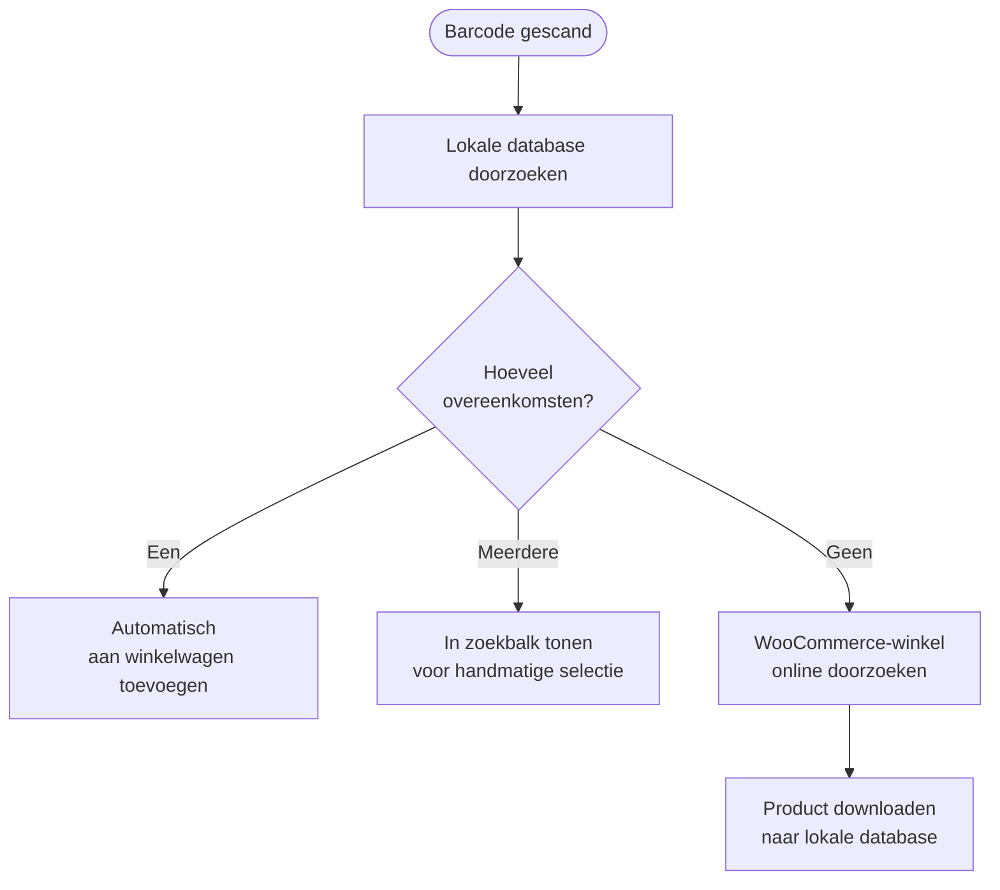

import Image from "@theme/IdealImage";
import Accordion from '@site/src/components/Accordion';
import AccordionItem from '@site/src/components/AccordionItem';

De meeste barcodescanners gedragen zich als een toetsenbord dat met je apparaat is verbonden.
Wanneer je een barcode scant, detecteert WCPOS dat de tekens sneller zijn ingevoerd dan bij normaal typen.
Deze "snelle toetsaanslagen" worden gebruikt om de invoer als een barcodescan te herkennen.

## Barcodescanning configureren {#configuring-barcode-scanning}

Omdat een barcodescan heel snel gebeurt, kan de POS het verschil zien tussen een barcode en iets dat met de hand is getypt.
In de POS-instellingen vind je opties om af te stemmen hoe barcodedetectie werkt.

  <Image
    alt="Instellingen voor barcodescanning in de POS-instellingen"
    img="/img/barcode-scanning-settings.png"
    style={{ maxHeight: 500 }}
  />
  
Instellingen voor barcodescanning in de POS-instellingen

| Instelling | Doel | Typische waarde |
|---|---|---|
| **Gemiddelde invoertijd** | Hoe snel de invoer moet zijn om als barcode te tellen | Een kort interval, snel genoeg zodat handmatig typen dit niet activeert |
| **Minimale lengte** | Hoe lang de aaneengesloten tekenreeks moet zijn om als barcode te worden behandeld | Stem dit af op de kortste barcode die je gebruikt (bijv. 8 voor EAN-8) |
| **Voorvoegsel/achtervoegsel verwijderen** | Verwijdert extra tekens die je scanner toevoegt, zoals een voorvoegsel of achtervoegsel, zodat alleen de hoofdbarcode overblijft | Laat dit leeg tenzij je scanner is ingesteld om zulke tekens toe te voegen |

## Wat gebeurt er wanneer een barcode wordt gedetecteerd? {#what-happens-when-a-barcode-is-detected}

Wanneer de POS een barcode detecteert, zoekt deze in de lokale database naar een overeenkomend product of een overeenkomende productvariatie.
Er zijn drie mogelijke uitkomsten:

:::tip Meerdere overeenkomsten wijzen meestal op een gegevensprobleem
Als meer dan een product dezelfde barcode heeft, kan de POS niet weten welk product moet worden toegevoegd. Daarom wordt de code in de zoekbalk geplaatst, zodat je zelf kunt kiezen. Meestal betekent dit dat je productgegevens moeten worden opgeschoond: elk product hoort een **unieke** barcode te hebben.
:::

## Productsynchronisatie begrijpen {#understanding-product-synchronisation}

### Progressief producten downloaden {#progressive-product-downloading}

WCPOS laadt niet al je producten in een keer.
In plaats daarvan worden ze in kleine batches gedownload.
Deze aanpak voorkomt vertragingen en zorgt ervoor dat je winkel soepel blijft werken.
Na verloop van tijd, terwijl je de POS gebruikt en zoekopdrachten uitvoert, worden steeds meer producten lokaal op je apparaat opgeslagen.

Zie [Productsynchronisatie](/products/sync) voor meer informatie.

### Waarom dit belangrijk is voor barcodescanning {#why-it-matters-for-barcode-scanning}

Wanneer je een barcode scant die nog niet lokaal is opgeslagen, gaat de POS "online" naar je WooCommerce-winkel om het product te vinden.
Als onderdeel van dit proces wordt dat product gedownload, samen met andere producten in kleine batches, en opgeslagen.
Daardoor wordt de POS na verloop van tijd sneller en efficienter naarmate meer producten lokaal beschikbaar zijn.

### Het proces versnellen {#how-to-speed-up-the-process}

Alleen al zoeken naar producten in de POS helpt om meer van je voorraad te downloaden.
Hoe vaker je de zoekfunctie gebruikt, en hoe vaker je scant, hoe completer je lokale database wordt.

## F.A.Q. {#faq}

<Accordion>
  <AccordionItem question="Waarom krijg ik '0 producten lokaal gevonden' wanneer ik een barcode scan?">

Niet alle producten zijn vanaf het begin lokaal beschikbaar.
De POS downloadt producten geleidelijk uit je online winkel en slaat ze op je apparaat op.
Als het product dat je net hebt gescand nog niet is opgeslagen, laat de zoekopdracht de POS online zoeken en het product downloaden, zodat het later wel beschikbaar is.

  </AccordionItem>

  <AccordionItem question="Kan de POS barcodes genereren en afdrukken?">

Nee, op dit moment niet. Onze POS is gemaakt om bestaande barcodes te scannen en te lezen, maar bevat geen functie om barcodes te maken of af te drukken.
Als je barcodes voor je producten wilt genereren, kun je WooCommerce-plugins van derden gebruiken die gespecialiseerd zijn in het maken en afdrukken van barcodes. Enkele voorbeelden zijn:

- [EAN for WooCommerce](https://wordpress.org/plugins/ean-for-woocommerce/)
- [A4 Barcode Generator](https://wordpress.org/plugins/a4-barcode-generator/)

Zodra je barcodes voor je producten hebt gegenereerd, kun je ze eenvoudig aan de kassa scannen om het afrekenen in de POS te versnellen.

  </AccordionItem>
</Accordion>
