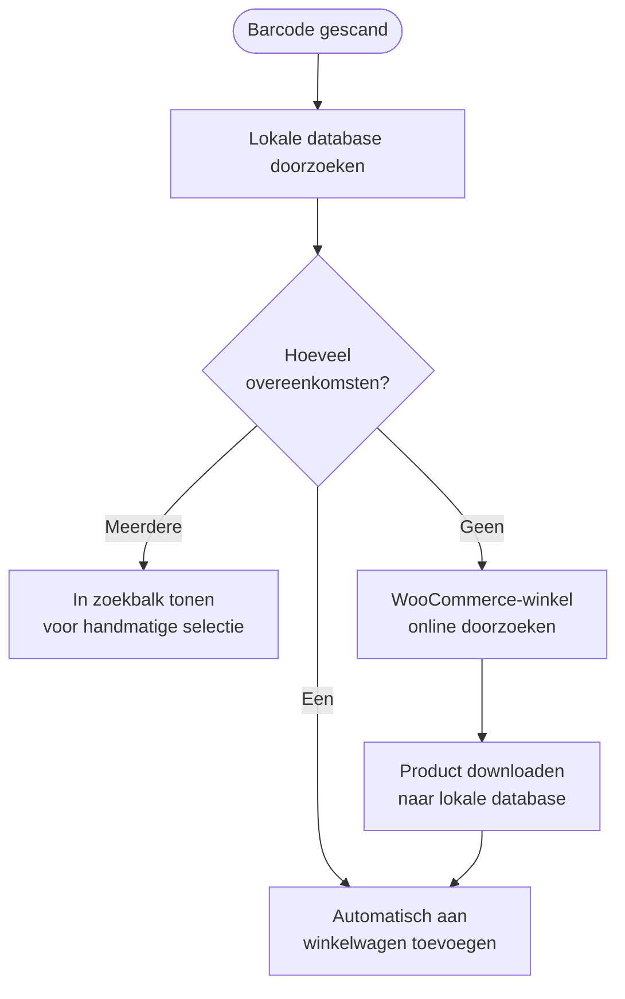

import Image from "@theme/IdealImage";
import Accordion from '@site/src/components/Accordion';
import AccordionItem from '@site/src/components/AccordionItem';

De meeste barcodescanners gedragen zich als een toetsenbord dat met je apparaat is verbonden.
Wanneer je een barcode scant, detecteert WCPOS dat de tekens sneller zijn ingevoerd dan bij normaal typen.
Deze "snelle toetsaanslagen" worden gebruikt om de invoer als een barcodescan te herkennen.
Dit werkt direct met bijna elke scanner — maar scanners ondersteunen ook andere [verbindingsmodi](#connection-modes) waarmee WCPOS rechtstreeks verbinding kan maken.

## Barcodescanning configureren {#configuring-barcode-scanning}

Omdat een barcodescan heel snel gebeurt, kan de POS het verschil zien tussen een barcode en iets dat met de hand is getypt.
In de POS-instellingen vind je opties om af te stemmen hoe barcodedetectie werkt.

  <Image
    alt="Instellingen voor barcodescanning in de POS-instellingen"
    img="/img/barcode-scanning-settings.png"
    style={{ maxHeight: 500 }}
  />
  
Instellingen voor barcodescanning in de POS-instellingen

| Instelling | Doel | Typische waarde |
|---|---|---|
| **Gemiddelde invoertijd** | Hoe snel de invoer moet zijn om als barcode te tellen | Een kort interval — snel genoeg zodat handmatig typen dit niet activeert |
| **Minimale lengte** | Hoe lang de aaneengesloten tekenreeks moet zijn om als barcode te worden behandeld | Stem dit af op de kortste barcode die je gebruikt (bijv. 8 voor EAN-8) |
| **Voorvoegsel/achtervoegsel verwijderen** | Verwijdert extra tekens die je scanner toevoegt (een voorvoegsel of achtervoegsel) zodat alleen de hoofdbarcode overblijft | Laat dit leeg tenzij je scanner is ingesteld om ze toe te voegen |

## Verbindingsmodi {#connection-modes}

Gebruik voor een begeleide route door de installatie of het oplossen van problemen de [wizard voor scannerinstallatie](/hardware/scanners/setup-wizard).

Elke barcodescanner wordt geleverd in een van enkele modi, en die modus bepaalt hoe WCPOS de scans kan ontvangen:

| Modus | Hoe de scan binnenkomt | Installatie |
|---|---|---|
| **Toetsenbord (HID)** — de fabrieksinstelling op vrijwel elke scanner | De scanner "typt" de barcode; WCPOS herkent de snelle toetsaanslagen | Geen — koppelen of aansluiten en scannen |
| **Serieel (SPP / USB-COM)** | Een rechtstreekse verbinding via USB-serieel of Bluetooth SPP | Wijzig de modus van de scanner en verbind hem daarna in de barcode-instellingen |
| **HID-POS** | Een rechtstreekse verbinding voor USB-scanners (via WebHID) | Wijzig de modus van de scanner en verbind hem daarna in de barcode-instellingen |
| **Bluetooth LE (GATT van leverancier)** | Een rechtstreekse Bluetooth Low Energy-verbinding | Koppel de scanner en voeg hem daarna in de barcode-instellingen toe via zijn service-UUID |

Toetsenbordmodus vereist geen installatie en is voor de meeste winkels de juiste keuze. Een rechtstreekse verbinding is de moeite waard als scans soms vervormd binnenkomen (verwisselde hoofdletters of symbolen door verschillen in toetsenbordindeling) of op de verkeerde plek terechtkomen wanneer het zoekvak geen focus heeft — een rechtstreeks verbonden scanner levert elke scan direct bij WCPOS af, ongeacht typesnelheid, toetsenbordindeling of focus.

:::info Een scanner in toetsenbordmodus kan niet rechtstreeks worden verbonden
Je apparaat behandelt een scanner in toetsenbordmodus precies als een toetsenbord, en geen enkele app mag een toetsenbord overnemen.
Als je in de barcode-instellingen op **Seriële scanner verbinden** of **HID-scanner verbinden** drukt en je scanner staat niet in de lijst, staat hij vrijwel zeker nog in toetsenbordmodus.
:::

**Om van modus te wisselen** zoek je de instelbarcode in de handleiding van je scanner (kijk naar *"SPP mode"*, *"serial mode"* of *"HID-POS mode"*) en scan je die — de scanner stelt zichzelf opnieuw in. Vergeet bij Bluetooth-scanners de oude koppeling in de Bluetooth-instellingen van je apparaat en koppel opnieuw na het wisselen. Door de barcode *"HID"* of *"keyboard"* uit de handleiding te scannen, schakel je op elk moment terug.

Rechtstreekse verbindingen worden ondersteund in de desktop-app en op Chrome gebaseerde browsers (via de Web Serial- en WebHID-ondersteuning van de browser). De desktop-app toont een apparaatkiezer binnen de app; Chrome toont zijn eigen apparaatkiezer. Op iOS en Android zijn toetsenbordmodus en scannen met de camera de ondersteunde opties, en Android onderschept daarnaast rechtstreeks de toetsinvoer van hardwarescanners.

## Scannen met de camera {#camera-scanning}

Elk platform — web, desktop, iOS en Android — kan scannen met de camera van het apparaat, dus je hebt geen speciale scanner nodig om te beginnen. Open de camera via het scanpictogram in de zoekbalk; deze verschijnt als een **schaalbaar paneel direct onder de filters**, zodat de productlijst in beeld blijft terwijl je scant. Richt de camera op een barcode en WCPOS leest deze precies zoals bij een hardwarescan.

## Wat gebeurt er wanneer een barcode wordt gedetecteerd? {#what-happens-when-a-barcode-is-detected}

Wanneer de POS een barcode detecteert, zoekt deze in de lokale database naar een overeenkomend product of een overeenkomende productvariatie.
Er zijn drie mogelijke uitkomsten:

```mermaid
flowchart TD
    Scan([Barcode gescand]) --> Lookup[Lokale database doorzoeken]
    Lookup --> Check{Hoeveel\novereenkomsten?}
    Check -->|Een| Cart[Automatisch aan\nwinkelwagen toevoegen]
    Check -->|Meerdere| Search[In zoekbalk tonen\nvoor handmatige selectie]
    Check -->|Geen| Online[WooCommerce-winkel\nonline doorzoeken]
    Online --> Download[Product downloaden\nnaar lokale database]
    Download --> Cart
```

Wanneer een scan geen lokale overeenkomst vindt, valt WCPOS terug op je winkel online, downloadt het overeenkomende product en **voegt het automatisch toe aan de winkelwagen** — zodat een onbekende barcode de verkoop toch afrondt, en dezelfde scan de volgende keer direct resultaat geeft.

:::tip Meerdere overeenkomsten wijzen meestal op een gegevensprobleem
Als meer dan één product dezelfde barcode heeft, kan de POS niet weten welk product moet worden toegevoegd. Daarom wordt de code in de zoekbalk geplaatst, zodat je zelf kunt kiezen. Meestal betekent dit dat je productgegevens moeten worden opgeschoond: elk product hoort een **unieke** barcode te hebben.
:::

## Scanfeedback en -gedrag {#scan-feedback-and-behaviour}

- **Scangeluiden** — WCPOS kan bij elke scan een geluid afspelen zodat kassamedewerkers direct bevestiging krijgen zonder naar het scherm te kijken. Geluiden zijn optioneel en bieden een keuze uit thema's; zet ze aan en kies een thema in de [Barcode-instellingen](/settings/store/barcode).
- **Op het Bestellingenscherm** — scans worden naar het zoekveld voor bestellingen geleid, zodat je een barcode kunt scannen om de bestelling of het product te vinden dat je zoekt.
- **UPC-A-barcodes** — een UPC-A-scan wordt omgezet naar de cijfers die op de verpakking staan, zodat de waarde die de POS matcht dezelfde is als die je productgegevens gebruiken.

## Productsynchronisatie begrijpen {#understanding-product-synchronisation}

De POS downloadt je catalogus op de achtergrond in kleine batches, dus niet elk product staat vanaf de eerste minuut op het apparaat — zie [Productsynchronisatie](/products/sync) voor hoe dit werkt.

### Waarom dit belangrijk is voor barcodescanning {#why-it-matters-for-barcode-scanning}

Wanneer je een barcode scant die nog niet lokaal is opgeslagen, gaat de POS online naar je WooCommerce-winkel, vindt dat product en downloadt het — zodat dezelfde scan de volgende keer direct resultaat geeft. Je hoeft niets te doen om dit te versnellen: de achtergrondaanvulling van de catalogus vult de rest van je voorraad vanzelf aan, en je kunt de voortgang bekijken in **Winkelstatus → Database**.

## F.A.Q. {#faq}

<Accordion>
  <AccordionItem question="Waarom krijg ik '0 producten lokaal gevonden' wanneer ik een barcode scan?">

Niet alle producten staan vanaf het begin op het apparaat — de POS vult je catalogus op de achtergrond aan gedurende de eerste minuten van gebruik.
Als het product dat je net hebt gescand nog niet is opgeslagen, laat de scan de POS online zoeken en het product downloaden, zodat het de volgende keer direct beschikbaar is.

  </AccordionItem>

  <AccordionItem question="Kan de POS barcodes genereren en afdrukken?">

Nee, op dit moment niet. Onze POS is gemaakt om bestaande barcodes te scannen en te lezen, maar bevat geen functie om barcodes te maken of af te drukken.
Als je barcodes voor je producten wilt genereren, kun je WooCommerce-plugins van derden gebruiken die gespecialiseerd zijn in het maken en afdrukken van barcodes. Enkele voorbeelden zijn:

- [EAN for WooCommerce](https://wordpress.org/plugins/ean-for-woocommerce/)
- [A4 Barcode Generator](https://wordpress.org/plugins/a4-barcode-generator/)

Zodra je barcodes voor je producten hebt gegenereerd, kun je ze eenvoudig aan de kassa scannen om het afrekenen in de POS te versnellen.

  </AccordionItem>
</Accordion>
