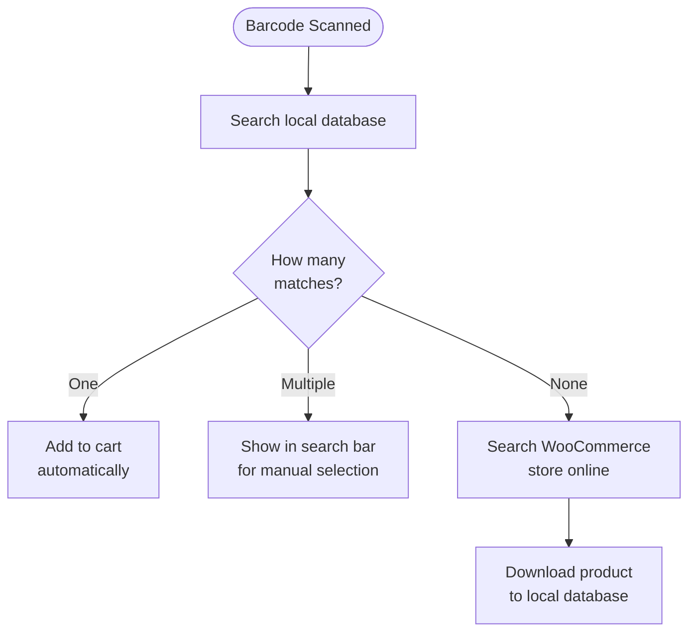

import Image from "@theme/IdealImage";
import Accordion from '@site/src/components/Accordion';
import AccordionItem from '@site/src/components/AccordionItem';

A maioria dos leitores de código de barras se comporta como um teclado conectado ao seu dispositivo.
Quando um código de barras é lido, o WCPOS detecta que os caracteres foram inseridos mais rápido do que na digitação normal.
Ele usa essas "teclas pressionadas rapidamente" para identificar a entrada como uma leitura de código de barras.

## Configuração da leitura de código de barras {#configuring-barcode-scanning}

Como a leitura de um código de barras acontece muito rapidamente, o POS consegue diferenciar um código de barras de algo digitado manualmente.
Nas configurações do POS, há opções para ajustar como a detecção de códigos de barras funciona.

  <Image
    alt="Configurações de leitura de código de barras nas configurações do POS"
    img="/img/barcode-scanning-settings.png"
    style={{ maxHeight: 500 }}
  />
  
Configurações de leitura de código de barras nas configurações do POS

| Configuração | Finalidade | Valor típico |
|---|---|---|
| **Tempo médio de entrada** | A velocidade com que a entrada deve ocorrer para contar como código de barras | Um intervalo curto — rápido o suficiente para que a digitação manual não o acione |
| **Comprimento mínimo** | O tamanho que a sequência contínua de caracteres deve ter para ser tratada como código de barras | Corresponda ao código de barras mais curto que você usa (por exemplo, 8 para EAN-8) |
| **Remoção de prefixo/sufixo** | Remove os caracteres extras que seu leitor adiciona (um prefixo ou sufixo), para que apenas o código de barras principal permaneça | Deixe em branco, a menos que seu leitor esteja configurado para adicioná-los |

## O que acontece quando um código de barras é detectado? {#what-happens-when-a-barcode-is-detected}

Quando o POS detecta um código de barras, ele procura no banco de dados local um produto ou variação de produto correspondente.
Há três resultados possíveis:

:::tip Várias correspondências geralmente indicam um problema nos dados
Se mais de um produto compartilhar o mesmo código de barras, o POS não consegue saber qual adicionar; por isso, ele coloca o código na barra de pesquisa para que você escolha. Quando isso acontece, geralmente é sinal de que os dados dos produtos precisam ser organizados — cada produto deve ter um código de barras **único**.
:::

## Como entender a sincronização de produtos {#understanding-product-synchronisation}

### Download progressivo de produtos {#progressive-product-downloading}

O WCPOS não carrega todos os seus produtos de uma só vez.
Em vez disso, ele os baixa em pequenos lotes.
Essa abordagem evita lentidão e garante que sua loja funcione sem problemas.
Com o tempo, conforme o POS é usado e pesquisas são realizadas, mais produtos ficam armazenados localmente no dispositivo.

Consulte [Sincronização de produtos](/products/sync) para obter mais detalhes.

### Por que isso é importante para a leitura de códigos de barras {#why-it-matters-for-barcode-scanning}

Quando um código de barras que ainda não está armazenado localmente é lido, o POS ficará "online" para encontrá-lo na sua loja WooCommerce.
Como parte desse processo, ele baixará esse produto (e outros em pequenos lotes) e os salvará.
Isso significa que, com o tempo, o POS fica mais rápido e eficiente à medida que mais produtos são armazenados localmente.

### Como acelerar o processo {#how-to-speed-up-the-process}

Basta pesquisar produtos no POS para ajudar a baixar mais itens do seu inventário.
Quanto mais a pesquisa é usada — e quanto mais códigos são lidos — mais completo se torna o banco de dados local.

## Perguntas frequentes {#faq}

<Accordion>
  <AccordionItem question="Por que vejo '0 produtos encontrados localmente' ao escanear um código de barras?">

Nem todos os produtos ficam disponíveis localmente logo no início.
O POS baixa gradualmente os produtos da sua loja online e os armazena no seu dispositivo.
Se o produto que acabou de ser escaneado ainda não estiver armazenado, a busca faz com que o POS o procure online e depois o baixe, para que fique disponível no futuro.

  </AccordionItem>

  <AccordionItem question="O POS gera e imprime códigos de barras?">

Não, não neste momento. Nosso POS foi desenvolvido para escanear e ler códigos de barras existentes, mas não inclui funcionalidade para criá-los ou imprimi-los.
Se você precisa gerar códigos de barras para seus produtos, pode usar plugins WooCommerce de terceiros especializados na criação e impressão de códigos de barras. Alguns exemplos incluem:

- [EAN for WooCommerce](https://wordpress.org/plugins/ean-for-woocommerce/)
- [A4 Barcode Generator](https://wordpress.org/plugins/a4-barcode-generator/)

Depois de gerar códigos de barras para seus produtos, você pode escaneá-los facilmente no caixa para agilizar o processo de checkout no POS.

  </AccordionItem>
</Accordion>
