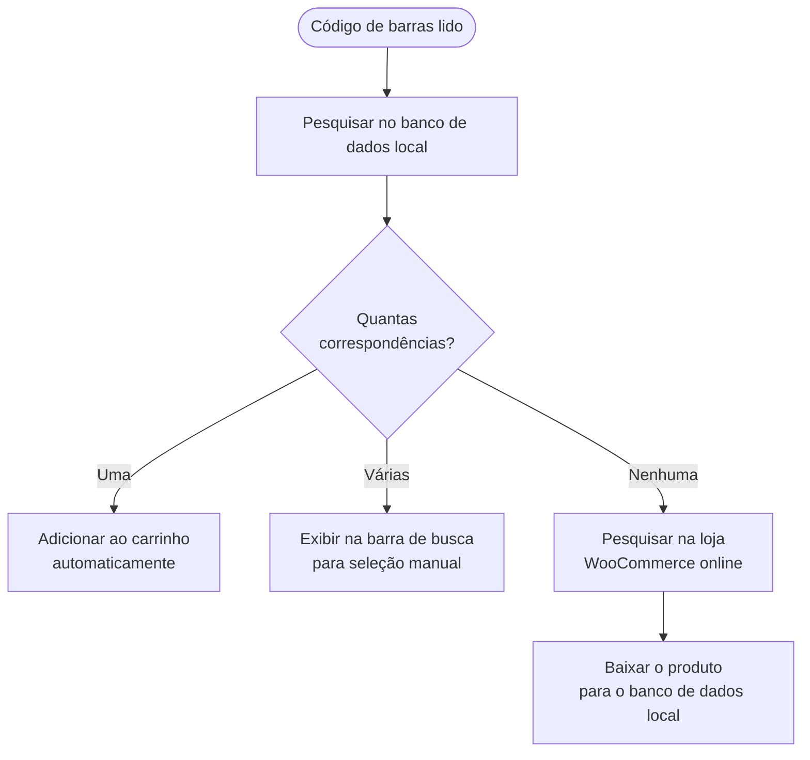

import Image from "@theme/IdealImage";
import Accordion from '@site/src/components/Accordion';
import AccordionItem from '@site/src/components/AccordionItem';

A maioria dos leitores de código de barras se comporta como um teclado conectado ao seu dispositivo.
Quando um código de barras é lido, o WCPOS detecta que os caracteres foram inseridos mais rápido do que na digitação normal.
Ele usa essas "teclas pressionadas rapidamente" para identificar a entrada como uma leitura de código de barras.
Isso funciona de imediato com quase todos os leitores — mas os leitores também oferecem outros [modos de conexão](#connection-modes) aos quais o WCPOS pode se conectar diretamente.

## Configuração da leitura de código de barras {#configuring-barcode-scanning}

Como a leitura de um código de barras acontece muito rapidamente, o POS consegue diferenciar um código de barras de algo digitado manualmente.
Nas configurações do POS, há opções para ajustar como a detecção de códigos de barras funciona.

  <Image
    alt="Configurações de leitura de código de barras nas configurações do POS"
    img="/img/barcode-scanning-settings.png"
    style={{ maxHeight: 500 }}
  />
  
Configurações de leitura de código de barras nas configurações do POS

| Configuração | Finalidade | Valor típico |
|---|---|---|
| **Tempo médio de entrada** | A velocidade com que a entrada deve ocorrer para contar como código de barras | Um intervalo curto — rápido o suficiente para que a digitação manual não o acione |
| **Comprimento mínimo** | O tamanho que a sequência contínua de caracteres deve ter para ser tratada como código de barras | Corresponda ao código de barras mais curto que você usa (por exemplo, 8 para EAN-8) |
| **Remoção de prefixo/sufixo** | Remove os caracteres extras que seu leitor adiciona (um prefixo ou sufixo), para que apenas o código de barras principal permaneça | Deixe em branco, a menos que seu leitor esteja configurado para adicioná-los |

## Modos de conexão {#connection-modes}

Para um caminho guiado pela configuração ou pela solução de problemas, use o [Assistente de configuração de leitores](/hardware/scanner-setup-wizard).

Todo leitor de código de barras sai de fábrica em um de poucos modos, e o modo determina como o WCPOS pode receber suas leituras:

| Modo | Como a leitura chega | Configuração |
|---|---|---|
| **Teclado (HID)** — o padrão de fábrica em quase todos os leitores | O leitor "digita" o código de barras; o WCPOS reconhece as teclas rápidas | Nenhuma — pareie ou conecte e leia |
| **Serial (SPP / USB-COM)** | Uma conexão direta entre o leitor e o WCPOS | Altere o modo do leitor e depois conecte-o nas configurações de Código de barras |
| **HID-POS** | Uma conexão direta (leitores USB) | Altere o modo do leitor e depois conecte-o nas configurações de Código de barras |

O modo teclado não exige configuração e é o adequado para a maioria das lojas. Uma conexão direta vale a pena se as leituras às vezes chegam embaralhadas (trocas de maiúsculas/símbolos causadas por diferenças de layout de teclado) ou caem no lugar errado quando o campo de busca não está em foco — um leitor conectado diretamente entrega cada leitura direto ao WCPOS, independentemente da velocidade de digitação, do layout do teclado ou do foco.

:::info Um leitor em modo teclado não pode ser conectado diretamente
Seu dispositivo trata um leitor em modo teclado exatamente como um teclado, e nenhum aplicativo tem permissão para assumir o controle de um teclado.
Se você tocar em **Conectar leitor serial** ou **Conectar leitor HID** nas configurações de Código de barras e o seu leitor não aparecer na lista, é quase certo que ele ainda está em modo teclado.
:::

**Para alternar de modo**, encontre o código de barras de configuração no manual do seu leitor (procure por *"modo SPP"*, *"modo serial"* ou *"modo HID-POS"*) e leia-o — o leitor se reconfigura sozinho. Em leitores Bluetooth, remova o pareamento antigo nas configurações de Bluetooth do dispositivo e pareie novamente após a troca. Ler o código de barras *"HID"* ou *"teclado"* do manual reverte a configuração a qualquer momento.

No momento, as conexões diretas são compatíveis com o aplicativo de desktop e com navegadores baseados no Chrome. No iOS e no Android, o modo teclado e a leitura por câmera são as opções compatíveis.

## O que acontece quando um código de barras é detectado? {#what-happens-when-a-barcode-is-detected}

Quando o POS detecta um código de barras, ele procura no banco de dados local um produto ou variação de produto correspondente.
Há três resultados possíveis:

```mermaid
flowchart TD
    Scan([Código de barras lido]) --> Lookup[Pesquisar no banco de dados local]
    Lookup --> Check{Quantas\ncorrespondências?}
    Check -->|Uma| Cart[Adicionar ao carrinho\nautomaticamente]
    Check -->|Várias| Search[Exibir na barra de busca\npara seleção manual]
    Check -->|Nenhuma| Online[Pesquisar na loja\nWooCommerce online]
    Online --> Download[Baixar o produto\npara o banco de dados local]
```

:::tip Várias correspondências geralmente indicam um problema nos dados
Se mais de um produto compartilhar o mesmo código de barras, o POS não consegue saber qual adicionar; por isso, ele coloca o código na barra de pesquisa para que você escolha. Quando isso acontece, geralmente é sinal de que os dados dos produtos precisam ser organizados — cada produto deve ter um código de barras **único**.
:::

## Como entender a sincronização de produtos {#understanding-product-synchronisation}

O POS baixa seu catálogo em pequenos lotes em segundo plano, então nem todo produto está no dispositivo desde o primeiro minuto — veja [Sincronização de produtos](/products/sync) para entender como isso funciona.

### Por que isso é importante para a leitura de códigos de barras {#why-it-matters-for-barcode-scanning}

Quando você lê um código de barras que ainda não está armazenado localmente, o POS vai até a sua loja WooCommerce online, encontra aquele produto e o baixa — de modo que a mesma leitura seja instantânea da próxima vez. Você não precisa fazer nada para acelerar isso: a carga inicial do catálogo em segundo plano preenche o restante do seu inventário sozinha, e você pode acompanhar o progresso em **Saúde da loja → Banco de dados**.

## Perguntas frequentes {#faq}

<Accordion>
  <AccordionItem question="Por que vejo '0 produtos encontrados localmente' ao escanear um código de barras?">

Nem todos os produtos ficam no dispositivo logo no início — o POS faz a carga inicial do seu catálogo em segundo plano ao longo dos primeiros minutos de uso.
Se o produto que acabou de ser lido ainda não estiver armazenado, a leitura faz com que o POS o procure online e o baixe, para que seja instantâneo da próxima vez.

  </AccordionItem>

  <AccordionItem question="O POS gera e imprime códigos de barras?">

Não, não neste momento. Nosso POS foi desenvolvido para escanear e ler códigos de barras existentes, mas não inclui funcionalidade para criá-los ou imprimi-los.
Se você precisa gerar códigos de barras para seus produtos, pode usar plugins WooCommerce de terceiros especializados na criação e impressão de códigos de barras. Alguns exemplos incluem:

- [EAN for WooCommerce](https://wordpress.org/plugins/ean-for-woocommerce/)
- [A4 Barcode Generator](https://wordpress.org/plugins/a4-barcode-generator/)

Depois de gerar códigos de barras para seus produtos, você pode escaneá-los facilmente no caixa para agilizar o processo de checkout no POS.

  </AccordionItem>
</Accordion>
