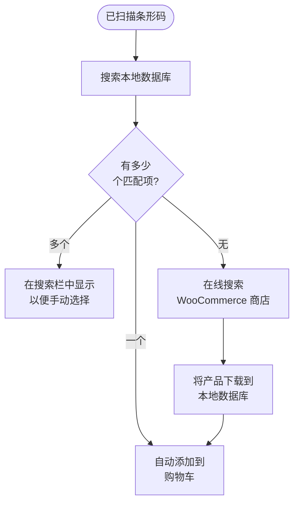

import Image from "@theme/IdealImage";
import Accordion from '@site/src/components/Accordion';
import AccordionItem from '@site/src/components/AccordionItem';

大多数条码扫描器的行为都类似于连接到你设备的键盘。
当你扫描条码时，WCPOS 会检测到字符的输入速度比正常打字更快。
它利用这些“快速按键”将输入识别为一次条码扫描。
这在几乎所有扫描器上都开箱即用 —— 但扫描器还支持其他[连接模式](#connection-modes)，WCPOS 可以直接与之连接。

## 配置条码扫描 {#configuring-barcode-scanning}

由于条码扫描发生得非常快，POS 可以区分条码与手动输入的内容。
在 POS 设置中，你会找到用于微调条码检测运作方式的选项。

  <Image
    alt="POS 设置中的条码扫描设置"
    img="/img/barcode-scanning-settings.png"
    style={{ maxHeight: 500 }}
  />
  
POS 设置中的条码扫描设置

| 设置 | 作用 | 典型取值 |
|---|---|---|
| **平均输入时间** | 输入速度必须达到多快才能被计为条码 | 一个较短的间隔 —— 快到手动打字不会触发它 |
| **最小长度** | 连续的字符串必须达到多长才被视为条码 | 与你使用的最短条码保持一致（例如 EAN-8 为 8） |
| **前缀/后缀移除** | 剥离扫描器添加的额外字符（前缀或后缀），只保留主要条码 | 除非你的扫描器被配置为添加这些字符，否则请留空 |

## 连接模式 {#connection-modes}

如需引导式的设置或故障排除流程，请使用[扫描器设置向导](/hardware/scanners/setup-wizard)。

每台条码扫描器出厂时都处于几种模式之一，而该模式决定了 WCPOS 如何接收它的扫描结果：

| 模式 | 数据如何送达 | 设置 |
|---|---|---|
| **键盘（HID）** —— 几乎所有扫描器的出厂默认模式 | 扫描器“键入”条码；WCPOS 识别这些快速击键 | 无需设置 —— 配对或插入后即可扫描 |
| **串行（SPP / USB-COM）** | 通过 USB 串行或蓝牙 SPP 的直接连接 | 切换扫描器的模式，然后在条码设置中连接它 |
| **HID-POS** | 面向 USB 扫描器的直接连接（通过 WebHID） | 切换扫描器的模式，然后在条码设置中连接它 |
| **蓝牙 LE（厂商 GATT）** | 一种直接的蓝牙低功耗连接 | 配对扫描器，然后在条码设置中按其服务 UUID 添加它 |

键盘模式无需任何设置，适合大多数商店。如果扫描结果有时会出现乱码（因键盘布局差异导致的大小写/符号混乱），或在搜索框未获得焦点时落到错误的位置，那么直接连接就很值得 —— 直接连接的扫描器会将每次扫描直接送达 WCPOS，与打字速度、键盘布局或焦点无关。

:::info 处于键盘模式的扫描器无法直接连接
你的设备会把键盘模式的扫描器完全当作键盘对待，而任何应用都不允许接管键盘。
如果你在条码设置中按下**连接串行扫描器**或**连接 HID 扫描器**，而列表中没有出现你的扫描器，那么它几乎肯定仍处于键盘模式。
:::

**要切换模式**，请在扫描器的手册中找到设置条码（查找 *"SPP mode"*、*"serial mode"* 或 *"HID-POS mode"*）并扫描它 —— 扫描器会自行重新配置。对于蓝牙扫描器，请在设备的蓝牙设置中忘记旧的配对，切换后重新配对。随时扫描手册中的 *"HID"* 或 *"keyboard"* 条码即可将其切换回来。

直接连接在桌面应用和基于 Chrome 的浏览器中受支持（使用浏览器的 Web Serial 和 WebHID 支持）。桌面应用会在应用内显示设备选择器；Chrome 会显示它自己的设备选择器。在 iOS 和 Android 上，受支持的方式是键盘模式和摄像头扫描，此外 Android 还会直接拦截硬件扫描器的按键输入。

## 摄像头扫描 {#camera-scanning}

每个平台 —— Web、桌面、iOS 和 Android —— 都可以使用设备摄像头扫描，因此你无需专用扫描器即可上手。从搜索栏中的扫描图标打开摄像头；它会以**一个可调整大小的面板出现在筛选器正下方**，以便你在扫描时产品列表保持可见。将摄像头对准条码，WCPOS 会像处理硬件扫描一样精确地读取它。

## 检测到条码时会发生什么？ {#what-happens-when-a-barcode-is-detected}

当 POS 检测到条码时，它会在其本地数据库中查找匹配的产品或产品变体。
有三种可能的结果：

当一次扫描没有找到本地匹配时，WCPOS 会回退到在线访问你的商店，下载匹配的产品，并**自动将其添加到购物车** —— 因此未知条码依然能完成这笔销售，而且同一条码下次扫描时会立即响应。

:::tip 多个匹配通常意味着数据问题
如果不止一个产品共享同一条码，POS 无法知道该添加哪一个，于是它会把该代码放入搜索栏供你选择。当这种情况发生时，通常表明你的产品数据需要整理 —— 每个产品都应有一个**唯一**的条码。
:::

## 扫描反馈与行为 {#scan-feedback-and-behaviour}

- **扫描声音** —— WCPOS 可以在每次扫描时播放声音，让收银员无需看屏幕即可获得即时确认。声音是可选的，并提供多种主题可选；请在[条码设置](/settings/store/barcode)中开启它们并选择一个主题。
- **在订单界面上** —— 扫描会被路由到订单搜索字段，因此你可以扫描条码来查找你要找的订单或产品。
- **UPC-A 条码** —— 一次 UPC-A 扫描会解析为印在包装上的数字，因此 POS 匹配的值与你的产品数据所使用的一致。

## 理解产品同步 {#understanding-product-synchronisation}

POS 会在后台分批下载你的产品目录，因此并非从第一分钟起所有产品就都已存入设备 —— 其工作方式请参见[产品同步](/products/sync)。

### 为什么它对条码扫描很重要 {#why-it-matters-for-barcode-scanning}

当你扫描一个尚未在本地存储的条码时，POS 会在线访问你的 WooCommerce 商店，找到该产品并将其下载下来 —— 因此下次扫描同一条码时会立即响应。你无需做任何事情来加快这一过程：后台的目录预填充会自行补齐你的其余库存，你可以在 **Store health → Database** 中查看进度。

## 常见问题解答 {#faq}

<Accordion>
  <AccordionItem question="为什么我扫描条码时会出现“本地找到 0 个产品”？">

并非所有产品从一开始就已存入设备 —— POS 会在最初使用的几分钟内在后台预填充你的产品目录。
如果你刚扫描的产品尚未存储，该次扫描会触发 POS 在线查找并下载它，因此下次会立即响应。

  </AccordionItem>

  <AccordionItem question="POS 是否会生成和打印条码？">

不，目前不支持。我们的 POS 旨在扫描和读取现有条码，但不包含创建或打印条码的功能。
如果你需要为产品生成条码，可以使用专门用于条码创建和打印的第三方 WooCommerce 插件。一些示例包括：

- [EAN for WooCommerce](https://wordpress.org/plugins/ean-for-woocommerce/)
- [A4 Barcode Generator](https://wordpress.org/plugins/a4-barcode-generator/)

一旦你为产品生成了条码，就可以轻松地在收银台扫描它们，从而加快 POS 的结账流程。

  </AccordionItem>
</Accordion>
