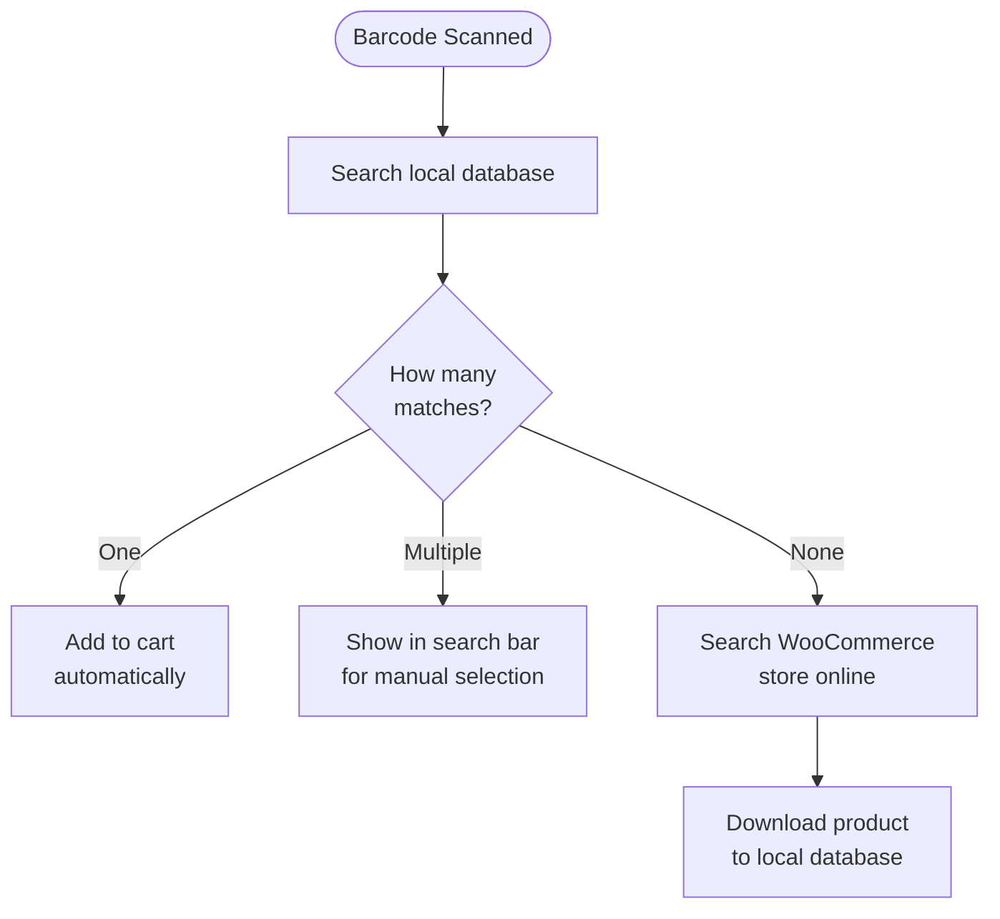

import Image from "@theme/IdealImage";
import Accordion from '@site/src/components/Accordion';
import AccordionItem from '@site/src/components/AccordionItem';

Most barcode scanners behave like a keyboard connected to your device.
When you scan a barcode, the WCPOS detects that the characters were entered faster than normal typing.
It uses these "fast key presses" to identify the input as a barcode scan.

## Configuring Barcode Scanning {#configuring-barcode-scanning}

Since a barcode scan happens very fast, the POS can tell the difference between a barcode and something typed in by hand.
In the POS settings, you'll find options for fine-tuning how barcode detection works.

  <Image
    alt="Barcode Scanning Settings in the POS Settings"
    img="/img/barcode-scanning-settings.png"
    style={{ maxHeight: 500 }}
  />
  
Barcode Scanning Settings in the POS Settings

| Setting | Purpose | Typical value |
|---|---|---|
| **Average input time** | How fast the input must be to count as a barcode | A short interval — fast enough that hand-typing won't trigger it |
| **Minimum length** | How long the continuous string of characters must be to be treated as a barcode | Match the shortest barcode you use (e.g. 8 for EAN-8) |
| **Prefix/Suffix removal** | Strips extra characters your scanner adds (a prefix or suffix) so only the main barcode remains | Leave empty unless your scanner is configured to add them |

## What Happens When a Barcode is Detected? {#what-happens-when-a-barcode-is-detected}

When the POS detects a barcode, it looks in its local database to find a matching product or product variation.
There are three possible outcomes:

:::tip Multiple matches usually means a data issue
If more than one product shares the same barcode, the POS can't know which to add, so it drops the code into the search bar for you to choose. When this happens it's usually a sign your product data needs tidying up — each product should have a **unique** barcode.
:::

## Understanding Product Synchronisation {#understanding-product-synchronisation}

### Progressive Product Downloading {#progressive-product-downloading}

WCPOS doesn't load all your products at once.
Instead, it downloads them in small batches.
This approach prevents slowdowns and makes sure your store runs smoothly.
Over time, as you use the POS and conduct searches, more of your products are stored locally on your device.

See [Product Synchronisation](/products/sync) for more details.

### Why It Matters for Barcode Scanning {#why-it-matters-for-barcode-scanning}

When you scan a barcode that isn't yet stored locally, the POS will "go online" to your WooCommerce store to find it.
As part of this process, it will download that product (and others in small batches) and save them.
This means that over time, the POS becomes faster and more efficient as more products are stored locally.

### How to Speed Up the Process {#how-to-speed-up-the-process}

Simply searching for products in the POS helps it download more of your inventory.
The more you use the search — and the more you scan—the more complete your local database becomes.

## F.A.Q. {#faq}

<Accordion>
  <AccordionItem question="Why do I get '0 products found locally' when I scan a barcode?">

Not all products are available locally right from the start.
The POS gradually downloads products from your online store and stores them on your device.
If the product you just scanned isn't stored yet, the search triggers the POS to look it up online and then download it so it's available in the future.

  </AccordionItem>

  <AccordionItem question="Does the POS generate and print barcodes?">

No, not at this time. Our POS is designed to scan and read existing barcodes, but it does not include functionality to create or print them.
If you need to generate barcodes for your products, you can use third-party WooCommerce plugins that specialise in barcode creation and printing. Some examples include:

- [EAN for WooCommerce](https://wordpress.org/plugins/ean-for-woocommerce/)
- [A4 Barcode Generator](https://wordpress.org/plugins/a4-barcode-generator/)

Once you have generated barcodes for your products, you can easily scan them at the register to speed up the checkout process in the POS.

  </AccordionItem>
</Accordion>
