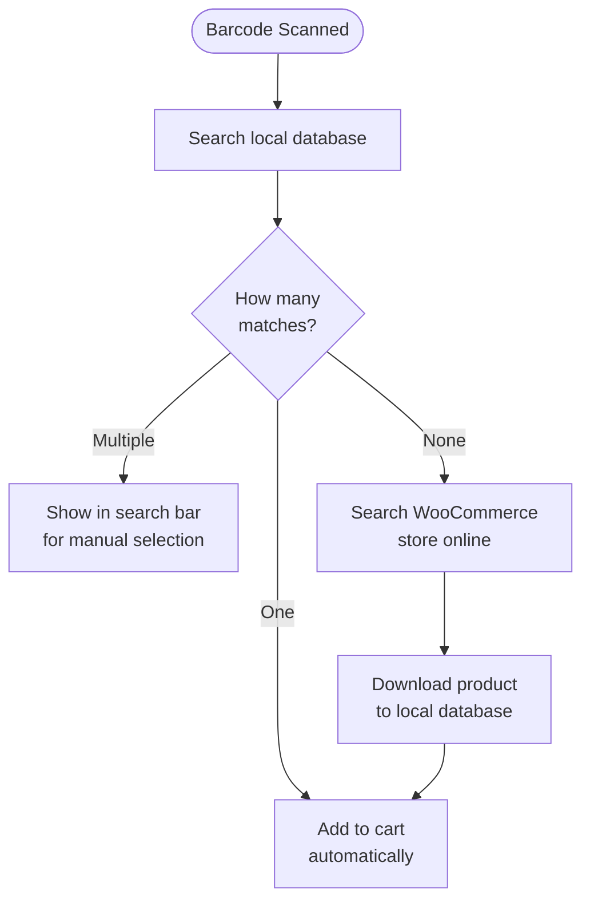

import Image from "@theme/IdealImage";
import Accordion from '@site/src/components/Accordion';
import AccordionItem from '@site/src/components/AccordionItem';

Most barcode scanners behave like a keyboard connected to your device.
When you scan a barcode, the WCPOS detects that the characters were entered faster than normal typing.
It uses these "fast key presses" to identify the input as a barcode scan.
This works out of the box with almost every scanner — but scanners also support other [connection modes](#connection-modes) that WCPOS can connect to directly.

## Configuring Barcode Scanning {#configuring-barcode-scanning}

Since a barcode scan happens very fast, the POS can tell the difference between a barcode and something typed in by hand.
In the POS settings, you'll find options for fine-tuning how barcode detection works.

  <Image
    alt="Barcode Scanning Settings in the POS Settings"
    img="/img/barcode-scanning-settings.png"
    style={{ maxHeight: 500 }}
  />
  
Barcode Scanning Settings in the POS Settings

| Setting | Purpose | Typical value |
|---|---|---|
| **Average input time** | How fast the input must be to count as a barcode | A short interval — fast enough that hand-typing won't trigger it |
| **Minimum length** | How long the continuous string of characters must be to be treated as a barcode | Match the shortest barcode you use (e.g. 8 for EAN-8) |
| **Prefix/Suffix removal** | Strips extra characters your scanner adds (a prefix or suffix) so only the main barcode remains | Leave empty unless your scanner is configured to add them |

## Connection Modes {#connection-modes}

For a guided path through setup or troubleshooting, use the [Scanner Setup Wizard](/hardware/scanners/setup-wizard).

Every barcode scanner ships in one of a few modes, and the mode decides how WCPOS can receive its scans:

| Mode | How it arrives | Setup |
|---|---|---|
| **Keyboard (HID)** — the factory default on almost every scanner | The scanner "types" the barcode; WCPOS recognises the fast keystrokes | None — pair or plug in and scan |
| **Serial (SPP / USB-COM)** | A direct connection over USB serial or Bluetooth SPP | Switch the scanner's mode, then connect it in the Barcode settings |
| **HID-POS** | A direct connection for USB scanners (via WebHID) | Switch the scanner's mode, then connect it in the Barcode settings |
| **Bluetooth LE (vendor GATT)** | A direct Bluetooth Low Energy connection | Pair the scanner, then add it in the Barcode settings by its service UUID |

Keyboard mode needs no setup and is right for most stores. A direct connection is worth it if scans sometimes arrive garbled (uppercase/symbol mix-ups from keyboard-layout differences) or land in the wrong place when the search box isn't focused — a directly connected scanner delivers every scan straight to WCPOS, regardless of typing speed, keyboard layout, or focus.

:::info A scanner in keyboard mode can't be connected directly
Your device treats a keyboard-mode scanner exactly like a keyboard, and no app is allowed to take over a keyboard.
If you press **Connect serial scanner** or **Connect HID scanner** in the Barcode settings and your scanner doesn't appear in the list, it is almost certainly still in keyboard mode.
:::

**To switch modes**, find the setup barcode in your scanner's manual (look for *"SPP mode"*, *"serial mode"*, or *"HID-POS mode"*) and scan it — the scanner reconfigures itself. For Bluetooth scanners, forget the old pairing in your device's Bluetooth settings and pair again after switching. Scanning the manual's *"HID"* or *"keyboard"* barcode switches it back at any time.

Direct connections are supported in the Desktop app and Chrome-based browsers (using the browser's Web Serial and WebHID support). The Desktop app shows a device chooser inside the app; Chrome shows its own device picker. On iOS and Android, keyboard mode and camera scanning are the supported options, and Android additionally intercepts hardware-scanner key input directly.

## Camera scanning {#camera-scanning}

Every platform — web, desktop, iOS, and Android — can scan with the device camera, so you don't need a dedicated scanner to get started. Open the camera from the scan icon in the search bar; it appears as a **resizable panel directly below the filters**, so the product list stays in view while you scan. Point the camera at a barcode and WCPOS reads it exactly as it would a hardware scan.

## What Happens When a Barcode is Detected? {#what-happens-when-a-barcode-is-detected}

When the POS detects a barcode, it looks in its local database to find a matching product or product variation.
There are three possible outcomes:

```mermaid
flowchart TD
    Scan([Barcode Scanned]) --> Lookup[Search local database]
    Lookup --> Check{How many\nmatches?}
    Check -->|One| Cart[Add to cart\nautomatically]
    Check -->|Multiple| Search[Show in search bar\nfor manual selection]
    Check -->|None| Online[Search WooCommerce\nstore online]
    Online --> Download[Download product\nto local database]
    Download --> Cart
```

When a scan finds no local match, WCPOS falls back to your store online, downloads the matching product, and **adds it to the cart automatically** — so an unknown barcode still completes the sale, and the same scan is instant next time.

:::tip Multiple matches usually means a data issue
If more than one product shares the same barcode, the POS can't know which to add, so it drops the code into the search bar for you to choose. When this happens it's usually a sign your product data needs tidying up — each product should have a **unique** barcode.
:::

## Scan feedback and behaviour {#scan-feedback-and-behaviour}

- **Scan sounds** — WCPOS can play a sound on each scan so cashiers get instant confirmation without looking at the screen. Sounds are optional and offer a choice of themes; turn them on and pick a theme in the [Barcode settings](/settings/store/barcode).
- **On the Orders screen** — scans are routed to the Orders search field, so you can scan a barcode to find the order or product you're looking for.
- **UPC-A barcodes** — a UPC-A scan resolves to the digits printed on the package, so the value the POS matches is the one your product data uses.

## Understanding Product Synchronisation {#understanding-product-synchronisation}

The POS downloads your catalogue in small batches in the background, so not every product is on the device from the first minute — see [Product Synchronisation](/products/sync) for how this works.

### Why It Matters for Barcode Scanning {#why-it-matters-for-barcode-scanning}

When you scan a barcode that isn't yet stored locally, the POS goes online to your WooCommerce store, finds that product, and downloads it — so the same scan is instant next time. You don't need to do anything to speed this up: the background catalogue seed fills in the rest of your inventory on its own, and you can check progress in **Store health → Database**.

## F.A.Q. {#faq}

<Accordion>
  <AccordionItem question="Why do I get '0 products found locally' when I scan a barcode?">

Not all products are on the device right from the start — the POS seeds your catalogue in the background over its first minutes of use.
If the product you just scanned isn't stored yet, the scan triggers the POS to look it up online and download it, so it's instant the next time.

  </AccordionItem>

  <AccordionItem question="Does the POS generate and print barcodes?">

No, not at this time. Our POS is designed to scan and read existing barcodes, but it does not include functionality to create or print them.
If you need to generate barcodes for your products, you can use third-party WooCommerce plugins that specialise in barcode creation and printing. Some examples include:

- [EAN for WooCommerce](https://wordpress.org/plugins/ean-for-woocommerce/)
- [A4 Barcode Generator](https://wordpress.org/plugins/a4-barcode-generator/)

Once you have generated barcodes for your products, you can easily scan them at the register to speed up the checkout process in the POS.

  </AccordionItem>
</Accordion>
